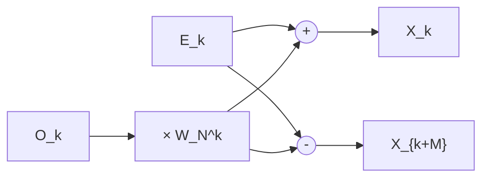

<!--metadata
  title: "Series And Transformations"
  authors: ["Subhajit", "claude.ai"]
  dateCreated: "19/07/2026"
  dateEdited: "19/07/2026"
  description: "A treatise on power-series expansion and integral-transform methods, for the second-year engineering mathematics curriculum"
  tags: [""]
-->


<!--

prompt:
---------

Write a detailed, bookish markdown treatise on Taylor & Maclaurin series, 
Fourier series (including the Discrete Fourier Transform and Fast Fourier 
Transform algorithms), the continuous Fourier Transform, and the Laplace 
Transform. Same structure as the earlier integral/vector-calculus treatise: 
rules, theorems, important proofs given in full where they illuminate the 
technique, worked examples, problem-solving tricks, and one genuinely hard, 
fully worked Challenge Problem per major section.

Pitch this at UNDERGRADUATE level, not high-school/JEE level — assume first- 
and second-year university math (limits, Riemann integration, linear algebra, 
complex numbers, basic ODEs). Write for a UG "Engineering Mathematics" / 
"Mathematical Methods" / "Signals & Systems" course and exams like GATE or 
university semester finals, not for JEE Advanced or the Olympiads. Where a 
fully rigorous proof needs machinery outside that scope (e.g. term-by-term 
differentiation of a Fourier series, or Bromwich-contour inversion of a 
Laplace transform), state the result, use it freely, and name the proof 
method rather than skip it silently — exactly as was done for the Gamma 
function's Reflection Formula last time.

Cover the following:

## Part 1 — Taylor and Maclaurin Series
- Taylor's theorem with remainder: Lagrange form, Cauchy form, integral 
  form; prove at least the Lagrange form (via the Cauchy Mean Value Theorem 
  or generalized Rolle)
- Maclaurin series as the a=0 case; standard table (e^x, sin x, cos x, 
  ln(1+x), (1+x)^α binomial series, arctan x, arcsin x, sinh x, cosh x) 
  with radius of convergence for each
- Radius/interval of convergence: ratio and root tests, Cauchy–Hadamard formula
- When term-by-term differentiation/integration of a power series is valid 
  (brief remark on uniform convergence)
- Manipulating known series: substitution, multiplying/dividing series, 
  composing series (e.g. e^(sin x)), differentiating/integrating a known 
  series to get a new one
- Taylor expansion in two variables (gradient/Hessian form), stated with 
  one small example
- Application: evaluating indeterminate limits via series instead of 
  L'Hôpital; remainder-based error bounds
- Challenge Problem candidate: prove e is irrational using the Maclaurin 
  series of e^x at x=1 and a remainder bound

## Part 2 — Fourier Series
- Derive the Fourier coefficients from orthogonality of {cos(nπx/L), 
  sin(nπx/L)} on [-L,L] — prove the orthogonality integrals
- Dirichlet conditions for convergence; convergence to the midpoint at a 
  jump discontinuity
- Complex exponential form of the series
- Half-range sine/cosine expansions (odd/even extensions)
- Parseval's theorem, proved
- The Gibbs phenomenon — what it is and why truncated series overshoot at jumps
- Application: separation of variables for the 1D heat equation
- Challenge Problem candidate: derive the Fourier series of a square wave, 
  then use Parseval's theorem to evaluate Σ(1/n²) = π²/6

## Part 3 — The Discrete Fourier Transform and FFT Algorithms
- DFT definition and inverse; relation to sampling a continuous signal 
  (briefly: Nyquist/aliasing)
- Properties: linearity, periodicity, circular convolution theorem, 
  conjugate symmetry for real input
- Why direct computation is O(N²)
- Full derivation of the radix-2 Cooley–Tukey decimation-in-time FFT: 
  splitting into even/odd samples, the butterfly, twiddle factors W_N^k, 
  and a proof that the recursion gives O(N log N)
- A clear survey (need not be fully derived) of the other major variants: 
  decimation-in-frequency, radix-4/split-radix, mixed-radix Cooley–Tukey, 
  the prime-factor (Good–Thomas) algorithm, and Bluestein's algorithm for 
  arbitrary N — what each buys you and when you'd reach for it
- Application: fast convolution via the convolution theorem
- Challenge Problem candidate: hand-compute an 8-point radix-2 DIT FFT via 
  the butterfly diagram for a specific sequence, checked against the direct DFT

## Part 4 — The Continuous Fourier Transform
- Motivate as the L→∞ limit of the Fourier series
- Forward/inverse transform, existence conditions
- Properties: linearity, time/frequency shift, scaling, differentiation 
  (F[f']=iωf̂), convolution theorem, Parseval/Plancherel
- Standard pairs: rect ↔ sinc, Gaussian ↔ Gaussian, delta ↔ 1, one-sided 
  exponential decay ↔ rational function of iω
- Duality; the sampling ↔ periodicity relationship tying this back to Part 3
- Challenge Problem candidate: prove the Fourier transform of e^(-at²) is 
  itself Gaussian — via differentiating under the integral sign to get a 
  first-order ODE it satisfies (same "Feynman's trick" as the earlier 
  treatise), not contour shifting

## Part 5 — The Laplace Transform
- Definition, region/abscissa of convergence, exponential-order existence condition
- Properties: linearity, first shifting theorem, second shifting theorem 
  (unit-step delay), differentiation/integration theorems (in both t and s), 
  convolution theorem
- Standard transform table, including unit step, Dirac delta, and the 
  periodic-function formula
- Inverting a transform: partial fractions (repeated/complex-conjugate 
  poles), convolution method, and — named but not fully derived — the 
  Bromwich/Mellin contour-inversion integral
- Initial Value and Final Value theorems, WITH validity conditions flagged 
  as a common pitfall (FVT gives a wrong answer if sF(s) has poles in the 
  closed right half-plane)
- Application: solving linear ODEs/systems with initial conditions, 
  including discontinuous or impulsive forcing (unit step / Dirac delta)
- Brief mention of transfer function / impulse response / pole-location vs 
  stability, for engineering flavour
- The s=iω relationship to the Part 4 Fourier transform
- Challenge Problem candidate: evaluate ∫₀^∞ (e^(-at)-e^(-bt))/t dt = ln(b/a) 
  using the "integrate the transform along s" identity 
  ∫₀^∞ f(t)/t dt = ∫₀^∞ F(s) ds

## Formatting and tone
- Markdown, LaTeX via $...$ / $$...$$
- Same bookish register as before: Theorem / Proof / Remark / Example / 
  Challenge Problem labels, ∎ (or $\blacksquare$) to close proofs
- Short Preface, Table of Contents, Conventions section, closing Master 
  Formula Sheet appendix — matching the earlier document's structure
- Close with a short "unifying theme" remark analogous to how the earlier 
  treatise tied Green's/Stokes'/Divergence back to the Fundamental Theorem 
  of Calculus — here, tying the DFT/FFT back to the continuous Fourier 
  transform, and the Fourier and Laplace transforms to each other, as the 
  natural analogue

model:
-------
calude sonnet 5 : extra

acc:
----
college email: 133

-->

# Series and Transforms: Taylor, Fourier, and Laplace Methods


## Preface

The first treatise in this sequence was about *integration* — about recovering a whole from an accumulation of infinitesimal parts, and about the family of theorems (Green's, Stokes', the Divergence Theorem) that generalize the Fundamental Theorem of Calculus to higher dimensions. This treatise is about something adjacent but distinct: *representation*. Given a function that may be transcendental, discontinuous, or known only empirically, how do we rebuild it — exactly, or to controlled accuracy — out of simpler pieces we already understand?

Two families of "simple pieces" dominate the undergraduate curriculum, and they correspond to two different philosophies of approximation.

The first family is **powers of $(x-a)$**. A Taylor series reconstructs $f$ in the *immediate neighborhood* of a point using only the local information encoded in its derivatives at that point. It is a fundamentally **local** representation: excellent near $a$, and it may say nothing useful far away (it may not even converge there).

The second family is **sinusoids and complex exponentials**, $e^{i\omega t}$. A Fourier series or transform reconstructs $f$ over its *entire domain* at once, using globally-defined oscillating basis functions. It is a fundamentally **global** representation, and it has a special property that Taylor series does not share: $e^{i\omega t}$ is an eigenfunction of the differentiation operator, $\frac{d}{dt}e^{i\omega t} = i\omega\, e^{i\omega t}$. This single fact is why Fourier and Laplace methods turn differential equations into algebra, and why they diagonalize convolution. We will return to this idea, and make it precise, in the closing section.

Along the way we pick up the Discrete Fourier Transform and the Fast Fourier Transform — the computational machinery that makes Fourier analysis practical on a computer — and the Laplace transform, which extends Fourier's idea to functions that don't decay, at the cost of trading a real frequency axis for a complex one.

As before: theorems are stated precisely, proofs are given in full where the machinery is within scope, and where full rigor requires tools beyond a first exposure (uniform convergence arguments, contour integration for inversion), the result is stated, used freely, and the *name* of the proof technique is given rather than waved away. Worked examples anchor each idea, and each Part closes with one Challenge Problem worked start to finish.

---

## Table of Contents

**Part I — Taylor and Maclaurin Series**
1.1 Taylor's Theorem with Remainder
1.2 The Maclaurin Series and the Standard Table
1.3 Radius and Interval of Convergence
1.4 Term-by-Term Differentiation and Integration
1.5 Manipulating Known Series
1.6 Taylor Series in Two Variables
1.7 Applications: Limits and Error Bounds
1.8 Challenge Problem I — The Irrationality of $e$

**Part II — Fourier Series**
2.1 Orthogonality and the Fourier Coefficients
2.2 Dirichlet Conditions and Convergence
2.3 The Complex Exponential Form
2.4 Half-Range Expansions
2.5 Parseval's Theorem
2.6 The Gibbs Phenomenon
2.7 Application: Separation of Variables for the Heat Equation
2.8 Challenge Problem II — The Square Wave and $\sum 1/n^2$

**Part III — The Discrete Fourier Transform and FFT Algorithms**
3.1 The DFT and Its Inverse
3.2 Properties of the DFT
3.3 The Cost of Direct Computation
3.4 The Radix-2 Cooley–Tukey FFT
3.5 A Survey of Other FFT Algorithms
3.6 Application: Fast Convolution
3.7 Challenge Problem III — An 8-Point FFT by Hand

**Part IV — The Continuous Fourier Transform**
4.1 From Series to Transform: The $L\to\infty$ Limit
4.2 Definition and Existence
4.3 Properties of the Fourier Transform
4.4 Standard Transform Pairs
4.5 Duality and the Sampling Theorem
4.6 Challenge Problem IV — The Fourier Transform of a Gaussian

**Part V — The Laplace Transform**
5.1 Definition and Region of Convergence
5.2 Properties of the Laplace Transform
5.3 The Standard Transform Table
5.4 Inversion Techniques
5.5 Initial and Final Value Theorems
5.6 Application: Linear ODEs with Discontinuous Forcing
5.7 Transfer Functions and Stability
5.8 The Relationship to the Fourier Transform
5.9 Challenge Problem V — A Frullani-Type Integral via Laplace

**Closing — A Unifying Theme**

**Appendix — Master Formula Sheet**

---

## Conventions

- $i = \sqrt{-1}$ throughout, except in §5.7 where the electrical-engineering symbol $j$ is noted as an alternative.
- Fourier series live on $[-L, L]$ with real basis $\left\{1, \cos\frac{n\pi x}{L}, \sin\frac{n\pi x}{L}\right\}$.
- The continuous Fourier transform is normalized as
$$\hat f(\omega) = \int_{-\infty}^{\infty} f(t)\, e^{-i\omega t}\, dt, \qquad f(t) = \frac{1}{2\pi}\int_{-\infty}^{\infty} \hat f(\omega)\, e^{i\omega t}\, d\omega,$$
the "angular frequency, non-unitary" convention. This is the most common choice in signals-and-systems courses; other textbooks use ordinary frequency ($e^{-2\pi i f t}$, no $1/2\pi$ needed) or a symmetric $1/\sqrt{2\pi}$ split. All are equivalent up to where the $2\pi$ is parked — a fact worth checking whenever you consult a second reference.
- The DFT is normalized as
$$X_k = \sum_{n=0}^{N-1} x_n\, e^{-i2\pi kn/N}, \qquad x_n = \frac{1}{N}\sum_{k=0}^{N-1} X_k\, e^{i2\pi kn/N},$$
and we write $W_N = e^{-i2\pi/N}$ for the primitive $N$-th root of unity used throughout Part III.
- The Laplace transform is the **unilateral** (one-sided) transform,
$$F(s) = \int_0^{\infty} f(t)\, e^{-st}\, dt, \qquad s = \sigma + i\omega \in \mathbb{C},$$
and $f(t)$ is understood to be $0$ for $t<0$ unless stated otherwise.
- $\blacksquare$ closes a proof.

---

## Part I — Taylor and Maclaurin Series

### 1.1 Taylor's Theorem with Remainder

The motivating question: if we know $f(a), f'(a), f''(a), \ldots, f^{(n)}(a)$, how well does the degree-$n$ Taylor polynomial
$$P_n(x) = \sum_{k=0}^n \frac{f^{(k)}(a)}{k!}(x-a)^k$$
approximate $f(x)$, and can we bound the error exactly?

**Theorem 1.1 (Taylor's Theorem with Lagrange Remainder).**
Let $f$ be $n+1$ times differentiable on an open interval $I$ containing $a$ and $x$. Then there exists $c$ strictly between $a$ and $x$ such that
$$f(x) = \underbrace{\sum_{k=0}^{n} \frac{f^{(k)}(a)}{k!}(x-a)^k}_{P_n(x)} + \underbrace{\frac{f^{(n+1)}(c)}{(n+1)!}(x-a)^{n+1}}_{R_n(x),\ \text{Lagrange form}}.$$

**Proof.** Fix $x \neq a$ and define, for $t$ between $a$ and $x$,
$$S(t) = \sum_{k=0}^{n} \frac{f^{(k)}(t)}{k!}(x-t)^k, \qquad \varphi(t) = f(x) - S(t).$$
Note $S(x) = f(x)$ (every term with $k\geq 1$ vanishes since $(x-x)^k=0$), so $\varphi(x)=0$; and $S(a) = P_n(x)$, so $\varphi(a) = f(x)-P_n(x) = R_n(x)$, exactly the remainder we want to characterize.

Differentiate $S$ with respect to $t$. The product rule applied to each term gives
$$S'(t) = \sum_{k=0}^n \left[\frac{f^{(k+1)}(t)}{k!}(x-t)^k - \frac{f^{(k)}(t)}{(k-1)!}(x-t)^{k-1}\right]_{k\geq 1\text{ for second piece}}.$$
More carefully: splitting the sum $S'(t)=\sum_{k=0}^n \frac{f^{(k+1)}(t)}{k!}(x-t)^k \;-\; \sum_{k=1}^{n} \frac{f^{(k)}(t)}{(k-1)!}(x-t)^{k-1}$, and reindexing the second sum with $j=k-1$ (so it runs $j=0,\ldots,n-1$ with the same summand as the first sum's $j$-th term), every term cancels except the top term of the first sum ($k=n$):
$$S'(t) = \frac{f^{(n+1)}(t)}{n!}(x-t)^n.$$
Hence $\varphi'(t) = -S'(t) = -\dfrac{f^{(n+1)}(t)}{n!}(x-t)^n$.

Now introduce the comparison function $\psi(t) = (x-t)^{n+1}$, so $\psi(x)=0$, $\psi(a) = (x-a)^{n+1}$, $\psi'(t) = -(n+1)(x-t)^n$. Since $\varphi$ and $\psi$ are differentiable on the interval between $a$ and $x$ and $\psi'\neq 0$ there (for $t\neq x$), the **Cauchy Mean Value Theorem** gives a point $c$ strictly between $a$ and $x$ with
$$\frac{\varphi(x)-\varphi(a)}{\psi(x)-\psi(a)} = \frac{\varphi'(c)}{\psi'(c)}.$$
The left side is $\dfrac{0 - R_n(x)}{0 - (x-a)^{n+1}} = \dfrac{R_n(x)}{(x-a)^{n+1}}$. The right side is
$$\frac{-f^{(n+1)}(c)(x-c)^n/n!}{-(n+1)(x-c)^n} = \frac{f^{(n+1)}(c)}{(n+1)!}.$$
Equating and solving for $R_n(x)$ gives exactly $R_n(x) = \dfrac{f^{(n+1)}(c)}{(n+1)!}(x-a)^{n+1}$. $\blacksquare$

**Remark (the Cauchy form falls out for free).** The proof above used the auxiliary comparison function $\psi(t)=(x-t)^{n+1}$; this was a *choice*, not a necessity. If instead we take the simplest possible comparison function, $\psi(t) = x-t$ (so $\psi'(t)=-1$), the same Cauchy Mean Value Theorem argument on the *same* $\varphi$ gives, for some $c$ between $a$ and $x$,
$$\frac{R_n(x)}{x-a} = \frac{\varphi'(c)}{-1} = \frac{f^{(n+1)}(c)}{n!}(x-c)^n \;\Longrightarrow\; R_n(x) = \frac{f^{(n+1)}(c)}{n!}(x-c)^n(x-a).$$
This is the **Cauchy form of the remainder**. It is less commonly used than the Lagrange form but is indispensable in one place you will meet again: the proof of the binomial series' convergence on the *full* interval $(-1,1)$, where the Lagrange form's estimate degrades near the endpoints but the Cauchy form's does not.

**Theorem 1.2 (Integral Form of the Remainder).**
If $f^{(n+1)}$ is continuous on the interval between $a$ and $x$, then
$$R_n(x) = \int_a^x \frac{f^{(n+1)}(t)}{n!}(x-t)^n\, dt.$$

**Proof sketch (induction on $n$, via integration by parts).** For $n=0$ this is just the Fundamental Theorem of Calculus: $f(x) = f(a) + \int_a^x f'(t)\,dt$. Assume the formula holds at order $n-1$: $R_{n-1}(x) = \int_a^x \frac{f^{(n)}(t)}{(n-1)!}(x-t)^{n-1}dt$. Integrate by parts with $u=f^{(n)}(t)$, $dv = \frac{(x-t)^{n-1}}{(n-1)!}dt$ (so $v = -\frac{(x-t)^n}{n!}$):
$$R_{n-1}(x) = \left[-\frac{f^{(n)}(t)(x-t)^n}{n!}\right]_a^x + \int_a^x \frac{f^{(n+1)}(t)}{n!}(x-t)^n\,dt = \frac{f^{(n)}(a)}{n!}(x-a)^n + R_n(x).$$
But by definition $R_{n-1}(x) = f(x) - P_{n-1}(x)$ and $P_n(x) = P_{n-1}(x) + \frac{f^{(n)}(a)}{n!}(x-a)^n$, so this identity says exactly $f(x)-P_{n-1}(x) = \frac{f^{(n)}(a)}{n!}(x-a)^n + R_n(x)$, i.e. $f(x) = P_n(x)+R_n(x)$ — consistent, and it exhibits $R_n$ in integral form, completing the induction. $\blacksquare$

**Remark.** All three forms describe the *same* number $R_n(x)$; they are three different ways of packaging it, useful in different contexts. Lagrange is the workhorse for error bounds (Part 1.7); Cauchy is needed for the binomial series' endpoint behavior; the integral form is what you differentiate under the integral sign, and is the natural form when $f^{(n+1)}$ is merely continuous rather than nicely bounded.

---

### 1.2 The Maclaurin Series and the Standard Table

**Definition.** The **Maclaurin series** of $f$ is its Taylor series about $a=0$:
$$f(x) \sim \sum_{k=0}^\infty \frac{f^{(k)}(0)}{k!}x^k.$$

The following table is the load-bearing wall of the entire subject — memorize it, and know *why* each radius of convergence is what it is (Section 1.3 makes this systematic).

| Function | Series | Radius of convergence |
|---|---|---|
| $e^x$ | $\displaystyle\sum_{n=0}^\infty \frac{x^n}{n!}$ | $\infty$ |
| $\sin x$ | $\displaystyle\sum_{n=0}^\infty \frac{(-1)^n x^{2n+1}}{(2n+1)!}$ | $\infty$ |
| $\cos x$ | $\displaystyle\sum_{n=0}^\infty \frac{(-1)^n x^{2n}}{(2n)!}$ | $\infty$ |
| $\sinh x$ | $\displaystyle\sum_{n=0}^\infty \frac{x^{2n+1}}{(2n+1)!}$ | $\infty$ |
| $\cosh x$ | $\displaystyle\sum_{n=0}^\infty \frac{x^{2n}}{(2n)!}$ | $\infty$ |
| $\ln(1+x)$ | $\displaystyle\sum_{n=1}^\infty \frac{(-1)^{n+1}x^n}{n}$ | $1$ (converges at $x=1$, diverges at $x=-1$) |
| $\arctan x$ | $\displaystyle\sum_{n=0}^\infty \frac{(-1)^n x^{2n+1}}{2n+1}$ | $1$ (converges at both endpoints) |
| $\arcsin x$ | $\displaystyle x+\sum_{n=1}^\infty \frac{(2n-1)!!}{(2n)!!}\frac{x^{2n+1}}{2n+1}$ | $1$ |
| $(1+x)^\alpha$ | $\displaystyle\sum_{n=0}^\infty \binom{\alpha}{n}x^n$, $\ \binom{\alpha}{n}=\frac{\alpha(\alpha-1)\cdots(\alpha-n+1)}{n!}$ | $1$ (endpoint behavior depends on $\alpha$) |

**Example 1.1.** Confirm the Maclaurin series of $\cos x$ by direct differentiation. $f(x)=\cos x$: $f(0)=1$, $f'(0)=-\sin 0=0$, $f''(0)=-\cos 0=-1$, $f'''(0)=\sin 0=0$, $f^{(4)}(0)=\cos 0=1$, and the pattern $1,0,-1,0,1,0,-1,0,\ldots$ repeats with period 4. Plugging into $\sum f^{(k)}(0)x^k/k!$ kills every odd term and alternates sign on the even ones, giving exactly $\sum_{n\geq0}(-1)^n x^{2n}/(2n)!$.

**Remark (binomial series endpoint behavior).** For $(1+x)^\alpha$: if $\alpha$ is a non-negative integer, the series terminates (it's just the Binomial Theorem) and converges everywhere. Otherwise the radius is exactly $1$; convergence at $x=\pm1$ depends delicately on $\alpha$ (e.g. converges at both endpoints for $\alpha>0$, at $x=1$ only for $-1<\alpha<0$, at neither for $\alpha\leq -1$) — this is precisely where the Cauchy remainder form from 1.1 is needed to control the endpoint, since the Lagrange form's bound blows up there.

---

### 1.3 Radius and Interval of Convergence

**Theorem 1.3 (Ratio Test for Power Series).** For $\sum_{n=0}^\infty c_n(x-a)^n$, let
$$L = \lim_{n\to\infty}\left|\frac{c_{n+1}}{c_n}\right|$$
(when the limit exists). The series converges absolutely for $|x-a|<1/L$ and diverges for $|x-a|>1/L$; i.e. the radius of convergence is $R=1/L$ (with the conventions $R=\infty$ if $L=0$, $R=0$ if $L=\infty$).

**Sketch.** Apply the ordinary ratio test to the terms $a_n = c_n(x-a)^n$: $\left|\frac{a_{n+1}}{a_n}\right| \to L|x-a|$, which is $<1$ (absolute convergence) exactly when $|x-a|<1/L$.

**Theorem 1.4 (Cauchy–Hadamard Formula).** More generally, without assuming the ratio limit exists,
$$\frac{1}{R} = \limsup_{n\to\infty} |c_n|^{1/n}.$$
This is the root-test analogue and is the *general* formula — it always exists (since $\limsup$ always exists in $[0,\infty]$), whereas the ratio-test limit sometimes doesn't (e.g. when the coefficients have gaps or oscillate multiplicatively).

**Example 1.2.** Find the radius of convergence of $\sum_{n=1}^\infty \frac{n!}{n^n}x^n$. Ratio test: $\left|\frac{c_{n+1}}{c_n}\right| = \frac{(n+1)!}{(n+1)^{n+1}}\cdot\frac{n^n}{n!} = \frac{n^n}{(n+1)^n} = \left(\frac{n}{n+1}\right)^n = \left(1+\frac1n\right)^{-n} \to \frac{1}{e}$. So $R = e$.

**Remark.** The interval of convergence is $(a-R,a+R)$ *plus possibly one or both endpoints*, which the ratio/root test cannot resolve (they give $L=1$ there, inconclusive) — endpoints must always be checked separately with a convergence test suited to the resulting numerical series (alternating series test, comparison test, etc., as in $\ln(1+x)$ above, which converges at $x=1$ by the alternating series test but diverges at $x=-1$, reducing to the negative harmonic series).

---

### 1.4 Term-by-Term Differentiation and Integration

A power series can be safely differentiated or integrated term by term *within its open interval of convergence* — but this is a theorem, not a triviality, and it is worth knowing precisely what makes it true.

**Theorem 1.5 (Term-by-Term Differentiation/Integration).** If $f(x) = \sum_{n=0}^\infty c_n(x-a)^n$ has radius of convergence $R>0$, then $f$ is infinitely differentiable on $(a-R,a+R)$, and for $|x-a|<R$:
$$f'(x) = \sum_{n=1}^\infty n c_n (x-a)^{n-1}, \qquad \int_a^x f(t)\,dt = \sum_{n=0}^\infty \frac{c_n}{n+1}(x-a)^{n+1},$$
and both the differentiated and the integrated series have the *same* radius of convergence $R$.

**Remark on why this is true (stated, not proved in full).** The rigorous justification rests on **uniform convergence**: a power series converges *uniformly* on any closed subinterval $[a-\rho,a+\rho]$ with $\rho<R$ strictly inside the interval of convergence (this itself follows by comparison with a convergent geometric series, the same estimate used in proving the ratio test). A general theorem of real analysis — uniform limits of continuous functions are continuous, and a uniformly convergent series of derivatives may be integrated/differentiated term by term against the original series — then delivers Theorem 1.5. We use this freely from here on; the full proof belongs to a course in real analysis, not engineering mathematics, but the name to remember is **uniform convergence on compact subintervals**.

**Example 1.3.** Differentiate the geometric series $\frac{1}{1-x}=\sum_{n=0}^\infty x^n$ ($|x|<1$) term by term:
$$\frac{1}{(1-x)^2} = \sum_{n=1}^\infty n x^{n-1} = \sum_{n=0}^\infty (n+1)x^n.$$
Differentiating again gives $\frac{2}{(1-x)^3}=\sum n(n-1)x^{n-2}$, and so on — a standard trick for summing series like $\sum n^2 x^n$.

---

### 1.5 Manipulating Known Series

Rather than computing derivatives from scratch, it is almost always faster to build a new series out of the standard table via algebraic operations valid inside the (smaller of the) relevant radii of convergence.

**Substitution.** Replace $x$ by a function of $x$. E.g. from $e^x=\sum x^n/n!$ ($R=\infty$), substitute $x\to -x^2$:
$$e^{-x^2} = \sum_{n=0}^\infty \frac{(-1)^n x^{2n}}{n!}, \qquad R=\infty.$$

**Multiplying series (Cauchy product).** If $f(x)=\sum a_n x^n$ and $g(x)=\sum b_n x^n$ both converge for $|x|<R$, then for $|x|<R$,
$$f(x)g(x) = \sum_{n=0}^\infty c_n x^n, \qquad c_n = \sum_{k=0}^n a_k b_{n-k}.$$

**Example 1.4.** $e^x \sin x$ up to $x^4$: $e^x = 1+x+\frac{x^2}2+\frac{x^3}6+\frac{x^4}{24}+\cdots$, $\sin x = x - \frac{x^3}{6}+\cdots$. Cauchy product, collecting by power:
- $x^1$: $1\cdot x = x$
- $x^2$: $1\cdot 0 + x\cdot x = x^2$
- $x^3$: $1\cdot(-1/6) + x\cdot 0 + \frac{x^2}{2}\cdot x \Rightarrow$ coefficient $-\frac16+\frac12=\frac13$
- $x^4$: coefficient works out to $0$ (by symmetry/direct computation)

giving $e^x\sin x = x+x^2+\frac{x^3}{3}+0\cdot x^4+\cdots$.

**Dividing series.** To find the series of $\tan x = \sin x/\cos x$, write $\tan x = c_1 x+c_3x^3+c_5x^5+\cdots$ (odd, since $\tan$ is odd) and solve $\sin x = \cos x \cdot \tan x$ coefficient-by-coefficient — this is usually faster than trying to invert $\cos x$'s series directly, and yields $\tan x = x+\frac{x^3}{3}+\frac{2x^5}{15}+\cdots$

**Composing series.** For $e^{\sin x}$, substitute the series for $\sin x$ into the series for $e^u$ and collect powers of $x$:
$$e^{\sin x} = 1+\sin x+\frac{\sin^2x}{2}+\frac{\sin^3x}6+\cdots = 1+\left(x-\frac{x^3}6+\cdots\right)+\frac12\left(x-\cdots\right)^2+\cdots = 1+x+\frac{x^2}{2}-\frac{x^4}{8}+\cdots$$
(collect term by term up to the desired order; this is mechanical but easy to make arithmetic slips in — always double check against a known symmetry, e.g. even/odd parity, as a sanity check).

**Differentiating/integrating a known series to reach a new one.** From $\frac{1}{1+x^2}=\sum_{n=0}^\infty(-1)^nx^{2n}$ ($|x|<1$), integrate term by term (Theorem 1.5) from $0$ to $x$:
$$\arctan x = \sum_{n=0}^\infty \frac{(-1)^n x^{2n+1}}{2n+1},$$
recovering the table entry directly — this is in fact the cleanest derivation of the arctan series, faster than computing $n$ derivatives of $\arctan$ by hand.

---

### 1.6 Taylor Series in Two Variables

**Definition (second-order Taylor expansion in $\mathbb{R}^2$).** For $f(x,y)$ with continuous second partials near $(a,b)$, writing $\mathbf{h}=(x-a,y-b)$, the gradient $\nabla f = (f_x,f_y)$, and the Hessian $H=\begin{pmatrix}f_{xx}&f_{xy}\\f_{xy}&f_{yy}\end{pmatrix}$ (all evaluated at $(a,b)$),
$$f(x,y) = f(a,b) + \nabla f(a,b)\cdot \mathbf{h} + \frac12\,\mathbf{h}^\mathsf{T} H(a,b)\,\mathbf{h} + O(\|\mathbf h\|^3).$$
Expanded out:
$$f(x,y) \approx f(a,b)+f_x(x-a)+f_y(y-b)+\frac12\Big[f_{xx}(x-a)^2+2f_{xy}(x-a)(y-b)+f_{yy}(y-b)^2\Big].$$

**Example 1.5.** Expand $f(x,y)=e^x\cos y$ to second order about the origin. Compute at $(0,0)$: $f=1$; $f_x=e^x\cos y=1$, $f_y=-e^x\sin y=0$; $f_{xx}=e^x\cos y=1$, $f_{yy}=-e^x\cos y=-1$, $f_{xy}=-e^x\sin y=0$. So
$$e^x\cos y \approx 1+x+\frac12(x^2-y^2).$$
(A quick check: setting $y=0$ recovers $e^x\approx 1+x+x^2/2$, correct.)

---

### 1.7 Applications: Limits and Error Bounds

**Series in place of L'Hôpital.** Indeterminate limits $\frac00$ often fall to a two- or three-term Taylor expansion faster than repeated differentiation.

**Example 1.6.** Evaluate $\displaystyle\lim_{x\to0}\frac{x-\sin x}{x^3}$. Using $\sin x = x-\frac{x^3}{6}+\frac{x^5}{120}-\cdots$:
$$\frac{x-\sin x}{x^3} = \frac{\frac{x^3}{6}-\frac{x^5}{120}+\cdots}{x^3} = \frac16-\frac{x^2}{120}+\cdots \;\xrightarrow{x\to0}\; \frac16.$$
Three applications of L'Hôpital would reach the same answer with far more arithmetic risk.

**Remainder-based error bounds.** Theorem 1.1 (Lagrange form) gives a *guaranteed* bound on how badly $P_n(x)$ approximates $f(x)$: if $|f^{(n+1)}(t)|\leq M$ for all $t$ between $a$ and $x$, then
$$|R_n(x)| \leq \frac{M}{(n+1)!}|x-a|^{n+1}.$$

**Example 1.7.** How many terms of the Maclaurin series for $\sin x$ are needed to compute $\sin(0.5)$ to within $10^{-6}$? Since all derivatives of $\sin$ are bounded by $1$, $|R_n(0.5)|\leq \frac{(0.5)^{n+1}}{(n+1)!}$. Trying $n=6$: $\frac{(0.5)^7}{7!} = \frac{0.0078125}{5040}\approx 1.55\times10^{-6}$ — not quite there. Trying $n=7$: $\frac{(0.5)^8}{8!}\approx 9.7\times10^{-8}$, comfortably under $10^{-6}$. Since the $\sin$ series has only odd powers, $n=7$ means the terms up to and including $x^7/7!$ (i.e. 4 nonzero terms) suffice.

---

### 1.8 Challenge Problem I — The Irrationality of $e$

**Problem.** Using the Maclaurin series of $e^x$ evaluated at $x=1$ and the Lagrange remainder bound, prove that $e$ is irrational.

**Solution.** Recall $e = \sum_{k=0}^\infty \frac{1}{k!}$. Fix any $n\geq 1$ and apply Taylor's theorem (Theorem 1.1) to $f(x)=e^x$ at $a=0$, $x=1$:
$$e = \sum_{k=0}^n \frac{1}{k!} + R_n, \qquad R_n = \frac{e^{c}}{(n+1)!} \text{ for some } c\in(0,1).$$
Since $0<c<1$ and $e^x$ is increasing, $1<e^c<e<3$, hence
$$
0 < R_n < \frac{3}{(n+1)!}. \tag{*}
$$

Now suppose, for contradiction, that $e=p/q$ for positive integers $p,q$. Choose $n\geq \max(q,3)$. Multiply the Taylor identity through by $n!$:
$$n!\,e = n!\sum_{k=0}^n \frac1{k!} + n!\,R_n.$$

*Left side is an integer.* $n!\,e = n!\cdot\frac pq = p\cdot\frac{n!}{q}$, and since $q\leq n$, $q$ divides $n!$, so $n!/q\in\mathbb Z$; hence $n!e\in\mathbb Z$.

*The finite sum, scaled by $n!$, is an integer.* $\displaystyle n!\sum_{k=0}^n\frac1{k!}=\sum_{k=0}^n \frac{n!}{k!}$, and for each $k\leq n$, $\frac{n!}{k!}=n(n-1)\cdots(k+1)$ is a product of integers, hence an integer. So the whole sum is an integer.

Therefore $n!R_n = n!e - (\text{integer sum})$ must **also** be an integer. But by $(\ast)$,
$$0 < n!R_n < \frac{3n!}{(n+1)!} = \frac{3}{n+1} \leq \frac{3}{4} < 1 \quad(\text{since } n\geq 3).$$
So $n!R_n$ is an integer strictly between $0$ and $1$ — impossible. This contradiction shows no such $p,q$ exist: $e$ is irrational. $\blacksquare$

**Remark.** This is Fourier's own 1815 proof (yes, that Fourier), and it is a beautiful early illustration of a technique that recurs throughout analytic number theory: turn a convergent series into an *integer sandwiched strictly between two consecutive integers*, and conclude it doesn't exist.

---

## Part II — Fourier Series

### 2.1 Orthogonality and the Fourier Coefficients

The entire machinery of Fourier series rests on one computational fact: the functions $\left\{1,\ \cos\frac{n\pi x}{L},\ \sin\frac{n\pi x}{L}\right\}_{n=1}^\infty$ are pairwise **orthogonal** on $[-L,L]$ under the inner product $\langle f,g\rangle = \int_{-L}^L f(x)g(x)\,dx$.

**Theorem 2.1 (Orthogonality Relations).** For integers $m,n\geq 1$,
$$\int_{-L}^{L}\cos\frac{m\pi x}{L}\cos\frac{n\pi x}{L}\,dx = \begin{cases}0 & m\neq n\\ L & m=n\end{cases},\qquad \int_{-L}^{L}\sin\frac{m\pi x}{L}\sin\frac{n\pi x}{L}\,dx = \begin{cases}0 & m\neq n\\ L & m=n\end{cases},$$
$$\int_{-L}^L \sin\frac{m\pi x}{L}\cos\frac{n\pi x}{L}\,dx = 0 \ \text{ for all } m,n,$$
and $\int_{-L}^L \cos\frac{n\pi x}{L}\,dx = \int_{-L}^L\sin\frac{n\pi x}{L}\,dx = 0$ for $n\geq1$, while $\int_{-L}^L 1\,dx = 2L$.

**Proof.** Use the product-to-sum identities
$$\cos A\cos B=\tfrac12[\cos(A-B)+\cos(A+B)],\quad \sin A\sin B=\tfrac12[\cos(A-B)-\cos(A+B)],\quad \sin A\cos B=\tfrac12[\sin(A+B)+\sin(A-B)]$$
with $A=\frac{m\pi x}L$, $B=\frac{n\pi x}L$. Each product becomes a sum of two single cosines or sines of the form $\cos\frac{k\pi x}{L}$ or $\sin\frac{k\pi x}{L}$ for integer $k=m\pm n$. Now use the elementary fact that for any nonzero integer $k$,
$$\int_{-L}^{L}\cos\frac{k\pi x}{L}\,dx = \left[\frac{L}{k\pi}\sin\frac{k\pi x}{L}\right]_{-L}^{L} = \frac{L}{k\pi}\big(\sin k\pi - \sin(-k\pi)\big) = 0,$$
since $\sin(k\pi)=0$ for integer $k$; and trivially $\int_{-L}^L \sin\frac{k\pi x}{L}dx=0$ for all integer $k$ (odd integrand... more directly, antiderivative $-\frac{L}{k\pi}\cos\frac{k\pi x}L$ evaluated symmetrically gives $0$), while for $k=0$ the "$\cos$" term is just $1$ and integrates to $2L$.

For $\cos\cos$: if $m\neq n$, both $\cos\frac{(m-n)\pi x}L$ and $\cos\frac{(m+n)\pi x}L$ have nonzero integer index $k=m\pm n\neq0$ (since $m,n\geq1$, $m+n\neq0$ always, and $m\neq n$ rules out $k=m-n=0$), so both integrate to $0$, giving total $0$. If $m=n$, the $\cos\frac{(m-n)\pi x}{L}=\cos 0=1$ term integrates to $2L$, and the $\cos\frac{2n\pi x}L$ term integrates to $0$; averaging with the $\frac12$ prefactor gives $\frac12(2L+0)=L$. The $\sin\sin$ case is identical with a sign flip on the second piece, giving the same final answer $L$ (at $m=n$) or $0$ (at $m\neq n$). The $\sin\cos$ case: both resulting terms are sines of nonzero-or-zero integer index, and $\int\sin(k\pi x/L)dx=0$ even at $k=0$ (since $\sin 0=0$ identically) — so this integral is *always* zero, mixed or not. $\blacksquare$

**Deriving the coefficients.** Suppose $f(x) = \dfrac{a_0}{2}+\sum_{n=1}^\infty\left(a_n\cos\dfrac{n\pi x}{L}+b_n\sin\dfrac{n\pi x}{L}\right)$ on $[-L,L]$ (convergence assumptions deferred to §2.2). To isolate $a_m$ ($m\geq1$), multiply both sides by $\cos\frac{m\pi x}{L}$ and integrate over $[-L,L]$; by Theorem 2.1, *every* term on the right vanishes under integration except the single $a_m\cos\frac{m\pi x}L$ term against itself, which contributes $a_mL$:
$$\int_{-L}^L f(x)\cos\frac{m\pi x}{L}\,dx = a_m L \;\Longrightarrow\; a_m = \frac1L\int_{-L}^L f(x)\cos\frac{m\pi x}L\,dx.$$
Identically, multiplying by $\sin\frac{m\pi x}L$ isolates
$$b_m = \frac1L\int_{-L}^L f(x)\sin\frac{m\pi x}L\,dx,$$
and multiplying by $1$ (or setting $m=0$ in the cosine formula, which is why the constant term is conventionally written $a_0/2$) gives $a_0 = \frac1L\int_{-L}^L f(x)\,dx$.

This term-by-term integration is justified rigorously by uniform convergence, exactly as in §1.4 — a fact we invoke without re-proving.

---

### 2.2 Dirichlet Conditions and Convergence

**Theorem 2.2 (Dirichlet's Convergence Theorem, stated).** Suppose $f$ is periodic with period $2L$ and on $[-L,L]$ satisfies the **Dirichlet conditions**: $f$ has at most finitely many discontinuities, at most finitely many local extrema, and $\int_{-L}^L |f(x)|\,dx<\infty$. Then the Fourier series of $f$ converges at every point $x$ to
$$\frac{f(x^-)+f(x^+)}{2},$$
the average of the left- and right-hand limits. In particular, at every point of continuity the series converges to $f(x)$ itself, and at a jump discontinuity it converges to the **midpoint of the jump**.

**Remark (why this is stated rather than proved).** The full proof analyzes the partial-sum sequence via the **Dirichlet kernel** $D_N(x) = \sum_{n=-N}^N e^{in\pi x/L}$, shows the partial sum is a convolution $f * D_N$, and controls this convolution's limiting behavior using the Riemann–Lebesgue lemma. This is standard machinery in a real-analysis course but is more than a first exposure needs; we use the theorem's *conclusion* freely.

**Example 2.1.** The square wave of §2.8 has a jump discontinuity at $x=0$, from $-1$ (as $x\to0^-$) to $+1$ (as $x\to0^+$). Dirichlet's theorem predicts the Fourier series converges *at $x=0$ itself* to $\frac{-1+1}{2}=0$ — and indeed every term of that series is a sine, and every sine vanishes at $x=0$, so the series sums to exactly $0$ there, consistent with the midpoint prediction.

---

### 2.3 The Complex Exponential Form

Using $\cos\theta = \frac{e^{i\theta}+e^{-i\theta}}2$, $\sin\theta=\frac{e^{i\theta}-e^{-i\theta}}{2i}$, the real Fourier series can be repackaged as a single two-sided sum.

**Theorem 2.3.** $\displaystyle f(x) = \sum_{n=-\infty}^{\infty} c_n\, e^{in\pi x/L}$, where
$$c_n = \frac{1}{2L}\int_{-L}^{L} f(x)\, e^{-in\pi x/L}\,dx,$$
and the relationship to the real coefficients is $c_0=\dfrac{a_0}2$, and for $n\geq1$: $c_n = \dfrac{a_n-ib_n}2$, $c_{-n}=\dfrac{a_n+ib_n}2=\overline{c_n}$ (the last equality holding whenever $f$ is real-valued).

**Derivation.** Substitute the exponential expressions for $\cos,\sin$ into the real series and collect terms by $e^{in\pi x/L}$; alternatively, note that $\{e^{in\pi x/L}\}_{n\in\mathbb Z}$ is itself an orthogonal set on $[-L,L]$ under the Hermitian inner product $\langle f,g\rangle=\int_{-L}^L f\bar g\,dx$ (since $\int_{-L}^L e^{im\pi x/L}e^{-in\pi x/L}dx = \int_{-L}^L e^{i(m-n)\pi x/L}dx$ is $2L$ if $m=n$ and $0$ otherwise, by the same nonzero-integer-index argument as Theorem 2.1), and repeat the coefficient-isolation trick of §2.1 directly in this basis.

**Example 2.2.** This form is what generalizes most directly to the DFT in Part III: note the coefficient formula $c_n=\frac1{2L}\int f(x)e^{-in\pi x/L}dx$ is a continuous integral analogue of the discrete sum $X_k=\sum_n x_n e^{-i2\pi kn/N}$ — same exponential kernel, integral replaced by sum, continuous index replaced by discrete.

---

### 2.4 Half-Range Expansions

If $f$ is only defined on $[0,L]$ (a common situation — e.g. the initial temperature profile of a rod occupying $[0,L]$), we are free to *extend* it to $[-L,L]$ however we like before Fourier-expanding, and the extension we choose determines which half of the basis survives.

- **Odd extension** ($f(-x):=-f(x)$) forces every $a_n=0$ (since $f(x)\cos\frac{n\pi x}L$ is then odd, and the integral of an odd function over a symmetric interval vanishes), leaving the **half-range sine series**
$$f(x) = \sum_{n=1}^\infty b_n\sin\frac{n\pi x}{L}, \qquad b_n = \frac2L\int_0^L f(x)\sin\frac{n\pi x}L\,dx.$$
- **Even extension** ($f(-x):=f(x)$) forces every $b_n=0$, leaving the **half-range cosine series**
$$f(x) = \frac{a_0}2+\sum_{n=1}^\infty a_n\cos\frac{n\pi x}{L}, \qquad a_n = \frac2L\int_0^L f(x)\cos\frac{n\pi x}L\,dx.$$

Both represent $f$ correctly on $(0,L)$; they differ only in how they (fictitiously) continue $f$ outside that interval, which is exactly why the choice matters for PDE boundary conditions (§2.7): a sine series automatically satisfies $f(0)=f(L)=0$-type (Dirichlet) boundary data, a cosine series automatically satisfies zero-slope (Neumann) boundary data at the endpoints.

**Example 2.3.** Find the half-range sine series of $f(x)=x$ on $(0,\pi)$ (so $L=\pi$). $b_n = \frac2\pi\int_0^\pi x\sin(nx)\,dx$. Integrate by parts: $\int x\sin(nx)dx = -\frac{x\cos(nx)}n+\frac{\sin(nx)}{n^2}$. Evaluating $0$ to $\pi$: $-\frac{\pi\cos(n\pi)}n+0-(0+0)=-\frac{\pi(-1)^n}n$. So $b_n=\frac2\pi\cdot\left(-\frac{\pi(-1)^n}n\right)=\frac{2(-1)^{n+1}}n$, giving
$$x = \sum_{n=1}^\infty \frac{2(-1)^{n+1}}n\sin(nx), \qquad 0<x<\pi.$$

---

### 2.5 Parseval's Theorem

**Theorem 2.4 (Parseval's Theorem for Fourier Series).** If $f(x)=\dfrac{a_0}2+\displaystyle\sum_{n=1}^\infty\left(a_n\cos\frac{n\pi x}L+b_n\sin\frac{n\pi x}L\right)$, then
$$\frac1L\int_{-L}^{L} [f(x)]^2\,dx = \frac{a_0^2}{2}+\sum_{n=1}^\infty\left(a_n^2+b_n^2\right).$$

**Proof.** Multiply the series for $f(x)$ by $f(x)$ itself and integrate term by term over $[-L,L]$ (justified by uniform convergence, as before):
$$\int_{-L}^L [f(x)]^2\,dx = \int_{-L}^L f(x)\left[\frac{a_0}2+\sum_{n=1}^\infty\left(a_n\cos\frac{n\pi x}L+b_n\sin\frac{n\pi x}L\right)\right]dx.$$
Distribute the integral and recognize each piece as exactly the defining integral for a Fourier coefficient from §2.1:
$$= \frac{a_0}{2}\underbrace{\int_{-L}^L f(x)\,dx}_{=a_0L} + \sum_{n=1}^\infty\left(a_n\underbrace{\int_{-L}^L f(x)\cos\tfrac{n\pi x}Ldx}_{=a_nL}+b_n\underbrace{\int_{-L}^Lf(x)\sin\tfrac{n\pi x}Ldx}_{=b_nL}\right)$$
$$= \frac{a_0^2L}2+L\sum_{n=1}^\infty(a_n^2+b_n^2).$$
Dividing both sides by $L$ gives the claim. $\blacksquare$

**Remark.** Parseval's theorem is an infinite-dimensional Pythagorean theorem: it says the "energy" of $f$ (mean-square value) equals the sum of the squared "lengths" of its projections onto each orthogonal basis direction. It is the single most useful *evaluative* tool in the whole subject — it turns a Fourier series (which you compute once) into an exact evaluation of an unrelated-looking numerical series, as in the Challenge Problem below.

---

### 2.6 The Gibbs Phenomenon

At a jump discontinuity, truncating a Fourier series to $N$ terms does **not** simply produce a smoothed-out approximation that flattens as $N\to\infty$. Instead, the partial sum $S_N(x)$ persistently **overshoots** the jump by a fixed fraction of the jump's height, no matter how large $N$ is — the overshoot's *location* shrinks toward the discontinuity as $N\to\infty$, but its *size* does not shrink.

**Theorem 2.5 (Gibbs phenomenon, stated).** For a jump of height $h=f(x_0^+)-f(x_0^-)$, the partial sums overshoot the upper value by approximately
$$\left(\frac{2}{\pi}\int_0^\pi \frac{\sin t}{t}\,dt - 1\right)\cdot\frac{h}{2} \approx 0.0895 \cdot h,$$
i.e. an overshoot of about $9\%$ of the jump height, persisting in the limit $N\to\infty$ (with the overshoot location converging to $x_0$).

**Why it happens (qualitative).** Each partial sum $S_N$ is the convolution of $f$ with the Dirichlet kernel $D_N$, which itself doesn't approach the ideal "picking-out" delta function uniformly — it retains oscillatory side-lobes of fixed relative height even as $N$ grows; those side-lobes are what produce the persistent ripple near a jump. Since this involves the same Dirichlet-kernel analysis flagged in §2.2, we state the $9\%$ figure rather than re-derive it.

**Remark (practical relevance).** This is why abruptly truncated Fourier reconstructions of square-edged signals always show "ringing" near edges — in image and audio compression this motivates windowing techniques that trade off sharper cutoffs against reduced ringing.

---

### 2.7 Application: Separation of Variables for the Heat Equation

Consider a rod of length $L$ with ends held at zero temperature, governed by the 1D heat equation
$$\frac{\partial u}{\partial t} = \alpha\,\frac{\partial^2 u}{\partial x^2}, \qquad u(0,t)=u(L,t)=0, \qquad u(x,0)=f(x).$$

**Separation of variables.** Seek solutions of the product form $u(x,t)=X(x)T(t)$. Substituting: $XT'=\alpha X''T$, so $\dfrac{T'}{\alpha T}=\dfrac{X''}{X}=-\lambda$ (a separation constant, forced negative for bounded, decaying-in-time, non-trivial solutions). This splits into two ODEs:
$$X''+\lambda X=0, \qquad X(0)=X(L)=0; \qquad\qquad T'=-\alpha\lambda T.$$
The $X$-equation with these boundary conditions is a Sturm–Liouville eigenvalue problem whose eigenfunctions are exactly $X_n(x)=\sin\dfrac{n\pi x}{L}$ with eigenvalues $\lambda_n=\left(\dfrac{n\pi}{L}\right)^2$, $n=1,2,3,\ldots$ — the same sine basis as the half-range sine series of §2.4! The $T$-equation then gives $T_n(t)=e^{-\alpha\lambda_n t}$.

**Assembling the general solution.** The general solution is a superposition
$$u(x,t)=\sum_{n=1}^\infty b_n\sin\frac{n\pi x}L\, e^{-\alpha(n\pi/L)^2t}.$$
The initial condition $u(x,0)=f(x)$ then **forces** $\sum b_n \sin\frac{n\pi x}L = f(x)$ — precisely the half-range sine expansion of the initial data, with $b_n$ given by the formula of §2.4. This is the payoff of the whole apparatus: Fourier series exist not merely to represent functions, but because they are exactly the eigenfunction expansions that diagonalize the spatial operator in a separable PDE, turning a PDE into an infinite decoupled family of ODEs.

---

### 2.8 Challenge Problem II — The Square Wave and $\sum 1/n^2$

**Problem.** Find the Fourier series of the square wave $f(x)=\begin{cases}-1 & -L<x<0\\ \ \ 1 & 0<x<L\end{cases}$ (period $2L$), then use Parseval's theorem to evaluate $\displaystyle\sum_{n=1}^\infty \frac1{n^2}$.

**Solution — the series.** $f$ is odd, so $a_n=0$ for all $n$ (including $a_0$). Compute
$$b_n = \frac1L\int_{-L}^{L}f(x)\sin\frac{n\pi x}L\,dx = \frac2L\int_0^L \sin\frac{n\pi x}L\,dx = \frac2L\left[-\frac{L}{n\pi}\cos\frac{n\pi x}{L}\right]_0^L = \frac2{n\pi}\big(1-\cos n\pi\big) = \frac{2}{n\pi}\big(1-(-1)^n\big).$$
This vanishes for even $n$ and equals $\frac4{n\pi}$ for odd $n$. So
$$f(x) = \frac4\pi\sum_{k=0}^\infty \frac{1}{2k+1}\sin\frac{(2k+1)\pi x}{L}.$$

**Solution — Parseval.** By Theorem 2.4 with $a_0=0$, all $a_n=0$:
$$\frac1L\int_{-L}^L [f(x)]^2\,dx = \sum_{n=1}^\infty b_n^2.$$
The left side is trivial since $f(x)^2\equiv1$ everywhere: $\frac1L\int_{-L}^L 1\,dx = \frac1L(2L)=2$. The right side, using $b_n=\frac4{n\pi}$ for odd $n$ and $0$ for even $n$:
$$\sum_{n \text{ odd}} \left(\frac{4}{n\pi}\right)^2 = \frac{16}{\pi^2}\sum_{n\text{ odd}}\frac1{n^2}.$$
Equating: $2=\dfrac{16}{\pi^2}\displaystyle\sum_{n\text{ odd}}\dfrac1{n^2}$, so
$$\sum_{n\text{ odd}}\frac{1}{n^2} = \frac{\pi^2}{8}.$$

**Recovering the full sum.** Split the sum over *all* positive integers into odd and even parts, and note the even part telescopes back to a copy of the full sum:
$$S:=\sum_{n=1}^\infty\frac1{n^2} = \underbrace{\sum_{n\text{ odd}}\frac1{n^2}}_{\pi^2/8} + \underbrace{\sum_{k=1}^\infty\frac1{(2k)^2}}_{=\frac14 S}.$$
So $S = \dfrac{\pi^2}8+\dfrac S4$, giving $\dfrac{3S}4=\dfrac{\pi^2}8$, hence
$$\boxed{\sum_{n=1}^\infty\frac1{n^2} = \frac{\pi^2}{6}.}$$

**Remark.** This is the Basel problem, famously first solved by Euler in 1735 by an entirely different (and, by 18th-century standards of rigor, shaky) route through the sine product formula. The Fourier/Parseval route above is fully rigorous given only Theorem 2.4, and is one of the cleanest applications of Fourier analysis to "pure" summation problems — the same trick evaluates $\sum 1/n^4$, $\sum 1/n^6$, etc. from the Parseval identity of higher-degree polynomial or triangle-wave Fourier series.

---

## Part III — The Discrete Fourier Transform and FFT Algorithms

### 3.1 The DFT and Its Inverse

Given a finite sequence of $N$ samples $x_0,x_1,\ldots,x_{N-1}$ (typically uniform samples of a continuous signal), the **Discrete Fourier Transform** is
$$X_k = \sum_{n=0}^{N-1} x_n\, W_N^{nk}, \qquad k=0,1,\ldots,N-1, \qquad W_N:=e^{-i2\pi/N},$$
with inverse
$$x_n = \frac1N\sum_{k=0}^{N-1}X_k\,W_N^{-nk}.$$

**Why the inverse formula works.** This is again an orthogonality statement, now on the *discrete* inner product $\langle u,v\rangle=\sum_{n=0}^{N-1}u_n\overline{v_n}$: the vectors $\left(W_N^{nk}\right)_{n=0}^{N-1}$ for $k=0,\ldots,N-1$ are pairwise orthogonal, since
$$\sum_{n=0}^{N-1}W_N^{n(k-j)} = \sum_{n=0}^{N-1}\left(e^{i2\pi(k-j)/N}\right)^n = \begin{cases}N & k=j\\ \dfrac{1-e^{i2\pi(k-j)}}{1-e^{i2\pi(k-j)/N}}=0 & k\neq j\end{cases}$$
(a finite geometric series that telescopes to $0$ whenever $k\neq j$, since the numerator is exactly $1-1=0$ while the denominator is nonzero for $0<|k-j|<N$). Substituting the DFT formula for $X_k$ into the proposed inverse and using this orthogonality collapses the double sum to recover $x_n$ exactly — the discrete parallel of the continuous derivation in §2.1 and §2.3.

**Relation to sampling and aliasing (brief).** If $x_n=f(nT)$ are samples of a continuous signal at spacing $T$ (sampling rate $f_s=1/T$), the DFT approximates samples of the continuous Fourier transform of $f$, but only faithfully if $f$ contains no frequency content at or above the **Nyquist frequency** $f_s/2$; frequency content above this folds back ("aliases") onto lower frequencies in the DFT output. This is made precise in §4.5 once the continuous transform is in hand.

---

### 3.2 Properties of the DFT

Writing $\mathrm{DFT}\{x_n\}=X_k$:

- **Linearity.** $\mathrm{DFT}\{ax_n+by_n\}=aX_k+bY_k$.
- **Periodicity.** $X_{k+N}=X_k$ and $x_{n+N}=x_n$ — both the sequence and its transform are naturally indexed modulo $N$, since $W_N^{n(k+N)}=W_N^{nk}W_N^{nN}=W_N^{nk}\cdot1$.
- **Circular convolution theorem.** Define the circular convolution $(x\circledast y)_n = \sum_{m=0}^{N-1}x_m\,y_{(n-m)\bmod N}$. Then
$$\mathrm{DFT}\{x\circledast y\} = X_k\cdot Y_k,$$
i.e. circular convolution in the time domain becomes ordinary pointwise multiplication in the frequency domain — the discrete analogue of the continuous convolution theorem (§4.3), and the reason the DFT is the natural tool for fast convolution (§3.6).
- **Conjugate symmetry for real input.** If every $x_n\in\mathbb R$, then $X_{N-k}=\overline{X_k}$ (equivalently $X_{-k}=\overline{X_k}$, using periodicity to identify index $-k$ with $N-k$). This halves the independent information in the spectrum of a real signal — only $k=0,\ldots,\lfloor N/2\rfloor$ need be stored, the rest follow by conjugation.

---

### 3.3 The Cost of Direct Computation

Computing a single $X_k$ from the defining sum costs $N$ complex multiplications and $N-1$ additions. Computing *all* $N$ outputs this way costs $O(N^2)$ complex multiplications total. For $N=10^6$ samples (unremarkable in audio or image processing), this is $10^{12}$ operations — the entire motivation for the FFT is to bring this down to $O(N\log N)\approx 2\times10^7$, a five-order-of-magnitude speedup.

---

### 3.4 The Radix-2 Cooley–Tukey FFT

Assume $N=2M$ is even (the recursive algorithm below assumes $N$ is a power of $2$, applying this split repeatedly).

**The split.** Partition the sum defining $X_k$ by parity of the index $n$: let $n=2m$ (even) or $n=2m+1$ (odd), $m=0,\ldots,M-1$:
$$X_k = \sum_{m=0}^{M-1}x_{2m}\,W_N^{2mk} + \sum_{m=0}^{M-1}x_{2m+1}\,W_N^{(2m+1)k} = \sum_{m=0}^{M-1}x_{2m}\,\big(W_N^2\big)^{mk} + W_N^k\sum_{m=0}^{M-1}x_{2m+1}\,\big(W_N^2\big)^{mk}.$$
Now observe $W_N^2 = e^{-i4\pi/N}=e^{-i2\pi/(N/2)}=W_M$. So both inner sums are themselves **$M$-point DFTs**:
$$X_k = E_k + W_N^k\,O_k, \qquad k=0,\ldots,M-1,$$
where $E_k=\sum_m x_{2m}W_M^{mk}$ is the $M$-point DFT of the even-indexed samples, and $O_k=\sum_m x_{2m+1}W_M^{mk}$ is the $M$-point DFT of the odd-indexed samples.

**The butterfly.** $E_k$ and $O_k$ are only defined (so far) for $k=0,\ldots,M-1$, but since they are themselves $M$-point DFTs, they are automatically periodic with period $M$: $E_{k+M}=E_k$, $O_{k+M}=O_k$. Meanwhile
$$W_N^{k+M} = W_N^k\, W_N^M = W_N^k\, e^{-i2\pi M/N} = W_N^k\, e^{-i\pi} = -W_N^k.$$
So for $k=0,\ldots,M-1$ we get **two** outputs from one pair $(E_k,O_k)$:
$$X_k = E_k + W_N^k O_k, \qquad X_{k+M}=E_k - W_N^k O_k.$$
This is the **butterfly**: one complex multiplication ($W_N^k O_k$, called the **twiddle factor** multiplication), one complex addition, one complex subtraction, producing two outputs. Diagrammatically:

```txt
E_k ---------(+)------- X_k
        \    /
         \  /
          \/
          /\
         /  \
        /    \
O_k --[×W_N^k]--(-)---- X_{k+M}
```



**The recursion.** Each $M$-point DFT is computed the same way, recursively, until we reach $1$-point DFTs (trivial: $X_0=x_0$). Since $N=2^p$, this recursion has exactly $p=\log_2N$ levels; index bookkeeping (which samples land in which sub-DFT after repeated even/odd splitting) works out to exactly the **bit-reversal permutation**: sample $x_n$ ends up, before the butterflies begin, at the position whose binary representation is the bit-reversal of $n$'s binary representation.

**Theorem 3.1 ($O(N\log N)$ complexity).** The radix-2 FFT computes all $N$ DFT outputs in $O(N\log N)$ complex multiplications, versus $O(N^2)$ for direct computation.

**Proof.** Let $T(N)$ denote the operation count. Combining two $M=N/2$-point DFTs into one $N$-point DFT via the butterfly costs $O(N)$ (one twiddle multiplication and two adds per butterfly, $N/2$ butterflies), giving the recurrence
$$T(N) = 2T(N/2) + cN$$
for some constant $c$, with base case $T(1)=O(1)$. Write $N=2^p$ and prove by induction on $p$ that $T(2^p) = c\,2^p\,p + O(2^p)$.

*Base case* $p=0$: $T(1)=O(1)$, consistent with $c\cdot1\cdot0+O(1)$.

*Inductive step:* assume $T(2^{p-1}) = c\,2^{p-1}(p-1)+O(2^{p-1})$. Then
$$T(2^p) = 2T(2^{p-1})+c\,2^p = 2\Big[c\,2^{p-1}(p-1)+O(2^{p-1})\Big]+c\,2^p = c\,2^p(p-1)+O(2^p)+c\,2^p = c\,2^p\,p+O(2^p).$$
Since $p=\log_2N$, this is $T(N)=cN\log_2N+O(N) = O(N\log N)$. $\blacksquare$

---

### 3.5 A Survey of Other FFT Algorithms

The radix-2 decimation-in-time (DIT) algorithm above is the canonical teaching example, but production FFT libraries use a broader toolkit:

- **Decimation-in-frequency (DIF).** Instead of splitting the *input* by even/odd index, split the *output* $X_k$ by parity of $k$. This produces a structurally dual butterfly (twiddle multiplication happens *before* the add/subtract rather than after) and a *bit-reversed output* rather than bit-reversed input — useful when it's more convenient to reorder the spectrum than the samples.
- **Radix-4 and split-radix.** Splitting into 4 interleaved subsequences instead of 2 reduces the total multiplication count further (radix-4 butterflies reuse more common sub-results), and split-radix algorithms (mixing radix-2 and radix-4 splits at different recursion levels) achieve close to the theoretical minimum multiplication count for power-of-two $N$. The payoff is a smaller constant in front of $N\log N$, at the cost of noticeably more complex bookkeeping — worth it in fixed hardware DSP cores where every multiply counts, less obviously worth it in general-purpose software.
- **Mixed-radix Cooley–Tukey.** If $N=N_1N_2$ for *any* factorization (not just powers of 2), the same divide-and-conquer idea applies: reindex $n=N_2n_1+n_2$, $k=N_1k_2+k_1$, and the DFT factors into an $N_1$-point DFT, a twiddle-factor multiplication stage, and an $N_2$-point DFT. This generalizes the radix-2 case ($N_1=2$) and is what lets FFT libraries handle arbitrary composite $N$ efficiently, not just powers of two.
- **The prime-factor (Good–Thomas) algorithm.** When $N=N_1N_2$ with $\gcd(N_1,N_2)=1$, the Chinese Remainder Theorem gives an index mapping that eliminates the twiddle-factor multiplications entirely (unlike general mixed-radix Cooley–Tukey) — you get an $N_1$-point and an $N_2$-point DFT glued together by pure reindexing. The gain is fewer multiplications; the restriction is that it only applies when $N$ has coprime factors, so it's typically combined with Cooley–Tukey rather than used alone.
- **Bluestein's algorithm (chirp z-transform).** For $N$ prime or otherwise resistant to factorization, Bluestein rewrites the DFT sum using the identity $nk=\binom n2+\binom k2-\binom{n-k}2$ (a "completing the square" trick on the exponent) to express the DFT as a **convolution**, which can then itself be computed via zero-padding to a convenient power-of-two length and applying the convolution theorem (§3.6) with a fast radix-2 FFT. This is the standard fallback: it makes $O(N\log N)$ achievable for *every* $N$, prime or composite, at the cost of a larger constant and the need for zero-padding.

**Remark.** The unifying idea behind all of these is the same divide-and-conquer principle as radix-2: exploit some structure in $N$ (a factorization, a coprimality, or — via Bluestein — an algebraic identity that manufactures a convenient structure regardless of $N$) to replace one large DFT with several smaller ones plus cheap glue.

---

### 3.6 Application: Fast Convolution

Directly computing the **linear convolution** of two length-$N$ sequences costs $O(N^2)$ (it is literally a double sum). The circular convolution theorem of §3.2 gives a faster route:
$$x * y = \mathrm{IDFT}\big\{\mathrm{DFT}\{x\}\cdot\mathrm{DFT}\{y\}\big\},$$
computable in $O(N\log N)$ via two forward FFTs, one pointwise multiplication ($O(N)$), and one inverse FFT.

**Caveat — zero-padding.** The theorem as stated computes *circular* convolution, which wraps around modulo $N$; ordinary (linear) convolution of two length-$N$ sequences has length $2N-1$ and will only match the circular result if both sequences are first zero-padded to length $\geq 2N-1$ (conventionally rounded up to the next power of $2$ for FFT efficiency). This is the standard recipe for fast polynomial multiplication, fast large-integer multiplication, and fast FIR filtering.

---

### 3.7 Challenge Problem III — An 8-Point FFT by Hand

**Problem.** Compute the DFT of $x=(1,1,1,1,0,0,0,0)$ ($N=8$) via the radix-2 decimation-in-time butterfly diagram, and check the result against the direct DFT formula.

**Step 1 — bit-reversal reorder.** For $N=8$ (3-bit indices), the bit-reversal permutation sends index $n$ to the index with reversed bits: $0(000)\to0,\ 1(001)\to4,\ 2(010)\to2,\ 3(011)\to6,\ 4(100)\to1,\ 5(101)\to5,\ 6(110)\to3,\ 7(111)\to7$. Reading off $x$ in this order ($x_0,x_4,x_2,x_6,x_1,x_5,x_3,x_7$) gives the reordered array
$$r = (1,0,1,0,1,0,1,0).$$

**Step 2 — stage 1 (combine into 4 two-point DFTs).** A 2-point DFT of $(a,b)$ is simply $(a+b,\,a-b)$ (since $W_2^0=1$). Applied to the four adjacent pairs of $r$: $(1,0)\to(1,1)$, four times identically. Result:
$$(1,1,\ 1,1,\ 1,1,\ 1,1).$$

**Step 3 — stage 2 (combine into 2 four-point DFTs, twiddles $W_4^0=1,\,W_4^1=-i$).** Take the two size-2 results in each group as $E=(E_0,E_1)=(1,1)$ and $O=(O_0,O_1)=(1,1)$, and butterfly: $X_k=E_k+W_4^kO_k$, $X_{k+2}=E_k-W_4^kO_k$.
$$X_0=E_0+O_0=1+1=2,\quad X_1=E_1+W_4^1O_1=1+(-i)(1)=1-i,$$
$$X_2=E_0-O_0=1-1=0,\quad X_3=E_1-W_4^1O_1=1-(-i)(1)=1+i.$$
Both groups of 4 (positions 0–3 and 4–7) are built from identical inputs, so both produce $(2,\,1-i,\,0,\,1+i)$. After stage 2:
$$(2,1-i,0,1+i,\ 2,1-i,0,1+i).$$

**Step 4 — stage 3 (combine into the final 8-point DFT, twiddles $W_8^k=e^{-ik\pi/4}$).** Take $E=(2,1-i,0,1+i)$ (positions 0–3) and $O=(2,1-i,0,1+i)$ (positions 4–7, identical to $E$ here), and butterfly $X_k=E_k+W_8^kO_k$, $X_{k+4}=E_k-W_8^kO_k$ for $k=0,1,2,3$, using $W_8^0=1$, $W_8^1=\frac{\sqrt2}2(1-i)$, $W_8^2=-i$, $W_8^3=-\frac{\sqrt2}2(1+i)$:

- $k=0$: $X_0=2+2=4$, $\quad X_4=2-2=0$.
- $k=1$: $W_8^1O_1 = \frac{\sqrt2}2(1-i)(1-i)=\frac{\sqrt2}2(1-i)^2=\frac{\sqrt2}2(-2i)=-\sqrt2\,i$. So $X_1=(1-i)+(-\sqrt2i)=1-(1+\sqrt2)i$, $\ X_5=(1-i)-(-\sqrt2i)=1+(\sqrt2-1)i$.
- $k=2$: $O_2=0$, so $X_2=0+0=0$, $\ X_6=0-0=0$.
- $k=3$: $W_8^3O_3=-\sqrt2\,i$ (by the mirrored computation to $k=1$), so $X_3=(1+i)+(-\sqrt2i)=1+(1-\sqrt2)i$, $\ X_7=(1+i)-(-\sqrt2i)=1+(1+\sqrt2)i$.

**Final FFT result:**
$$X = \big(4,\ \ 1-(1+\sqrt2)i,\ \ 0,\ \ 1+(1-\sqrt2)i,\ \ 0,\ \ 1+(\sqrt2-1)i,\ \ 0,\ \ 1+(1+\sqrt2)i\big).$$

**Check against the direct DFT.** Directly, $X_k=\sum_{n=0}^{3}W_8^{nk}$, a finite geometric series. For $k=0$: $X_0=1+1+1+1=4$ ✓. For $k=2$: $W_8^2=-i$, so $X_2=1+(-i)+(-i)^2+(-i)^3=1-i-1+i=0$ ✓. For $k=4$: $W_8^4=-1$, so $X_4=1-1+1-1=0$ ✓. For $k=1$: $X_1=\sum_{n=0}^3(W_8)^n=\frac{1-W_8^4}{1-W_8}=\frac{2}{1-W_8}$; numerically $W_8=\frac{\sqrt2}2-\frac{\sqrt2}2i\approx0.7071-0.7071i$, so $1-W_8\approx0.2929+0.7071i$, and $2/(0.2929+0.7071i)\approx1-2.4142i$. Compare to the butterfly result $X_1=1-(1+\sqrt2)i\approx1-2.4142i$ ✓.

Both routes agree at every checked index, confirming the butterfly computation. $\blacksquare$

---

## Part IV — The Continuous Fourier Transform

### 4.1 From Series to Transform: The $L\to\infty$ Limit

A Fourier series represents a *periodic* function using a *discrete* set of frequencies $\omega_n=n\pi/L$. What happens to a non-periodic function, which we can think of as the $L\to\infty$ limit of a periodic function whose period grows without bound?

As $L\to\infty$, the spacing between adjacent allowed frequencies, $\Delta\omega=\pi/L$, shrinks to $0$ — the discrete spectrum becomes dense, and in the limit, continuous. Starting from the complex form (Theorem 2.3) $f(x)=\sum_n c_n e^{in\pi x/L}$ with $c_n=\frac1{2L}\int_{-L}^Lf(x)e^{-in\pi x/L}dx$, define $\hat f(\omega_n):=2Lc_n=\int_{-L}^Lf(x)e^{-i\omega_nx}dx$. Then
$$f(x) = \sum_n c_n e^{i\omega_nx} = \sum_n \frac{\hat f(\omega_n)}{2L}e^{i\omega_nx} = \frac1{2\pi}\sum_n \hat f(\omega_n)e^{i\omega_nx}\,\Delta\omega \qquad \left(\Delta\omega=\frac{\pi}{L}\right),$$
and this last expression is a Riemann sum. Letting $L\to\infty$ (so $\Delta\omega\to0$ and the sum becomes an integral) converts it formally into
$$f(x) = \frac1{2\pi}\int_{-\infty}^\infty \hat f(\omega)e^{i\omega x}\,d\omega, \qquad \hat f(\omega)=\int_{-\infty}^\infty f(x)e^{-i\omega x}\,dx,$$
which is exactly the Fourier transform pair of §4.2. This heuristic (rigorous only under further technical conditions, but a genuinely reliable guide to the formulas) is why the Fourier transform's inverse carries a $\frac1{2\pi}$ and the forward transform doesn't, in our chosen convention — it is the leftover $\frac1{2L}$ from the series, absorbed asymmetrically.

---

### 4.2 Definition and Existence

$$\hat f(\omega) = \mathcal F\{f\}(\omega) = \int_{-\infty}^{\infty}f(t)\,e^{-i\omega t}\,dt, \qquad f(t) = \mathcal F^{-1}\{\hat f\}(t) = \frac1{2\pi}\int_{-\infty}^\infty \hat f(\omega)\,e^{i\omega t}\,d\omega.$$

**Sufficient condition for existence.** If $f\in L^1(\mathbb R)$, i.e. $\int_{-\infty}^\infty|f(t)|\,dt<\infty$, then $\hat f(\omega)$ exists (as an absolutely convergent integral) for every real $\omega$, and is moreover continuous and bounded ($|\hat f(\omega)|\leq \int|f(t)|dt$ for all $\omega$) — this is the **Riemann–Lebesgue** regime. Many engineering-relevant signals (constants, pure sinusoids, the unit step) are *not* absolutely integrable and require either a generalized (distributional) transform involving Dirac deltas, or must be handled as a limit of $L^1$ approximations; we use such transforms freely (they appear in the standard-pairs table below) while flagging that their justification is distributional rather than classical.

---

### 4.3 Properties of the Fourier Transform

Let $\mathcal F\{f\}=\hat f(\omega)$, $\mathcal F\{g\}=\hat g(\omega)$.

- **Linearity.** $\mathcal F\{af+bg\}=a\hat f+b\hat g$.
- **Time shift.** $\mathcal F\{f(t-t_0)\}=e^{-i\omega t_0}\hat f(\omega)$.
- **Frequency shift (modulation).** $\mathcal F\{e^{i\omega_0t}f(t)\}=\hat f(\omega-\omega_0)$.
- **Scaling.** $\mathcal F\{f(at)\}=\dfrac1{|a|}\hat f\!\left(\dfrac\omega a\right)$ — compressing in time dilates in frequency, and vice versa (the mathematical root of the time–bandwidth tradeoff).
- **Differentiation.** $\mathcal F\{f'(t)\}=i\omega\,\hat f(\omega)$.

  *Proof.* Integrate by parts: $\int_{-\infty}^\infty f'(t)e^{-i\omega t}dt = \big[f(t)e^{-i\omega t}\big]_{-\infty}^\infty - \int_{-\infty}^\infty f(t)(-i\omega)e^{-i\omega t}\,dt = 0+i\omega\hat f(\omega)$, where the boundary term vanishes because $f\in L^1$ with $f'$ also integrable forces $f(t)\to0$ as $t\to\pm\infty$. $\blacksquare$

  More generally $\mathcal F\{f^{(n)}(t)\}=(i\omega)^n\hat f(\omega)$ by induction — this is the property that makes the Fourier transform diagonalize constant-coefficient differential operators, foreshadowed in the Preface.
- **Convolution theorem.** With $(f*g)(t)=\int_{-\infty}^\infty f(\tau)g(t-\tau)\,d\tau$,
$$\mathcal F\{f*g\} = \hat f(\omega)\,\hat g(\omega).$$
  *Proof.* $\mathcal F\{f*g\}(\omega)=\int_{-\infty}^\infty\left[\int_{-\infty}^\infty f(\tau)g(t-\tau)d\tau\right]e^{-i\omega t}dt$. Swap the order of integration (justified by Fubini's theorem under the $L^1$ assumption) and substitute $u=t-\tau$ in the inner integral: $=\int_{-\infty}^\infty f(\tau)\left[\int_{-\infty}^\infty g(u)e^{-i\omega(u+\tau)}du\right]d\tau = \int_{-\infty}^\infty f(\tau)e^{-i\omega\tau}\hat g(\omega)\,d\tau = \hat f(\omega)\hat g(\omega)$. $\blacksquare$
- **Parseval/Plancherel theorem.** $\displaystyle\int_{-\infty}^\infty |f(t)|^2\,dt = \frac1{2\pi}\int_{-\infty}^\infty|\hat f(\omega)|^2\,d\omega$ — the continuous analogue of Theorem 2.4, again expressing conservation of energy between time and frequency representations.

---

### 4.4 Standard Transform Pairs

| $f(t)$ | $\hat f(\omega)$ | Notes |
|---|---|---|
| $\mathrm{rect}(t/T)$ (height 1 on $\|t\|<T/2$) | $T\,\mathrm{sinc}\!\left(\dfrac{\omega T}{2}\right)$, $\mathrm{sinc}(x):=\dfrac{\sin x}{x}$ | a finite pulse spreads over all frequencies |
| $e^{-at^2}$ ($a>0$) | $\sqrt{\dfrac\pi a}\,e^{-\omega^2/4a}$ | Gaussian is self-dual — proved in §4.6 |
| $\delta(t)$ | $1$ | perfectly localized in time $\Leftrightarrow$ perfectly spread in frequency |
| $1$ | $2\pi\,\delta(\omega)$ | the dual statement, by the duality property below |
| $e^{-at}u(t)$ ($a>0$, $u$ = unit step) | $\dfrac1{a+i\omega}$ | one-sided decay $\to$ rational function of $i\omega$; note $s=i\omega$ recovers the Laplace transform of $e^{-at}$ from §5.3 |

---

### 4.5 Duality and the Sampling Theorem

**Theorem 4.1 (Duality).** If $\mathcal F\{f(t)\}=\hat f(\omega)$, then $\mathcal F\{\hat f(t)\}=2\pi f(-\omega)$ — i.e. transforming *twice* nearly returns the original function (up to the factor $2\pi$ and a reflection). This symmetry is why the table above lists both $\delta\leftrightarrow1$ and $1\leftrightarrow2\pi\delta$: each is the dual of the other.

**The sampling$\leftrightarrow$periodicity relationship.** Two facts, dual to each other under $\mathcal F$, tie this Part directly back to Part III:
1. **Sampling in time creates periodicity in frequency.** Multiplying $f(t)$ by a train of Dirac deltas spaced $T$ apart (i.e. sampling) corresponds, by the convolution theorem, to *convolving* $\hat f(\omega)$ with a delta train spaced $2\pi/T$ apart in frequency — which **periodizes** the spectrum with period $2\pi/T$. If $\hat f(\omega)$ is not already bandlimited to less than half this period, the periodized copies overlap: this overlap *is* aliasing, and the threshold (half the periodization spacing) is exactly the Nyquist frequency mentioned in §3.1.
2. **Truncating (windowing) in time creates ripple/spreading in frequency**, by the same convolution theorem applied to multiplication by a finite window — the mechanism visible as the Gibbs phenomenon in §2.6 for the periodic case, and as spectral leakage in the non-periodic case.

In short: the DFT of Part III is what you get by *sampling* a continuous signal (imposing periodicity in frequency, via fact 1) *and* truncating it to a finite window (imposing periodicity in time, dually) — a finite, discrete signal is one whose transform is forced to be both periodic and discrete on both sides, which is precisely the self-consistent structure the DFT captures.

---

### 4.6 Challenge Problem IV — The Fourier Transform of a Gaussian

**Problem.** Prove $\mathcal F\{e^{-at^2}\}(\omega) = \sqrt{\dfrac\pi a}\,e^{-\omega^2/4a}$ for $a>0$, by differentiating under the integral sign to obtain and solve a first-order ODE satisfied by $\hat f(\omega)$ (not via contour shifting).

**Solution.** Let $F(\omega)=\displaystyle\int_{-\infty}^\infty e^{-at^2}e^{-i\omega t}\,dt$. Differentiate with respect to $\omega$ under the integral sign:
$$F'(\omega) = \int_{-\infty}^\infty (-it)\,e^{-at^2}e^{-i\omega t}\,dt.$$
The key trick: recognize $t\,e^{-at^2}$ as (up to constant) the derivative of $e^{-at^2}$ itself, since $\dfrac{d}{dt}e^{-at^2}=-2at\,e^{-at^2}$, i.e. $t\,e^{-at^2}=-\dfrac1{2a}\dfrac{d}{dt}\big(e^{-at^2}\big)$. Substituting,
$$F'(\omega) = -i\int_{-\infty}^\infty\left[-\frac1{2a}\frac{d}{dt}e^{-at^2}\right]e^{-i\omega t}\,dt = \frac{i}{2a}\int_{-\infty}^\infty \frac{d}{dt}\big(e^{-at^2}\big)\,e^{-i\omega t}\,dt.$$
Integrate by parts (boundary terms vanish since $e^{-at^2}\to0$ as $t\to\pm\infty$):
$$\int_{-\infty}^\infty \frac{d}{dt}\big(e^{-at^2}\big)e^{-i\omega t}dt = \Big[e^{-at^2}e^{-i\omega t}\Big]_{-\infty}^\infty - \int_{-\infty}^\infty e^{-at^2}(-i\omega)e^{-i\omega t}\,dt = 0+i\omega F(\omega).$$
So
$$F'(\omega) = \frac{i}{2a}\cdot i\omega F(\omega) = -\frac{\omega}{2a}F(\omega).$$
This is a separable first-order linear ODE. Separate variables: $\dfrac{dF}{F}=-\dfrac{\omega}{2a}\,d\omega$, integrate: $\ln F(\omega) = -\dfrac{\omega^2}{4a}+C$, so
$$F(\omega) = F(0)\,e^{-\omega^2/4a}.$$
Finally, $F(0)=\displaystyle\int_{-\infty}^\infty e^{-at^2}\,dt = \sqrt{\pi/a}$, the standard Gaussian integral. Therefore
$$\boxed{\mathcal F\{e^{-at^2}\}(\omega) = \sqrt{\frac\pi a}\,e^{-\omega^2/4a}.}$$
$\blacksquare$

**Remark.** This is the same "Feynman's trick" (differentiation under the integral sign, converting an integral into an ODE it satisfies) used elsewhere in this sequence — here it converts an *intractable-looking* integral (no elementary antiderivative for $e^{-at^2}e^{-i\omega t}$) into a one-line separable ODE, entirely avoiding contour integration.

---

## Part V — The Laplace Transform

### 5.1 Definition and Region of Convergence

$$F(s) = \mathcal L\{f(t)\} = \int_0^\infty f(t)\,e^{-st}\,dt, \qquad s=\sigma+i\omega\in\mathbb C.$$

**Existence.** If $f$ is piecewise continuous on $[0,\infty)$ and of **exponential order** — i.e. there exist constants $M>0$, $\alpha\in\mathbb R$ with $|f(t)|\leq Me^{\alpha t}$ for all sufficiently large $t$ — then $F(s)$ exists (the defining integral converges absolutely) for every $s$ with $\mathrm{Re}(s)>\alpha$. The infimum of such valid $\alpha$ is the **abscissa of convergence**; the transform is guaranteed to exist and be analytic on the open half-plane to the right of it.

**Remark.** This is exactly why the Laplace transform can handle signals the Fourier transform can't (e.g. $f(t)=e^{2t}$, not $L^1$, has no classical Fourier transform) — the factor $e^{-\sigma t}$ (real part of $e^{-st}$) provides its own convergence-forcing decay, at the price of only being defined on a half-plane rather than the whole imaginary axis.

---

### 5.2 Properties of the Laplace Transform

- **Linearity.** $\mathcal L\{af+bg\}=aF(s)+bG(s)$.
- **First shifting theorem (s-shift).** $\mathcal L\{e^{at}f(t)\} = F(s-a)$.

  *Proof.* $\int_0^\infty e^{at}f(t)e^{-st}dt = \int_0^\infty f(t)e^{-(s-a)t}dt=F(s-a)$. $\blacksquare$
- **Second shifting theorem (t-delay).** $\mathcal L\{f(t-a)u(t-a)\} = e^{-as}F(s)$ for $a\geq0$, where $u$ is the unit step.

  *Proof.* $\int_0^\infty f(t-a)u(t-a)e^{-st}dt=\int_a^\infty f(t-a)e^{-st}dt$; substitute $\tau=t-a$: $=\int_0^\infty f(\tau)e^{-s(\tau+a)}d\tau = e^{-as}F(s)$. $\blacksquare$
- **Differentiation in $t$.** $\mathcal L\{f'(t)\} = sF(s)-f(0)$, and by induction $\mathcal L\{f''(t)\}=s^2F(s)-sf(0)-f'(0)$, generally
$$\mathcal L\{f^{(n)}(t)\} = s^nF(s)-\sum_{j=0}^{n-1}s^{n-1-j}f^{(j)}(0).$$
  *Proof (n=1).* Integrate by parts: $\int_0^\infty f'(t)e^{-st}dt=\big[f(t)e^{-st}\big]_0^\infty+s\int_0^\infty f(t)e^{-st}dt = (0-f(0))+sF(s)=sF(s)-f(0)$ (boundary term at $\infty$ vanishes by exponential order, for $\mathrm{Re}(s)$ large enough). $\blacksquare$

  **This is the property that makes the Laplace transform the standard tool for ODEs with initial conditions** (§5.6): differentiation becomes multiplication by $s$, with initial data appearing explicitly and automatically.
- **Integration in $t$.** $\mathcal L\left\{\displaystyle\int_0^t f(\tau)\,d\tau\right\} = \dfrac{F(s)}{s}$.
- **Differentiation in $s$.** $\mathcal L\{t\,f(t)\} = -F'(s)$, generally $\mathcal L\{t^nf(t)\}=(-1)^nF^{(n)}(s)$.
- **Integration in $s$ (division by $t$).** If $\lim_{t\to0^+}f(t)/t$ exists finitely, then
$$\mathcal L\left\{\frac{f(t)}{t}\right\}(s) = \int_s^\infty F(\sigma)\,d\sigma.$$
  *Proof.* $\displaystyle\int_s^\infty F(\sigma)\,d\sigma = \int_s^\infty\int_0^\infty f(t)e^{-\sigma t}\,dt\,d\sigma$. Swap the order of integration (Fubini, valid under the stated hypotheses) and do the inner $\sigma$-integral first: $\displaystyle=\int_0^\infty f(t)\left[\int_s^\infty e^{-\sigma t}\,d\sigma\right]dt = \int_0^\infty f(t)\cdot\frac{e^{-st}}t\,dt = \mathcal L\{f(t)/t\}(s)$. $\blacksquare$

  Setting $s=0$ in this identity gives $\displaystyle\int_0^\infty \frac{f(t)}{t}\,dt = \int_0^\infty F(\sigma)\,d\sigma$ — exactly the tool used in the Challenge Problem below.
- **Convolution theorem.** With $(f*g)(t)=\int_0^t f(\tau)g(t-\tau)\,d\tau$ (one-sided convolution, matching the one-sided transform),
$$\mathcal L\{f*g\} = F(s)\,G(s),$$
proved identically to the Fourier convolution theorem of §4.3 (swap order of integration, substitute).

---

### 5.3 The Standard Transform Table

| $f(t)$, $t\geq0$ | $F(s)$ | Region |
|---|---|---|
| $1$ | $\dfrac1s$ | $\mathrm{Re}(s)>0$ |
| $t^n$ | $\dfrac{n!}{s^{n+1}}$ | $\mathrm{Re}(s)>0$ |
| $e^{at}$ | $\dfrac1{s-a}$ | $\mathrm{Re}(s)>a$ |
| $\sin\omega t$ | $\dfrac{\omega}{s^2+\omega^2}$ | $\mathrm{Re}(s)>0$ |
| $\cos\omega t$ | $\dfrac{s}{s^2+\omega^2}$ | $\mathrm{Re}(s)>0$ |
| $e^{at}\sin\omega t$ | $\dfrac{\omega}{(s-a)^2+\omega^2}$ | $\mathrm{Re}(s)>a$ |
| $e^{at}\cos\omega t$ | $\dfrac{s-a}{(s-a)^2+\omega^2}$ | $\mathrm{Re}(s)>a$ |
| $u(t-a)$ (unit step delayed by $a\geq0$) | $\dfrac{e^{-as}}s$ | $\mathrm{Re}(s)>0$ |
| $\delta(t-a)$ (Dirac delta, $a\geq0$) | $e^{-as}$ | all $s$ |
| $f(t)$ periodic, period $T$ | $\dfrac{1}{1-e^{-sT}}\displaystyle\int_0^T f(t)e^{-st}\,dt$ | $\mathrm{Re}(s)>0$ |

**Remark (periodic-function formula).** This last entry follows by splitting $\int_0^\infty=\sum_{k=0}^\infty\int_{kT}^{(k+1)T}$, substituting $t=\tau+kT$ in each piece to reduce every piece to the same integral over $[0,T]$ times $e^{-skT}$, and summing the resulting geometric series in $e^{-sT}$.

---

### 5.4 Inversion Techniques

**Partial fractions.** The most common route: decompose $F(s)$ into simple pieces matching table entries. For a **repeated real pole** $\dfrac1{(s-a)^n}$, the inverse is $\dfrac{t^{n-1}e^{at}}{(n-1)!}$ (from differentiating the $e^{at}\leftrightarrow\frac1{s-a}$ pair with respect to $s$, per the $s$-differentiation property above). For a **complex-conjugate pole pair** $\dfrac{Bs+C}{(s-\sigma_0)^2+\omega_0^2}$, write the numerator as $B(s-\sigma_0)+(C+B\sigma_0)$ to split into the $e^{\sigma_0t}\cos\omega_0t$ and $e^{\sigma_0t}\sin\omega_0t$ table pairs directly, avoiding complex arithmetic entirely.

**Convolution method.** If $F(s)=G(s)H(s)$ for two recognizable transforms, then $f(t)=(g*h)(t)$ by the convolution theorem — useful when partial fractions would be messy but the factorization is natural (e.g. inverting a transfer function times an input transform, §5.7).

**The Bromwich (Mellin) inversion integral (named, not derived).** In full generality, the inverse transform is the contour integral
$$f(t) = \frac1{2\pi i}\int_{\gamma-i\infty}^{\gamma+i\infty} F(s)\,e^{st}\,ds,$$
taken along a vertical line $\mathrm{Re}(s)=\gamma$ lying to the right of every singularity of $F$. This is evaluated in practice via the residue theorem (closing the contour with a large semicircular arc and summing residues at the poles of $F(s)e^{st}$, when Jordan's lemma justifies discarding the arc's contribution) — machinery from complex analysis beyond this course's assumed background, so we name it as the rigorous foundation underlying partial-fraction inversion (each partial-fraction term is, in fact, exactly the residue contribution from one pole) without deriving it.

---

### 5.5 Initial and Final Value Theorems

**Theorem 5.1 (Initial Value Theorem).** If $f$ and $f'$ have Laplace transforms and the limit exists,
$$f(0^+) = \lim_{s\to\infty} sF(s).$$

**Theorem 5.2 (Final Value Theorem).** If $f$ and $f'$ have Laplace transforms and $\lim_{t\to\infty}f(t)$ exists,
$$\lim_{t\to\infty}f(t) = \lim_{s\to0} sF(s).$$

**⚠ Pitfall — validity condition on the Final Value Theorem.** The FVT is only valid if $sF(s)$ has **no poles in the closed right half-plane** ($\mathrm{Re}(s)\geq0$), including the imaginary axis. If this fails, the formula $\lim_{s\to0}sF(s)$ can return a finite, plausible-looking number even though $f(t)$ has no limit at all (e.g. it oscillates or blows up).

**Example 5.1 (the classic trap).** Let $f(t)=\sin t$, so $F(s)=\dfrac1{s^2+1}$. Then $sF(s)=\dfrac{s}{s^2+1}\to0$ as $s\to0$ — the FVT formula gives $0$. But $\sin t$ does **not** converge as $t\to\infty$; it oscillates forever. The failure is exactly the flagged condition: $sF(s)=\frac s{s^2+1}$ has poles at $s=\pm i$, on the imaginary axis, inside the forbidden closed right half-plane. **Always check pole locations of $sF(s)$ before trusting an FVT answer.**

---

### 5.6 Application: Linear ODEs with Discontinuous Forcing

The Laplace transform's chief engineering virtue: it converts a linear ODE with initial conditions directly into an *algebraic* equation for $F(s)$, initial conditions included automatically (via the $t$-differentiation property), and handles discontinuous or impulsive forcing (step functions, delta functions) without special-casing.

**Example 5.2.** Solve $y''+3y'+2y=u(t-1)$, $y(0)=0$, $y'(0)=0$ (a system at rest, suddenly forced by a unit step switched on at $t=1$).

Transform both sides using the $t$-differentiation property (with zero initial conditions, the transforms simplify to $\mathcal L\{y'\}=sY(s)$, $\mathcal L\{y''\}=s^2Y(s)$) and $\mathcal L\{u(t-1)\}=e^{-s}/s$:
$$s^2Y(s)+3sY(s)+2Y(s) = \frac{e^{-s}}s \;\Longrightarrow\; Y(s) = \frac{e^{-s}}{s(s+1)(s+2)}.$$
Partial-fraction the rational part first, ignoring the $e^{-s}$: $\dfrac1{s(s+1)(s+2)} = \dfrac{A}s+\dfrac{B}{s+1}+\dfrac{C}{s+2}$. Clearing denominators: $1=A(s+1)(s+2)+Bs(s+2)+Cs(s+1)$. At $s=0$: $1=2A\Rightarrow A=\frac12$. At $s=-1$: $1=B(-1)(1)=-B\Rightarrow B=-1$. At $s=-2$: $1=C(-2)(-1)=2C\Rightarrow C=\frac12$. So
$$\frac1{s(s+1)(s+2)} = \frac{1/2}{s}-\frac1{s+1}+\frac{1/2}{s+2}, \qquad \mathcal L^{-1}\left\{\cdot\right\} = \frac12 - e^{-t}+\frac12e^{-2t} =: g(t).$$
By the second shifting theorem, multiplying by $e^{-s}$ in the $s$-domain delays and switches on $g$ at $t=1$:
$$y(t) = g(t-1)\,u(t-1) = \left[\frac12-e^{-(t-1)}+\frac12e^{-2(t-1)}\right]u(t-1).$$
No special casing of "before $t=1$" versus "after $t=1$" was ever needed — the unit-step delay was carried through the algebra automatically.

---

### 5.7 Transfer Functions and Stability

For a linear time-invariant system described by a constant-coefficient linear ODE, transforming with **zero initial conditions** gives an algebraic relationship $Y(s) = H(s)\,X(s)$ between input transform $X(s)$ and output transform $Y(s)$, where
$$H(s) = \frac{Y(s)}{X(s)}$$
is the **transfer function**. By the convolution theorem, $H(s)$ is exactly the Laplace transform of the system's **impulse response** $h(t)$ (the output when $x(t)=\delta(t)$), since $Y(s)=H(s)X(s)\Leftrightarrow y(t)=(h*x)(t)$.

**Poles and stability.** $H(s)$'s poles are the roots of the ODE's characteristic polynomial. A system is **BIBO (bounded-input, bounded-output) stable** if and only if every pole of $H(s)$ has strictly negative real part (lies in the open left half-plane) — each pole $s_k=\sigma_k+i\omega_k$ contributes a term $\sim e^{\sigma_kt}(\cdots)$ to $h(t)$, which decays iff $\sigma_k<0$. This is why control-systems courses spend so much effort plotting pole locations (root-locus diagrams): the transfer function's algebra directly encodes the time-domain stability of the physical system, with no need to solve the ODE explicitly.

**Remark (notation).** Electrical engineering texts conventionally write $j=\sqrt{-1}$ (reserving $i$ for current) and often write the transfer function evaluated on the imaginary axis as $H(j\omega)$ — this is precisely the frequency response, and is the bridge to §5.8.

---

### 5.8 The Relationship to the Fourier Transform

Compare definitions: $\hat f(\omega)=\int_{-\infty}^\infty f(t)e^{-i\omega t}dt$ versus $F(s)=\int_0^\infty f(t)e^{-st}dt$. For a **causal** signal ($f(t)=0$ for $t<0$), the two lower limits coincide, and setting $s=i\omega$ (i.e. restricting the Laplace transform to the imaginary axis) gives
$$F(i\omega) = \hat f(\omega),$$
**provided** the imaginary axis lies within the Laplace transform's region of convergence — i.e. provided the abscissa of convergence is $\leq0$, equivalently $f$ decays fast enough (or is at least bounded) that its classical Fourier transform exists at all. When it doesn't (e.g. $f(t)=e^{2t}u(t)$, abscissa of convergence $2>0$), $F(s)$ is still perfectly well-defined on $\mathrm{Re}(s)>2$, but the substitution $s=i\omega$ lands *outside* the region of convergence and the identification with a classical Fourier transform breaks down — exactly the situation flagged in §5.1 as the Laplace transform's main advantage over Fourier's.

**Remark.** This is why root-locus/pole-zero plots (§5.7, using $s$) and Bode/frequency-response plots (using $j\omega$) are two views of the *same* function $H(s)$, one over the whole complex plane and one restricted to the imaginary axis — the entire discipline of frequency-response control design is, in this light, "read off Fourier information from a Laplace object, when it's legal to do so."

---

### 5.9 Challenge Problem V — A Frullani-Type Integral via Laplace

**Problem.** Evaluate $\displaystyle\int_0^\infty \frac{e^{-at}-e^{-bt}}{t}\,dt$ for $a,b>0$, using the identity $\displaystyle\int_0^\infty \frac{f(t)}{t}\,dt=\int_0^\infty F(s)\,ds$.

**Solution.** Let $f(t)=e^{-at}-e^{-bt}$. By linearity and the exponential entry of the table (§5.3),
$$F(s) = \mathcal L\{e^{-at}\}-\mathcal L\{e^{-bt}\} = \frac1{s+a}-\frac1{s+b}, \qquad \mathrm{Re}(s)>-\min(a,b).$$
Since $a,b>0$, this is certainly valid for all $s\geq0$, so we may apply the $s$-integration identity from §5.2 with lower limit $s=0$:
$$\int_0^\infty\frac{e^{-at}-e^{-bt}}{t}\,dt = \int_0^\infty\left[\frac1{s+a}-\frac1{s+b}\right]ds = \lim_{S\to\infty}\Big[\ln(s+a)-\ln(s+b)\Big]_0^S = \lim_{S\to\infty}\left[\ln\frac{S+a}{S+b}-\ln\frac ab\right].$$
As $S\to\infty$, $\dfrac{S+a}{S+b}\to1$, so $\ln\dfrac{S+a}{S+b}\to0$, leaving
$$\int_0^\infty \frac{e^{-at}-e^{-bt}}{t}\,dt = -\ln\frac ab = \ln\frac ba.$$
$\blacksquare$

**Remark.** This is a **Frullani integral**, and the Laplace-transform route above is one of the cleanest proofs available — the more common textbook derivation splits the integral at an intermediate point and takes a delicate limit "by hand." Here the $s$-integration property does that bookkeeping automatically, and the same trick evaluates any integral of the form $\int_0^\infty \frac{f(at)-f(bt)}t dt$ for suitable $f$, not just the exponential case.

---

## Closing — A Unifying Theme

Three ideas ran through this treatise, and it's worth stating explicitly how they connect.

**Local versus global bases.** A Taylor series builds $f$ out of powers $(x-a)^n$, functions defined by their behavior *at a single point* $a$ — hence a Taylor series is only ever guaranteed to work near $a$, within a radius of convergence. A Fourier series or transform builds $f$ out of $e^{i\omega t}$, functions defined over the *entire real line at once* — hence a Fourier representation, when it converges, describes $f$ globally, with no notion of "radius." This is the local/global distinction from the Preface, and it is why the two families of techniques get reached for in such different situations: Taylor for local approximation and error control (§1.7), Fourier for anything periodic or spread over an infinite domain.

**Why sinusoids and exponentials specifically?** The deeper reason $e^{i\omega t}$ (and its Laplace cousin $e^{st}$) is the *right* global basis, rather than an arbitrary one, is the eigenfunction property flagged in the Preface:
$$\frac{d}{dt}e^{st} = s\,e^{st}.$$
Exponentials are the eigenfunctions of the differentiation operator. This single algebraic fact cascades into everything computational in Parts II–V: it is *why* differentiation becomes multiplication by $i\omega$ (§4.3) or by $s$ (§5.2), which is *why* constant-coefficient ODEs become algebra under these transforms (§5.6); and it is *why* both transforms diagonalize convolution (§3.2, §4.3, §5.2) — convolution is what a linear time-invariant operator *does* in the time domain, and an operator commuting with time-shifts is, by general linear-algebra reasoning, necessarily diagonal in a basis of eigenfunctions of the shift operator, which $e^{st}$ furnishes. A Taylor basis has no such property ($\frac{d}{dt}(t-a)^n$ is a *different* power, not a multiple of the same one), which is exactly why Taylor series are the right tool for *local approximation* but the wrong tool for *solving differential equations* or *analyzing convolution*.

**The DFT/FFT as the discrete, finite shadow of the continuous transform.** Part III's Discrete Fourier Transform is not a separate theory bolted onto Part IV's continuous transform — §4.5 made the connection precise: sampling a continuous signal in time forces its transform to become periodic in frequency (the mechanism behind Nyquist/aliasing), and truncating it to a finite time window forces the reverse, periodicity in time (the discrete mechanism behind the Gibbs phenomenon of §2.6 and spectral leakage). Impose *both* — a signal that is both time-limited and evaluated only at finitely many samples — and what remains is forced to be periodic and discrete on both sides at once, which is exactly the self-consistent structure the DFT captures. The Cooley–Tukey FFT (§3.4) is then simply the fast *algorithm* for that same object — a divide-and-conquer exploitation of the finite structure that has no continuous analogue, because there is no way to "recursively halve" a continuum. The DFT is not an approximation to the continuous Fourier transform in the way a Taylor polynomial approximates a function; under the right sampling and periodicity conditions, it is *exactly* the continuous transform's information, repackaged finitely.

**Fourier and Laplace as one transform, restricted differently.** Finally, §5.8 made explicit what was implicit throughout Part V: the Laplace transform is not a different idea from the Fourier transform, but the *same* integral $\int f(t)e^{-st}dt$, evaluated on the whole complex $s$-plane rather than restricted to the imaginary axis $s=i\omega$. Trading the real frequency axis for a complex half-plane costs nothing when $f$ already has a Fourier transform, and buys everything when it doesn't — any signal of exponential order gets a well-defined transform somewhere in the $s$-plane, at the price of that transform's domain now being a half-plane rather than a line. Pole locations in that half-plane then encode, in one picture, both frequency content (via $\mathrm{Im}(s)$) and growth or decay (via $\mathrm{Re}(s)$) — which is why a single root-locus diagram can answer both "how does this system respond to a sinusoid?" and "is this system stable?"

In the earlier treatise, Green's, Stokes', and the Divergence Theorem all collapsed into one Fundamental Theorem of Calculus, restated in each successive dimension and language. Here, the unifying object is the eigenfunction relation $\frac{d}{dt}e^{st}=se^{st}$: Fourier series, the Fourier transform, the DFT, and the Laplace transform are four appearances of the *same* idea — decompose a function into exponentials, because exponentials are exactly the functions that turn differentiation, shifting, and convolution into multiplication — specialized to periodic/continuous, aperiodic/continuous, periodic/discrete, and (via the complex $s$-plane) not-necessarily-decaying signals, respectively.

---

## Appendix — Master Formula Sheet

**Taylor & Maclaurin**
$$f(x) = \sum_{k=0}^n\frac{f^{(k)}(a)}{k!}(x-a)^k + R_n(x), \qquad R_n^{\text{Lagrange}}(x)=\frac{f^{(n+1)}(c)}{(n+1)!}(x-a)^{n+1}$$
$$\frac1R = \limsup_{n\to\infty}|c_n|^{1/n} \quad\text{(Cauchy–Hadamard)}$$
$$e^x=\sum\frac{x^n}{n!},\ \sin x=\sum\frac{(-1)^nx^{2n+1}}{(2n+1)!},\ \cos x=\sum\frac{(-1)^nx^{2n}}{(2n)!},\ \ln(1+x)=\sum\frac{(-1)^{n+1}x^n}n,\ (1+x)^\alpha=\sum\binom\alpha n x^n$$

**Fourier Series** (on $[-L,L]$)
$$f(x)=\frac{a_0}2+\sum_{n=1}^\infty\left(a_n\cos\frac{n\pi x}L+b_n\sin\frac{n\pi x}L\right), \quad a_n=\frac1L\int_{-L}^Lf\cos\frac{n\pi x}Ldx,\ \ b_n=\frac1L\int_{-L}^Lf\sin\frac{n\pi x}Ldx$$
$$f(x)=\sum_{n=-\infty}^\infty c_ne^{in\pi x/L}, \quad c_n=\frac1{2L}\int_{-L}^Lf(x)e^{-in\pi x/L}dx \qquad\qquad \frac1L\int_{-L}^Lf^2dx=\frac{a_0^2}2+\sum(a_n^2+b_n^2)\ \text{(Parseval)}$$

**DFT / FFT**
$$X_k=\sum_{n=0}^{N-1}x_nW_N^{nk},\ \ x_n=\frac1N\sum_kX_kW_N^{-nk},\ \ W_N=e^{-i2\pi/N} \qquad\qquad \mathrm{DFT}\{x\circledast y\}=X_kY_k$$
$$\text{Radix-2 butterfly: } X_k=E_k+W_N^kO_k,\ \ X_{k+N/2}=E_k-W_N^kO_k \qquad\qquad T(N)=2T(N/2)+O(N)=O(N\log N)$$

**Continuous Fourier Transform**
$$\hat f(\omega)=\int_{-\infty}^\infty f(t)e^{-i\omega t}dt,\quad f(t)=\frac1{2\pi}\int_{-\infty}^\infty\hat f(\omega)e^{i\omega t}d\omega$$
$$\mathcal F\{f'\}=i\omega\hat f,\quad \mathcal F\{f*g\}=\hat f\hat g,\quad \int|f|^2dt=\frac1{2\pi}\int|\hat f|^2d\omega\ \text{(Plancherel)}$$
$$\mathrm{rect}\leftrightarrow T\,\mathrm{sinc},\quad e^{-at^2}\leftrightarrow\sqrt{\pi/a}\,e^{-\omega^2/4a},\quad \delta(t)\leftrightarrow1,\quad e^{-at}u(t)\leftrightarrow\frac1{a+i\omega}$$

**Laplace Transform**
$$F(s)=\int_0^\infty f(t)e^{-st}dt \qquad \mathcal L\{f'\}=sF(s)-f(0) \qquad \mathcal L\{f(t-a)u(t-a)\}=e^{-as}F(s) \qquad \mathcal L\{f*g\}=FG$$
$$1\leftrightarrow\frac1s,\quad t^n\leftrightarrow\frac{n!}{s^{n+1}},\quad e^{at}\leftrightarrow\frac1{s-a},\quad \sin\omega t\leftrightarrow\frac\omega{s^2+\omega^2},\quad \cos\omega t\leftrightarrow\frac s{s^2+\omega^2},\quad \delta(t-a)\leftrightarrow e^{-as}$$
$$f(0^+)=\lim_{s\to\infty}sF(s)\ \text{(IVT)} \qquad\qquad \lim_{t\to\infty}f(t)=\lim_{s\to0}sF(s)\ \text{(FVT — valid only if $sF(s)$ has no poles in $\mathrm{Re}(s)\geq0$)}$$
$$H(s)=Y(s)/X(s)\ \text{(transfer function)};\quad \text{BIBO stable}\iff\text{all poles of }H(s)\text{ in }\mathrm{Re}(s)<0 \qquad\qquad F(i\omega)=\hat f(\omega)\ \text{for causal, decaying }f$$
