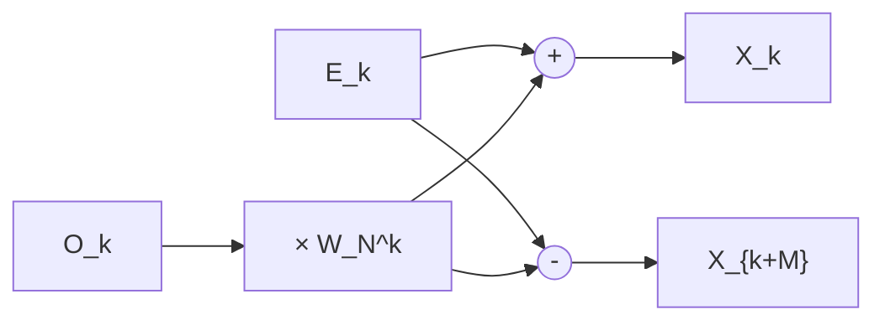

<!--metadata
  title: "Series And Transformations"
  authors: ["Subhajit Gorai"]
  dateCreated: "19/07/2026"
  dateEdited: "20/07/2026"
  description: "A treatise on power-series expansion and integral-transform methods, for the Working Engineer and Mathematician"
  tags: ["taylor series", "fourier series", "fourier transform", "laplace transform", "mathematics", "olympiad", "jee", "isi", "iit", "gate", "ml"]
-->

# Transform Methods: Series, Fourier, and Laplace


## Preface

There is a thread running from Brook Taylor's 1715 paper on finite differences to the Fast Fourier Transform algorithm that Cooley and Tukey rediscovered in 1965 to help detect Soviet nuclear tests — and it is a thicker thread than most syllabi let on. A Taylor series says: *near this one point, the function is (almost) a polynomial.* A Fourier series says something structurally identical but globally, over a whole period: *the function is (almost) a sum of sines and cosines.* The Fourier transform removes the "period" altogether and lets the frequencies run continuously. The Laplace transform takes the Fourier transform's idea of "decompose into oscillations" and adds a dial for growth and decay, which is exactly what you need to tame the discontinuous, impulsive, blow-up-prone forcing functions that real engineering systems are subjected to. The discrete Fourier transform and its fast algorithms are what happens when you make a computer do all of this arithmetic — and the price of that convenience is aliasing, circularity, and a wonderful bit of divide-and-conquer bookkeeping called the butterfly.

This treatise covers all five topics at the level of a second-year "Engineering Mathematics," "Mathematical Methods," or "Signals and Systems" course — the level of GATE, and of university semester finals, not the level of the Olympiads. We assume you already have: limits and continuity, Riemann integration, the elements of linear algebra (bases, orthogonality, inner products), complex numbers and Euler's formula, and first-order/second-order linear ODEs. Where full rigor would require machinery outside that toolkit — uniform convergence for term-by-term differentiation of a series, or contour integration for inverting a Laplace transform — we say so explicitly, name the correct theorem, and then *use the result freely*, exactly as one does in every engineering curriculum on Earth. A theorem used without full proof is labeled as such; nothing is smuggled in silently.

As before: read the proofs. Even the ones you are told to take on faith are worth reading once, because the *shape* of the proof — differentiate under the integral sign, bound a remainder, exploit orthogonality — is a tool you will reuse for the rest of your working life far more often than the specific theorem it proves.

---

## Table of Contents

**Part 1 — Taylor and Maclaurin Series**
1.1 Taylor's Theorem with Remainder
1.2 The Maclaurin Series and the Standard Table
1.3 Radius and Interval of Convergence
1.4 Term-by-Term Differentiation and Integration
1.5 Manipulating Known Series
1.6 Taylor Series in Two Variables
1.7 Application: Indeterminate Limits and Error Bounds
1.8 Challenge Problem: The Irrationality of $e$

**Part 2 — Fourier Series**
2.1 Orthogonality and the Fourier Coefficients
2.2 Dirichlet Conditions and Convergence
2.3 The Complex Exponential Form
2.4 Half-Range Expansions
2.5 Parseval's Theorem
2.6 The Gibbs Phenomenon
2.7 Application: The 1D Heat Equation
2.8 Challenge Problem: The Square Wave and $\sum 1/n^2$

**Part 3 — The Discrete Fourier Transform and FFT Algorithms**
3.1 The DFT and Its Inverse
3.2 Properties of the DFT
3.3 Why Direct Computation is $O(N^2)$
3.4 The Radix-2 Cooley–Tukey FFT
3.5 A Survey of FFT Variants
3.6 Application: Fast Convolution
3.7 Challenge Problem: An 8-Point FFT by Hand

**Part 4 — The Continuous Fourier Transform**
4.1 Motivation as a Limit of Fourier Series
4.2 Definition and Existence
4.3 Properties of the Transform
4.4 Standard Transform Pairs
4.5 Duality and the Sampling–Periodicity Relationship
4.6 Challenge Problem: The Fourier Transform of a Gaussian

**Part 5 — The Laplace Transform**
5.1 Definition and Region of Convergence
5.2 Properties of the Transform
5.3 The Standard Transform Table
5.4 Inverting a Transform
5.5 Initial and Final Value Theorems
5.6 Application: Solving Linear ODEs
5.7 Transfer Functions and Stability
5.8 The $s = i\omega$ Relationship to the Fourier Transform
5.9 Challenge Problem: Frullani's Integral via $\int_0^\infty F(s)\,ds$

**Appendix — Master Formula Sheet**

**Closing Remark — The Unifying Theme**

---

## Conventions

- Functions are real-valued unless stated otherwise; $i=\sqrt{-1}$.
- $f^{(n)}(x)$ denotes the $n$-th derivative; $f^{(0)}=f$.
- $\blacksquare$ closes a proof. Results stated without proof (because the proof needs machinery outside this course's scope) are marked **[Stated without full proof — see remark]**, with the correct proof technique named.
- "$\Leftrightarrow$" means "if and only if."
- For Fourier series, $L$ is the half-period, so the function has full period $2L$ and is defined (or extended) on $[-L,L]$.
- For the DFT, indices run $k,n=0,1,\dots,N-1$, and $W_N=e^{-2\pi i/N}$ is the primary $N$-th root of unity used throughout — note the sign convention (some texts use $e^{+2\pi i/N}$; ours matches the forward-DFT convention below).
- For the Laplace transform, $s=\sigma+i\omega\in\mathbb{C}$, and $\mathcal{L}\{f(t)\}=F(s)$ always denotes the *one-sided* (unilateral) transform, with $f(t)=0$ for $t<0$ implicitly assumed.
- "Engineering Mathematics" pragmatism: we interchange limits, sums, and integrals whenever the standard sufficient conditions (uniform convergence, absolute convergence, dominated convergence) hold, and we flag the one or two places per Part where this interchange is the whole content of the problem.

---

## Part 1 — Taylor and Maclaurin Series

### 1.1 Taylor's Theorem with Remainder

The entire enterprise begins with a single question: if you know a function and all its derivatives at one point $a$, how well can you reconstruct the function *elsewhere* using only a polynomial built from that data?

**Definition 1.1 (Taylor Polynomial).** Let $f$ be $n$ times differentiable at $a$. The **$n$-th order Taylor polynomial of $f$ about $a$** is
$$
P_n(x) = \sum_{k=0}^n \frac{f^{(k)}(a)}{k!}(x-a)^k = f(a) + f'(a)(x-a) + \frac{f''(a)}{2!}(x-a)^2 + \cdots + \frac{f^{(n)}(a)}{n!}(x-a)^n.
$$

$P_n$ is the unique degree-$\le n$ polynomial that matches $f$ and its first $n$ derivatives at $a$. The natural next question is how big the error $R_n(x)=f(x)-P_n(x)$ can be — and Taylor's theorem answers it in three equivalent-in-spirit but computationally distinct forms.

**Theorem 1.1 (Taylor's Theorem with Lagrange Remainder).** Let $f$ be $(n+1)$ times differentiable on an open interval containing $a$ and $x$. Then there exists some $c$ strictly between $a$ and $x$ such that
$$
f(x) = \sum_{k=0}^n \frac{f^{(k)}(a)}{k!}(x-a)^k + R_n(x), \qquad R_n(x) = \frac{f^{(n+1)}(c)}{(n+1)!}(x-a)^{n+1}.
$$

**Theorem 1.1′ (Cauchy Form of the Remainder).** Under the same hypotheses, there exists $c$ strictly between $a$ and $x$ with
$$
R_n(x) = \frac{f^{(n+1)}(c)}{n!}(x-c)^n(x-a).
$$

**Theorem 1.1″ (Integral Form of the Remainder).** If in addition $f^{(n+1)}$ is continuous (Riemann integrable suffices) on the interval, then
$$
R_n(x) = \int_a^x \frac{f^{(n+1)}(t)}{n!}(x-t)^n\,dt.
$$

**Remark.** All three forms carry the *same information* — the size of the error — but are useful in different situations. Lagrange's form is the workhorse for error bounds (Section 1.7) precisely because $(x-a)^{n+1}$ is easy to bound. The Cauchy form is occasionally sharper near the edge of a convergence interval (it appears, for instance, in a careful proof that the binomial series converges on all of $(-1,1)$). The integral form is the most "honest" — it makes no appeal to a mean-value existence argument, only to the Fundamental Theorem of Calculus — but requires the strongest hypothesis, continuity of $f^{(n+1)}$.

We now prove the Lagrange form. The proof is worth doing carefully because the trick it uses — cook up an auxiliary function so that a mean value theorem applies directly — recurs constantly in analysis.

**Proof of Theorem 1.1 (via the Cauchy Mean Value Theorem).**

Fix $x\ne a$ (the case $x=a$ is trivial, $R_n(a)=0$). Define two auxiliary functions of a variable $t$ between $a$ and $x$:
$$
g(t) = f(x) - \sum_{k=0}^n \frac{f^{(k)}(t)}{k!}(x-t)^k, \qquad h(t)=(x-t)^{n+1}.
$$

*Step 1: differentiate $g$.* This is the one calculation with any content, so we do it in full. Writing out the sum,
$$
g(t) = f(x)-f(t)-f'(t)(x-t)-\frac{f''(t)}{2!}(x-t)^2-\cdots-\frac{f^{(n)}(t)}{n!}(x-t)^n,
$$
and differentiating term by term with the product rule (each term after the first is a product of two functions of $t$), we get a **telescoping** cascade:
$$
g'(t) = -f'(t) - \Big[f''(t)(x-t)-f'(t)\Big] - \Big[\frac{f'''(t)}{2!}(x-t)^2-f''(t)(x-t)\Big] - \cdots - \Big[\frac{f^{(n+1)}(t)}{n!}(x-t)^n - \frac{f^{(n)}(t)}{(n-1)!}(x-t)^{n-1}\Big].
$$
Every term except the very first ($-f'(t)$) and the very last piece of the bracketed differences cancels against the piece before it — that is the telescoping. What survives is
$$
g'(t) = -\frac{f^{(n+1)}(t)}{n!}(x-t)^n.
$$

*Step 2: differentiate $h$.* This is immediate: $h'(t)=-(n+1)(x-t)^n$.

*Step 3: apply the Cauchy Mean Value Theorem.* $g$ and $h$ are both differentiable on the interval between $a$ and $x$ (this is where we use $f\in C^{n+1}$), and $h'(t)\ne0$ for $t$ strictly between $a$ and $x$ (since $x-t\ne0$ there). Note $g(x)=0$ and $h(x)=0$. The Cauchy Mean Value Theorem then guarantees a $c$ strictly between $a$ and $x$ with
$$
\frac{g(x)-g(a)}{h(x)-h(a)} = \frac{g'(c)}{h'(c)} \quad\Longrightarrow\quad \frac{0-g(a)}{0-h(a)}=\frac{-g'(c)}{-h'(c)} \quad\Longrightarrow\quad \frac{g(a)}{h(a)}=\frac{g'(c)}{h'(c)}.
$$

*Step 4: substitute.* We have $g(a)=R_n(x)$ (that is precisely the definition of the Taylor remainder — it's $f(x)$ minus the degree-$n$ Taylor polynomial evaluated using data at $a$), and $h(a)=(x-a)^{n+1}$. Plugging in Steps 1 and 2:
$$
\frac{R_n(x)}{(x-a)^{n+1}} = \frac{-\dfrac{f^{(n+1)}(c)}{n!}(x-c)^n}{-(n+1)(x-c)^n} = \frac{f^{(n+1)}(c)}{(n+1)!}.
$$
Rearranging gives exactly $R_n(x)=\dfrac{f^{(n+1)}(c)}{(n+1)!}(x-a)^{n+1}$. $\blacksquare$

**Remark (Why "generalized Rolle" is the same proof in disguise).** Many textbooks instead apply *Rolle's theorem repeatedly* to the single auxiliary function $\varphi(t)=f(x)-\sum_{k=0}^n\frac{f^{(k)}(t)}{k!}(x-t)^k-K(x-t)^{n+1}$ for a constant $K$ chosen so $\varphi(a)=0$ — this is algebraically the same content as the Cauchy Mean Value Theorem argument above, since $g(t)/h(t)\equiv K$ is exactly what the Cauchy MVT extracts. We present the Cauchy MVT route because it is shorter and makes the telescoping in Step 1 the star of the show, which it deserves to be.

**Example 1.1.** Bound the error in approximating $\sin(0.3)$ by its degree-3 Taylor polynomial about $a=0$.

*Solution.* $P_3(x)=x-x^3/3!$ (the $x^2$ and $x^4$ terms of the full Maclaurin series vanish, but let's use $n=3$ in the Lagrange formula anyway, so $f^{(4)}$ appears). $f^{(4)}(x)=\sin x$, and $|\sin c|\le1$ for all $c$, so
$$
|R_3(0.3)| = \left|\frac{f^{(4)}(c)}{4!}(0.3)^4\right| \le \frac{1}{24}(0.3)^4 = \frac{0.0081}{24} \approx 3.375\times10^{-4}.
$$
So $P_3(0.3)=0.3-0.0045=0.2955$ is accurate to within about $3.4\times10^{-4}$ — and indeed $\sin(0.3)=0.29552\ldots$, comfortably inside the bound. $\blacksquare$

### 1.2 The Maclaurin Series and the Standard Table

**Definition 1.2 (Maclaurin Series).** The **Maclaurin series** of $f$ is simply its Taylor series about $a=0$:
$$
f(x) = \sum_{k=0}^\infty \frac{f^{(k)}(0)}{k!}x^k,
$$
valid wherever the series converges *and* converges to $f(x)$ itself (convergence of the series and convergence to the right value are logically separate facts — see Remark below).

**Remark (A series can converge to the wrong thing).** It is a standard cautionary example that
$$
f(x) = \begin{cases} e^{-1/x^2} & x\ne0 \\ 0 & x=0\end{cases}
$$
has $f^{(k)}(0)=0$ for *every* $k$, so its Maclaurin series is identically $0$ — which converges everywhere, just not to $f(x)$ for $x\ne0$. The missing ingredient is that the Lagrange remainder $R_n(x)\to0$; when it does, we say $f$ is (real-)**analytic** at $0$ and the series genuinely represents $f$. Every function in the table below is analytic on its stated interval, and this is normally checked, when it needs to be checked at all, by bounding $|f^{(n+1)}(c)|$ uniformly and invoking Theorem 1.1.

**Table 1.1 (Standard Maclaurin Series).**

| Function | Series | Radius of Convergence |
|---|---|---|
| $e^x$ | $\displaystyle\sum_{n=0}^\infty \frac{x^n}{n!} = 1+x+\frac{x^2}{2!}+\cdots$ | $R=\infty$ |
| $\sin x$ | $\displaystyle\sum_{n=0}^\infty \frac{(-1)^nx^{2n+1}}{(2n+1)!} = x-\frac{x^3}{3!}+\frac{x^5}{5!}-\cdots$ | $R=\infty$ |
| $\cos x$ | $\displaystyle\sum_{n=0}^\infty \frac{(-1)^nx^{2n}}{(2n)!} = 1-\frac{x^2}{2!}+\frac{x^4}{4!}-\cdots$ | $R=\infty$ |
| $\sinh x$ | $\displaystyle\sum_{n=0}^\infty \frac{x^{2n+1}}{(2n+1)!} = x+\frac{x^3}{3!}+\frac{x^5}{5!}+\cdots$ | $R=\infty$ |
| $\cosh x$ | $\displaystyle\sum_{n=0}^\infty \frac{x^{2n}}{(2n)!} = 1+\frac{x^2}{2!}+\frac{x^4}{4!}+\cdots$ | $R=\infty$ |
| $\ln(1+x)$ | $\displaystyle\sum_{n=1}^\infty \frac{(-1)^{n-1}x^n}{n} = x-\frac{x^2}{2}+\frac{x^3}{3}-\cdots$ | $R=1$ (converges at $x=1$, diverges at $x=-1$) |
| $(1+x)^\alpha$ | $\displaystyle\sum_{n=0}^\infty \binom{\alpha}{n}x^n = 1+\alpha x+\frac{\alpha(\alpha-1)}{2!}x^2+\cdots$ | $R=1$ for $\alpha\notin\mathbb{Z}_{\ge0}$ (finite sum, all $x$, if $\alpha\in\mathbb{Z}_{\ge0}$) |
| $\arctan x$ | $\displaystyle\sum_{n=0}^\infty \frac{(-1)^nx^{2n+1}}{2n+1} = x-\frac{x^3}{3}+\frac{x^5}{5}-\cdots$ | $R=1$ (converges at both endpoints $x=\pm1$) |
| $\arcsin x$ | $\displaystyle x+\sum_{n=1}^\infty \frac{(2n-1)!!}{(2n)!!}\frac{x^{2n+1}}{2n+1} = x+\frac{x^3}{6}+\frac{3x^5}{40}+\cdots$ | $R=1$ |

Here $\binom{\alpha}{n}=\frac{\alpha(\alpha-1)\cdots(\alpha-n+1)}{n!}$ is the **generalized binomial coefficient** (defined for any real or complex $\alpha$), and $(2n-1)!!=1\cdot3\cdot5\cdots(2n-1)$ is the double factorial.

**Derivation sketch — $e^x$.** $f^{(k)}(x)=e^x$ for all $k$, so $f^{(k)}(0)=1$, giving $\sum x^n/n!$ directly. Since $|f^{(n+1)}(c)|=e^c$ is bounded on any fixed interval $[-M,M]$, the Lagrange remainder $R_n(x)=\frac{e^c}{(n+1)!}x^{n+1}\to0$ for every fixed $x$ as $n\to\infty$ (factorial beats any fixed power), confirming the series converges to $e^x$ everywhere, not merely that it converges.

**Derivation sketch — $\sin x$ and $\cos x$.** Derivatives of $\sin x$ cycle with period 4: $\sin x\to\cos x\to-\sin x\to-\cos x\to\sin x$. Evaluated at $0$: $0,1,0,-1,0,1,\dots$ — only odd-order derivatives survive, alternating sign, which produces the stated series. The bound $|f^{(n+1)}(c)|\le1$ (since it's always $\pm\sin c$ or $\pm\cos c$) again forces $R_n\to0$ for every $x$.

**Derivation sketch — the binomial series.** $f(x)=(1+x)^\alpha$ has $f^{(k)}(x)=\alpha(\alpha-1)\cdots(\alpha-k+1)(1+x)^{\alpha-k}$, so $f^{(k)}(0)=\alpha(\alpha-1)\cdots(\alpha-k+1)=k!\binom{\alpha}{k}$, giving the stated series directly from Definition 1.2. Convergence on $(-1,1)$ is most cleanly obtained not from the Lagrange remainder (which becomes delicate near $x=\pm1$) but from the **ratio test** applied to the series itself — see Theorem 1.2 below — since the *coefficients* $\binom{\alpha}{n}$ are all we need, independent of what function they came from.

**Derivation sketch — $\ln(1+x)$ and $\arctan x$.** Rather than differentiating $\ln(1+x)$ four or five times and hunting for a pattern, the efficient route is: start from the geometric series
$$
\frac{1}{1-t}=\sum_{n=0}^\infty t^n, \qquad |t|<1,
$$
substitute $t=-x$ to get $\frac{1}{1+x}=\sum_{n=0}^\infty(-1)^nx^n$, and **integrate term by term** from $0$ to $x$ (justified by Theorem 1.3 in Section 1.4):
$$
\ln(1+x) = \int_0^x \frac{dt}{1+t} = \sum_{n=0}^\infty(-1)^n\frac{x^{n+1}}{n+1} = \sum_{n=1}^\infty\frac{(-1)^{n-1}x^n}{n}.
$$
Similarly, substituting $t=-x^2$ into the geometric series gives $\frac{1}{1+x^2}=\sum_{n=0}^\infty(-1)^nx^{2n}$, and integrating term by term yields $\arctan x=\sum_{n=0}^\infty\frac{(-1)^nx^{2n+1}}{2n+1}$. This "integrate a known series" technique is one of the most useful tricks in the whole chapter — see Section 1.5.

### 1.3 Radius and Interval of Convergence

A power series $\sum_{n=0}^\infty c_n(x-a)^n$ does not, in general, converge for all $x$. The set of $x$ for which it does converge is always an interval centered at $a$ (possibly a single point, possibly all of $\mathbb{R}$) — this is the content of the next theorem.

**Theorem 1.2 (Radius of Convergence — Ratio and Root Tests).** For the power series $\sum c_n(x-a)^n$, define
$$
R=\frac1L, \qquad L=\lim_{n\to\infty}\left|\frac{c_{n+1}}{c_n}\right| \ \text{(ratio test form)} \qquad\text{or}\qquad L=\limsup_{n\to\infty}\sqrt[n]{|c_n|} \ \text{(Cauchy–Hadamard form)},
$$
with the convention $R=\infty$ if $L=0$ and $R=0$ if $L=\infty$. Then the series converges absolutely for $|x-a|<R$ and diverges for $|x-a|>R$. (At $|x-a|=R$ exactly, anything can happen — convergence must be checked case by case, typically with the alternating series test or a comparison test.)

**Remark (Ratio test vs. Cauchy–Hadamard).** The ratio-test formula for $R$ is easier to compute when it applies but technically requires $\lim|c_{n+1}/c_n|$ to *exist*. The **Cauchy–Hadamard formula**, using $\limsup$, always works — $\limsup$ exists for any bounded sequence, and if the sequence is unbounded we simply get $R=0$. In an undergraduate course the ratio test suffices for essentially every series you will meet (all of Table 1.1, for instance), and Cauchy–Hadamard is worth knowing exists mostly so the phrase doesn't ambush you on an exam.

*Proof sketch (ratio test route).* Apply the ordinary ratio test for series of numbers to $\sum|c_n(x-a)^n|$:
$$
\lim_{n\to\infty}\left|\frac{c_{n+1}(x-a)^{n+1}}{c_n(x-a)^n}\right| = |x-a|\lim_{n\to\infty}\left|\frac{c_{n+1}}{c_n}\right| = |x-a|\,L.
$$
The ratio test says: converges absolutely if this limit is $<1$, diverges if $>1$. That is exactly $|x-a|<1/L=R$ for convergence and $|x-a|>R$ for divergence. $\blacksquare$

**Example 1.2.** Find the radius of convergence of $\sum_{n=1}^\infty \frac{(x-3)^n}{n\,4^n}$.

*Solution.* $c_n=\frac{1}{n\cdot4^n}$, so
$$
L=\lim_{n\to\infty}\left|\frac{c_{n+1}}{c_n}\right| = \lim_{n\to\infty}\frac{n\cdot4^n}{(n+1)4^{n+1}} = \frac14\lim_{n\to\infty}\frac{n}{n+1} = \frac14,
$$
so $R=4$; the series converges absolutely for $|x-3|<4$, i.e. $x\in(-1,7)$, and we'd need to check $x=-1$ and $x=7$ separately (at $x=7$: $\sum1/n$ diverges; at $x=-1$: $\sum(-1)^n/n$ converges by the alternating series test — so the full interval of convergence is $[-1,7)$). $\blacksquare$

### 1.4 Term-by-Term Differentiation and Integration

We used "integrate a series term by term" freely in Section 1.2 to get $\ln(1+x)$ and $\arctan x$ from the geometric series. This is not automatic for infinite sums — pointwise convergence alone does not, in general, license swapping $\sum$ and $\int$ or $\sum$ and $\frac{d}{dx}$. The correct sufficient condition is **uniform convergence**, and the clean statement for power series is:

**Theorem 1.3 (Term-by-Term Differentiation/Integration).** If $f(x)=\sum_{n=0}^\infty c_n(x-a)^n$ has radius of convergence $R>0$, then $f$ is differentiable (indeed infinitely differentiable) on $(a-R,a+R)$, and for every $x$ in that interval,
$$
f'(x) = \sum_{n=1}^\infty n\,c_n(x-a)^{n-1}, \qquad \int_a^x f(t)\,dt = \sum_{n=0}^\infty \frac{c_n}{n+1}(x-a)^{n+1},
$$
and **both the differentiated and the integrated series have the same radius of convergence $R$** as the original.

**Remark on the proof (stated without full proof here).** The proof rests on the fact that a power series converges *uniformly* on any closed sub-interval $[a-r,a+r]$ with $r<R$ (this itself follows by comparing the series, via the Weierstrass $M$-test, to the convergent numerical series $\sum|c_n|r^n$), and a standard real-analysis theorem states that a uniformly convergent series of continuous functions may be integrated term by term, and — with the additional hypothesis that the *derivative* series also converges uniformly, which one separately checks has the same radius $R$ — may also be differentiated term by term. This machinery (uniform convergence, the Weierstrass $M$-test) sits just outside our assumed toolkit; we flag it here by name, exactly as promised in the preface, and use Theorem 1.3 freely from this point on.

**Example 1.3.** Differentiate the Maclaurin series for $\sin x$ term by term and confirm you get the series for $\cos x$.
$$
\frac{d}{dx}\left(x-\frac{x^3}{3!}+\frac{x^5}{5!}-\cdots\right) = 1-\frac{3x^2}{3!}+\frac{5x^4}{5!}-\cdots = 1-\frac{x^2}{2!}+\frac{x^4}{4!}-\cdots,
$$
which is exactly the Maclaurin series for $\cos x$. $\blacksquare$

### 1.5 Manipulating Known Series

Deriving every Maclaurin series from scratch via $f^{(n)}(0)/n!$ is often the hard way. Four algebraic operations let you generate a huge library of series from the handful in Table 1.1.

**Trick A — Substitution.** Replace $x$ by some expression $g(x)$ in a known series (valid provided $g(x)$ lies within the original radius of convergence). E.g. from $e^x=\sum x^n/n!$, substitute $x\to-x^2$:
$$
e^{-x^2} = \sum_{n=0}^\infty \frac{(-x^2)^n}{n!} = \sum_{n=0}^\infty \frac{(-1)^nx^{2n}}{n!} = 1-x^2+\frac{x^4}{2!}-\frac{x^6}{3!}+\cdots, \qquad R=\infty.
$$

**Trick B — Multiplying Series.** Two power series are multiplied like polynomials, collecting powers of $x$ (this is the **Cauchy product**: if $f=\sum a_nx^n$ and $g=\sum b_nx^n$, then $fg=\sum c_nx^n$ with $c_n=\sum_{k=0}^na_kb_{n-k}$). E.g., $e^x\cdot\frac{1}{1-x}$ up to $x^3$:
$$
\left(1+x+\frac{x^2}{2}+\frac{x^3}{6}+\cdots\right)(1+x+x^2+x^3+\cdots) = 1+2x+\frac52x^2+\frac83x^3+\cdots
$$
(check the $x^2$ coefficient: $1\cdot1+1\cdot1+\frac12\cdot1=\frac52$. ✓)

**Trick C — Dividing Series.** To get $\tan x=\sin x/\cos x$ as a series, divide the two series by long division (treating them as "polynomials" and matching coefficients order by order):
$$
\tan x = \frac{x-x^3/6+x^5/120-\cdots}{1-x^2/2+x^4/24-\cdots} = x+\frac{x^3}{3}+\frac{2x^5}{15}+\cdots
$$
Division is more delicate than multiplication (the resulting series' radius of convergence is governed by the nearest zero of the *denominator* in the complex plane — for $\cos x$ that is at $x=\pm\pi/2$, which is exactly the radius of convergence of the $\tan x$ series).

**Trick D — Composing Series.** To find the Maclaurin series of $e^{\sin x}$, substitute the *entire series* for $\sin x$ into the series for $e^u$ and collect terms in $x$:
$$
e^{\sin x} = 1+\sin x+\frac{\sin^2x}{2!}+\frac{\sin^3x}{3!}+\cdots = 1+\left(x-\frac{x^3}{6}+\cdots\right)+\frac12\left(x-\cdots\right)^2+\cdots
$$
Collecting through $x^3$: the $x$-term is $x$ (from the linear term); the $x^2$-term is $\frac12x^2$ (from $\sin^2x/2!\approx x^2/2$); the $x^3$-term gets contributions from *both* $\sin x$ itself ($-x^3/6$) and $\sin^3x/3!$ (since $\sin^3x\approx x^3$, this contributes $+x^3/6$); these cancel: $-\frac16+\frac16=0$. So
$$
e^{\sin x} = 1+x+\frac{x^2}{2}+0\cdot x^3+\cdots
$$
This example is a useful cautionary tale: composing series is mechanically straightforward but easy to botch bookkeeping-wise, and it is exactly the kind of computation where writing out each power's contribution in a small table, rather than trying to do it "in your head," saves you on an exam.

### 1.6 Taylor Series in Two Variables

**Definition 1.3 (Second-Order Taylor Expansion in Two Variables).** For $f(x,y)$ with continuous second partial derivatives near $(a,b)$, write $\mathbf{x}=(x,y)$, $\mathbf{a}=(a,b)$, $\Delta\mathbf{x}=\mathbf{x}-\mathbf{a}=(x-a,\,y-b)$. The second-order Taylor expansion is
$$
f(\mathbf{x}) \approx f(\mathbf{a}) + \nabla f(\mathbf{a})\cdot\Delta\mathbf{x} + \frac12\Delta\mathbf{x}^T H(\mathbf{a})\,\Delta\mathbf{x},
$$
where $\nabla f(\mathbf{a}) = \begin{pmatrix}f_x(a,b)\\f_y(a,b)\end{pmatrix}$ is the **gradient** and
$$
H(\mathbf{a}) = \begin{pmatrix} f_{xx}(a,b) & f_{xy}(a,b)\\ f_{yx}(a,b) & f_{yy}(a,b)\end{pmatrix}
$$
is the **Hessian matrix** (symmetric, by Clairaut's theorem on mixed partials, provided the second partials are continuous). Written out in full,
$$
f(x,y) \approx f(a,b)+f_x(a,b)(x-a)+f_y(a,b)(y-b)+\frac12\Big[f_{xx}(a,b)(x-a)^2+2f_{xy}(a,b)(x-a)(y-b)+f_{yy}(a,b)(y-b)^2\Big].
$$

**Remark.** This is precisely the natural two-variable generalization of $f(x)\approx f(a)+f'(a)(x-a)+\frac12f''(a)(x-a)^2$: the gradient plays the role of $f'(a)$ and the Hessian the role of $f''(a)$. This form is the workhorse of multivariable optimization — a critical point $\mathbf{a}$ (where $\nabla f(\mathbf{a})=0$) is a local min if $H(\mathbf{a})$ is positive definite, a local max if negative definite, and a saddle if indefinite, exactly mirroring the single-variable second-derivative test.

**Example 1.4.** Expand $f(x,y)=e^x\cos y$ to second order about $(a,b)=(0,0)$.

*Solution.* $f(0,0)=1$. $f_x=e^x\cos y\Rightarrow f_x(0,0)=1$; $f_y=-e^x\sin y\Rightarrow f_y(0,0)=0$. $f_{xx}=e^x\cos y\Rightarrow f_{xx}(0,0)=1$; $f_{xy}=-e^x\sin y\Rightarrow f_{xy}(0,0)=0$; $f_{yy}=-e^x\cos y\Rightarrow f_{yy}(0,0)=-1$. So
$$
e^x\cos y \approx 1+x+\frac12\big[x^2+0-y^2\big] = 1+x+\frac{x^2-y^2}{2}.
$$
(Sanity check: this matches multiplying the 1-D series $e^x\approx1+x+x^2/2$ and $\cos y\approx1-y^2/2$ and keeping terms of total degree $\le2$: $(1+x+x^2/2)(1-y^2/2)\approx1+x+x^2/2-y^2/2$. ✓) $\blacksquare$

### 1.7 Application: Indeterminate Limits and Error Bounds

**Series in place of L'Hôpital.** L'Hôpital's rule is often the slow way to resolve a $0/0$ limit when both functions have known Maclaurin series — series substitution turns repeated differentiation into simple algebra.

**Example 1.5.** Evaluate $\displaystyle\lim_{x\to0}\frac{x-\sin x}{x^3}$.

*Via L'Hôpital*, this needs differentiating numerator and denominator *three times* (the first two attempts still give $0/0$). *Via series*, using $\sin x=x-\frac{x^3}{6}+\frac{x^5}{120}-\cdots$:
$$
\frac{x-\sin x}{x^3} = \frac{x-\left(x-\frac{x^3}{6}+\frac{x^5}{120}-\cdots\right)}{x^3} = \frac{\frac{x^3}{6}-\frac{x^5}{120}+\cdots}{x^3} = \frac16-\frac{x^2}{120}+\cdots \;\longrightarrow\; \frac16 \quad\text{as } x\to0.
$$
One line, no repeated differentiation, and it comes with a bonus: the *next* term ($-x^2/120$) tells you the limit is approached from below for small $x>0$ — information L'Hôpital's rule alone does not hand you for free. $\blacksquare$

**Remainder-based error bounds.** Section 1.1's Example 1.1 already illustrated the core technique: Theorem 1.1's Lagrange remainder $R_n(x)=\frac{f^{(n+1)}(c)}{(n+1)!}(x-a)^{n+1}$ gives a *guaranteed* upper bound on truncation error, provided you can bound $|f^{(n+1)}(c)|$ over the relevant interval — which is easy whenever $f^{(n+1)}$ is itself bounded (as with $\sin,\cos$) or monotonic (many other elementary functions).

### 1.8 Challenge Problem: The Irrationality of $e$

**Challenge Problem 1.1.** Prove that $e$ is irrational, using the Maclaurin series of $e^x$ evaluated at $x=1$ together with a Lagrange remainder bound.

**Solution.**

*Step 1 — Set up the series at $x=1$.* From Table 1.1, for every $n$,
$$
e = \sum_{k=0}^n \frac{1}{k!} + R_n(1), \qquad R_n(1) = \frac{e^c}{(n+1)!}, \quad\text{some } c\in(0,1)
$$
by Theorem 1.1 with $a=0$, $x=1$. Since $0<c<1$, we have $1<e^c<e<3$ (using the crude bound $e<3$, itself easy to justify: $e=\sum1/k!<1+1+\frac12+\frac14+\frac18+\cdots=1+2=3$), so
$$
0 < R_n(1) < \frac{3}{(n+1)!}.
$$

*Step 2 — Suppose, for contradiction, that $e=p/q$ for positive integers $p,q$.* Choose $n\ge q$ and $n\ge3$ (any fixed such $n$ will do; we fix one). Define
$$
x_n := n!\left(e-\sum_{k=0}^n\frac{1}{k!}\right) = n!\,R_n(1).
$$

*Step 3 — Show $x_n$ is an integer.* We have $n!\,e=n!\cdot\frac{p}{q}$. Since $n\ge q$, $q$ divides $n!$, so $n!\,p/q$ is an integer. Also $n!\sum_{k=0}^n\frac{1}{k!}=\sum_{k=0}^n\frac{n!}{k!}$, and for every $k\le n$, $\frac{n!}{k!}=(k+1)(k+2)\cdots n$ is a product of integers, hence an integer. So $x_n$ is a difference of two integers, hence itself an integer.

*Step 4 — Show $0<x_n<1$, a contradiction.* From Step 1,
$$
0 < x_n = n!\,R_n(1) < n!\cdot\frac{3}{(n+1)!} = \frac{3}{n+1}.
$$
Since we are free to have chosen $n\ge3$ (in addition to $n\ge q$ — just take $n=\max(q,3)$), we get $\frac{3}{n+1}\le\frac34<1$. So $0<x_n<1$.

But Step 3 showed $x_n$ is an integer — and there is no integer strictly between $0$ and $1$. Contradiction.

*Conclusion.* The assumption $e=p/q$ is false; $e$ is irrational. $\blacksquare$

**Remark.** The heart of the argument is a clean instance of a very general strategy in irrationality proofs (it is the same skeleton behind Lambert's 1768 proof that $\pi$ is irrational, and behind many transcendence results): construct an expression that *must* be a nonzero integer if the number in question were rational, then show, using an error/remainder estimate, that the same expression is squeezed strictly between $0$ and $1$. An integer strictly between $0$ and $1$ does not exist — full stop — and that elementary fact is doing all of the work.

---

## Part 2 — Fourier Series

### 2.1 Orthogonality and the Fourier Coefficients

Where Part 1 approximated a function *locally*, near one point, by a polynomial, Fourier series approximate a *periodic* function *globally*, over an entire period, by a sum of sines and cosines. The engine that makes this work — and makes the coefficients computable by a simple formula rather than a difficult fitting problem — is orthogonality.

**Theorem 2.1 (Orthogonality Relations).** On the interval $[-L,L]$, for positive integers $m,n$:
$$
\int_{-L}^{L}\cos\frac{m\pi x}{L}\cos\frac{n\pi x}{L}\,dx = \begin{cases}0 & m\ne n\\ L & m=n\end{cases}, \qquad \int_{-L}^{L}\sin\frac{m\pi x}{L}\sin\frac{n\pi x}{L}\,dx = \begin{cases}0 & m\ne n\\ L & m=n\end{cases},
$$
$$
\int_{-L}^{L}\sin\frac{m\pi x}{L}\cos\frac{n\pi x}{L}\,dx = 0 \quad\text{(always, for all } m,n\text{, including } m=n\text{)}.
$$

**Proof.** All three follow from the **product-to-sum identities**. For the first, use $\cos A\cos B=\frac12[\cos(A-B)+\cos(A+B)]$ with $A=m\pi x/L$, $B=n\pi x/L$:
$$
\int_{-L}^L \cos\frac{m\pi x}{L}\cos\frac{n\pi x}{L}\,dx = \frac12\int_{-L}^L\left[\cos\frac{(m-n)\pi x}{L}+\cos\frac{(m+n)\pi x}{L}\right]dx.
$$
*Case $m\ne n$:* both $m-n$ and $m+n$ are nonzero integers, and $\int_{-L}^L\cos\frac{k\pi x}{L}\,dx = \left[\frac{L}{k\pi}\sin\frac{k\pi x}{L}\right]_{-L}^L = \frac{L}{k\pi}\big(\sin k\pi-\sin(-k\pi)\big)=0$ for any nonzero integer $k$ (since $\sin(k\pi)=0$ for integer $k$). So both terms vanish, giving $0$.

*Case $m=n$:* the first term becomes $\int_{-L}^L\cos0\,dx=\int_{-L}^L1\,dx=2L$, and the second term is $\int_{-L}^L\cos\frac{2n\pi x}{L}\,dx=0$ by the same computation as above (since $2n\ne0$). So the integral is $\frac12(2L+0)=L$.

The second identity follows identically, using $\sin A\sin B=\frac12[\cos(A-B)-\cos(A+B)]$ (same case analysis, same vanishing integrals).

The third identity uses $\sin A\cos B=\frac12[\sin(A+B)+\sin(A-B)]$: both resulting integrals are of the form $\int_{-L}^L\sin\frac{k\pi x}{L}dx$, which is *identically zero for every integer $k$ including $k=0$*, because $\sin$ is an odd function integrated over a symmetric interval (or, directly: $\int_{-L}^L\sin\frac{k\pi x}{L}dx=\left[-\frac{L}{k\pi}\cos\frac{k\pi x}{L}\right]_{-L}^L=-\frac{L}{k\pi}(\cos k\pi-\cos(-k\pi))=0$ since $\cos$ is even). So this integral vanishes for *all* $m,n$, with no case split needed. $\blacksquare$

**Theorem 2.2 (Fourier Coefficient Formulas).** If $f$ has period $2L$ and can be represented as
$$
f(x) = \frac{a_0}{2}+\sum_{n=1}^\infty\left(a_n\cos\frac{n\pi x}{L}+b_n\sin\frac{n\pi x}{L}\right),
$$
(with term-by-term integration of the series justified — see the remark after this proof), then
$$
a_n = \frac1L\int_{-L}^L f(x)\cos\frac{n\pi x}{L}\,dx \ \ (n\ge0), \qquad b_n = \frac1L\int_{-L}^L f(x)\sin\frac{n\pi x}{L}\,dx\ \ (n\ge1).
$$

**Proof.** Multiply both sides of the series by $\cos\frac{m\pi x}{L}$ (for fixed integer $m\ge1$) and integrate term by term over $[-L,L]$. By Theorem 2.1, *every term on the right vanishes* except the $a_m\cos\frac{m\pi x}{L}\cdot\cos\frac{m\pi x}{L}$ term, which integrates to $a_m\cdot L$:
$$
\int_{-L}^{L}f(x)\cos\frac{m\pi x}{L}\,dx = a_m L \quad\Longrightarrow\quad a_m = \frac1L\int_{-L}^L f(x)\cos\frac{m\pi x}{L}\,dx.
$$
The $b_n$ formula follows identically, multiplying by $\sin\frac{m\pi x}{L}$ instead. For $a_0$: integrate the series directly (no multiplication needed) — every $a_n,b_n$ term vanishes on integration over a full period except the constant term, which gives $\int_{-L}^L\frac{a_0}{2}dx=a_0L$, matching the formula with $n=0$ (this is exactly why the constant term is conventionally written $a_0/2$ rather than $a_0$ — it lets a single formula cover $n=0$ and $n\ge1$ at once). $\blacksquare$

**Remark (term-by-term integration).** As in Section 1.4, swapping $\int$ and $\sum_{n=1}^\infty$ needs justification — here, uniform convergence of the Fourier series on $[-L,L]$. This holds whenever $f$ is, e.g., piecewise smooth (the Dirichlet conditions of Section 2.2), and we use it freely from here on, exactly as flagged in the Preface.

### 2.2 Dirichlet Conditions and Convergence

Having a *formula* for the coefficients $a_n,b_n$ does not by itself guarantee the resulting series converges, still less that it converges back to $f(x)$. The standard sufficient condition used throughout engineering mathematics is due to Dirichlet.

**Theorem 2.3 (Dirichlet's Convergence Theorem) [Stated without full proof — proof requires careful estimates on the partial-sum ("Dirichlet kernel") integral, via the Riemann–Lebesgue lemma].** Suppose $f$ has period $2L$ and on any one period satisfies the **Dirichlet conditions**:
1. $f$ is piecewise continuous (only finitely many discontinuities per period, all of them jump discontinuities — no infinite blow-ups);
2. $f$ is piecewise monotonic (finitely many maxima and minima per period);
3. $f$ is absolutely integrable over one period: $\int_{-L}^L|f(x)|\,dx<\infty$.

Then the Fourier series of $f$ converges at every point $x$, and:
$$
\frac{a_0}{2}+\sum_{n=1}^\infty\left(a_n\cos\frac{n\pi x}{L}+b_n\sin\frac{n\pi x}{L}\right) = \begin{cases} f(x) & \text{if } f \text{ is continuous at } x \\ \dfrac{f(x^-)+f(x^+)}{2} & \text{if } x \text{ is a jump discontinuity}\end{cases}
$$
where $f(x^-),f(x^+)$ are the one-sided limits.

**Remark (why the midpoint, intuitively).** Every partial sum $S_N(x)$ of the Fourier series is continuous (it's a finite sum of continuous functions), so it cannot "jump" the way $f$ does; the best a sequence of continuous functions can do at a jump, in the limit, is settle at the average of the two sides — settling anywhere else would require the partial sums to persistently favor one side over the other in a way the symmetric orthogonal building blocks $\sin,\cos$ have no mechanism to do. Making this fully rigorous is exactly the content of the (omitted) proof via the Dirichlet kernel; we use the *result* — convergence to the midpoint at jumps — constantly from here on, e.g. it is exactly what powers Challenge Problem 2.1.

**Example 2.1.** The function $f(x)=x$ on $(-\pi,\pi)$, extended with period $2\pi$, has a jump discontinuity at $x=\pi$ (where $f(\pi^-)=\pi$ but the periodic extension gives $f(\pi^+)=-\pi$). Dirichlet's theorem predicts the Fourier series converges there to $\frac{\pi+(-\pi)}{2}=0$ — and indeed, every term $\sin(n\pi)=0$ and $\cos$ terms are absent from this odd function's expansion, so the series evaluated at $x=\pi$ literally sums to $0$, exactly as predicted. $\blacksquare$

### 2.3 The Complex Exponential Form

**Theorem 2.4 (Complex Exponential Fourier Series).** Using Euler's formula $e^{i\theta}=\cos\theta+i\sin\theta$, the real Fourier series of Theorem 2.2 can be rewritten as
$$
f(x) = \sum_{n=-\infty}^{\infty} c_n\, e^{in\pi x/L}, \qquad c_n = \frac{1}{2L}\int_{-L}^{L}f(x)\,e^{-in\pi x/L}\,dx,
$$
where the relationship to the real coefficients is $c_0=\frac{a_0}{2}$, and for $n\ge1$: $c_n=\frac{a_n-ib_n}{2}$, $c_{-n}=\frac{a_n+ib_n}{2}$ (so $c_{-n}=\overline{c_n}$ when $f$ is real).

**Derivation.** Substitute $\cos\frac{n\pi x}{L}=\frac{e^{in\pi x/L}+e^{-in\pi x/L}}{2}$ and $\sin\frac{n\pi x}{L}=\frac{e^{in\pi x/L}-e^{-in\pi x/L}}{2i}$ into Theorem 2.2's series, and collect the coefficient of $e^{in\pi x/L}$ for each $n\in\mathbb{Z}$:
$$
a_n\cos\frac{n\pi x}{L}+b_n\sin\frac{n\pi x}{L} = a_n\cdot\frac{e^{in\pi x/L}+e^{-in\pi x/L}}{2}+b_n\cdot\frac{e^{in\pi x/L}-e^{-in\pi x/L}}{2i} = \frac{a_n-ib_n}{2}e^{in\pi x/L}+\frac{a_n+ib_n}{2}e^{-in\pi x/L},
$$
(using $1/i=-i$), which identifies $c_n=\frac{a_n-ib_n}{2}$ as the coefficient of $e^{in\pi x/L}$ and $c_{-n}=\frac{a_n+ib_n}{2}$ as the coefficient of $e^{-in\pi x/L}$, matching terms with negative index in the sum $\sum_{n=-\infty}^{\infty}$. The integral formula for $c_n$ follows from an orthogonality argument for complex exponentials exactly parallel to Theorem 2.1: $\int_{-L}^L e^{im\pi x/L}e^{-in\pi x/L}dx=2L\,\delta_{mn}$ (the **Kronecker delta**), proved by direct integration when $m\ne n$ (an oscillating exponential integrates to zero over an integer number of periods) and trivially when $m=n$ (the integrand is $1$). $\blacksquare$

**Remark.** This complex form is not merely more compact — it is the form that generalizes directly to the DFT in Part 3 and the continuous Fourier transform in Part 4. The index $n$ here plays the role of a discrete "frequency," and $c_n$ measures how much of that frequency is present in $f$; this is the conceptual seed of everything that follows for the rest of this treatise.

### 2.4 Half-Range Expansions

Often a function is only specified on a *half*-interval $[0,L]$ (e.g., the initial temperature profile of a rod occupying $[0,L]$), and we are free to *choose* how to extend it to $[-L,L]$ before applying Fourier theory. Two canonical choices eliminate half the coefficients.

**Definition 2.1 (Odd/Even Extension).** Given $f$ defined on $[0,L]$:
- The **odd extension** sets $f(-x):=-f(x)$ for $x\in(0,L]$. Its Fourier series contains *only sine terms* (a **half-range sine series**), since $a_n=\frac1L\int_{-L}^Lf(x)\cos\frac{n\pi x}{L}dx=0$ automatically — the integrand is odd$\times$even$=$odd, and an odd function integrates to zero over a symmetric interval. What survives is
$$
f(x) = \sum_{n=1}^\infty b_n \sin\frac{n\pi x}{L}, \qquad b_n = \frac2L\int_0^L f(x)\sin\frac{n\pi x}{L}\,dx
$$
(the factor of $2$, and integrating only over $[0,L]$, comes from the fact that the integrand $f(x)\sin(n\pi x/L)$ is *even* — odd$\times$odd — so the integral over $[-L,L]$ is twice the integral over $[0,L]$).

- The **even extension** sets $f(-x):=f(x)$. Its series contains *only cosine terms* (a **half-range cosine series**), by the mirror-image argument:
$$
f(x) = \frac{a_0}{2}+\sum_{n=1}^\infty a_n\cos\frac{n\pi x}{L}, \qquad a_n = \frac2L\int_0^L f(x)\cos\frac{n\pi x}{L}\,dx.
$$

**Remark.** The choice between odd and even extension is not cosmetic — it is dictated by the boundary conditions of the physical problem. A vibrating string pinned at both ends ($u(0,t)=u(L,t)=0$) wants a sine expansion (each $\sin(n\pi x/L)$ already vanishes at $x=0,L$); a rod with insulated ends (zero heat flux, $u_x(0,t)=u_x(L,t)=0$) wants a cosine expansion (each $\cos(n\pi x/L)$ already has zero derivative at $x=0,L$). This is precisely why half-range series are the natural tool in Section 2.7's heat-equation application.

**Example 2.2.** Find the half-range sine series of $f(x)=1$ on $(0,L)$.

*Solution.*
$$
b_n = \frac2L\int_0^L 1\cdot\sin\frac{n\pi x}{L}\,dx = \frac2L\left[-\frac{L}{n\pi}\cos\frac{n\pi x}{L}\right]_0^L = \frac{2}{n\pi}\big(1-\cos n\pi\big) = \frac{2}{n\pi}\big(1-(-1)^n\big) = \begin{cases}\dfrac{4}{n\pi} & n \text{ odd}\\ 0 & n\text{ even}\end{cases}.
$$
So $1 = \dfrac{4}{\pi}\left(\sin\dfrac{\pi x}{L}+\dfrac13\sin\dfrac{3\pi x}{L}+\dfrac15\sin\dfrac{5\pi x}{L}+\cdots\right)$ for $0<x<L$. $\blacksquare$

### 2.5 Parseval's Theorem

**Theorem 2.5 (Parseval's Theorem).** If $f$ has Fourier series $f(x)=\frac{a_0}{2}+\sum_{n=1}^\infty(a_n\cos\frac{n\pi x}{L}+b_n\sin\frac{n\pi x}{L})$, then
$$
\frac1L\int_{-L}^L [f(x)]^2\,dx = \frac{a_0^2}{2}+\sum_{n=1}^\infty(a_n^2+b_n^2).
$$

**Proof.** Multiply the series for $f(x)$ by $f(x)$ itself and integrate term by term over $[-L,L]$:
$$
\int_{-L}^{L}[f(x)]^2\,dx = \int_{-L}^L f(x)\left[\frac{a_0}{2}+\sum_{n=1}^\infty\left(a_n\cos\frac{n\pi x}{L}+b_n\sin\frac{n\pi x}{L}\right)\right]dx.
$$
Distribute the integral over the sum and recognize each resulting piece as *exactly* one of the coefficient-defining integrals from Theorem 2.2:
$$
= \frac{a_0}{2}\int_{-L}^L f(x)\,dx + \sum_{n=1}^\infty\left[a_n\int_{-L}^L f(x)\cos\frac{n\pi x}{L}dx + b_n\int_{-L}^L f(x)\sin\frac{n\pi x}{L}dx\right].
$$
But $\int_{-L}^Lf(x)dx=a_0L$ (from the $a_0$ formula), $\int_{-L}^Lf(x)\cos\frac{n\pi x}{L}dx=a_nL$, and $\int_{-L}^Lf(x)\sin\frac{n\pi x}{L}dx=b_nL$ — these are precisely the defining formulas of Theorem 2.2, read backwards. Substituting:
$$
\int_{-L}^L[f(x)]^2dx = \frac{a_0}{2}\cdot a_0L + \sum_{n=1}^\infty\big(a_n\cdot a_nL+b_n\cdot b_nL\big) = L\left[\frac{a_0^2}{2}+\sum_{n=1}^\infty(a_n^2+b_n^2)\right].
$$
Dividing both sides by $L$ gives the claimed identity. $\blacksquare$

**Remark.** Parseval's theorem is nothing but the statement "**energy is conserved when you change basis**": the left side, $\frac1L\int f^2$, is the mean-square value (a physical notion of signal *power* or *energy*), and the right side re-expresses that same total energy as a sum over each frequency component's individual contribution — exactly like the Pythagorean theorem $|\mathbf{v}|^2=\sum v_i^2$ applied to the (infinite-dimensional) orthogonal basis $\{1,\cos\frac{n\pi x}{L},\sin\frac{n\pi x}{L}\}$. This "sum-of-squares equals total energy" idea reappears essentially unchanged as Plancherel's theorem for the continuous Fourier transform in Section 4.3.

### 2.6 The Gibbs Phenomenon

**Definition/Observation 2.2 (The Gibbs Phenomenon).** When a Fourier series is truncated to $N$ terms and $f$ has a jump discontinuity, the partial sum $S_N(x)$ does not merely approximate the jump poorly near the discontinuity — it systematically **overshoots** the jump on both sides, by an amount that does *not* shrink as $N\to\infty$. Concretely, for a jump of height $J=f(x_0^+)-f(x_0^-)$ at $x_0$, the overshoot on either side approaches a *fixed fraction* of $J$, namely
$$
\text{overshoot} \;\longrightarrow\; J\cdot\left(\frac{1}{\pi}\int_0^\pi \frac{\sin t}{t}\,dt - \frac12\right) \approx 0.0895\,J \quad(\text{about } 9\%\text{ of the jump}),
$$
as $N\to\infty$. What *does* shrink as $N\to\infty$ is the *width* of the region near $x_0$ over which the overshoot occurs — the spike gets narrower but not shorter, so it survives in the limit as a set of "measure zero" and does not contradict Dirichlet's convergence theorem (which is a statement about convergence *at each fixed point*, and at each fixed point away from $x_0$ the overshoot region eventually excludes that point as $N$ grows).

**Remark (why it happens, informally).** Near a jump, $f$ locally resembles a step function, and a finite trigonometric sum is a smooth, band-limited object trying to reproduce an infinitely sharp corner; smooth functions built from finitely many oscillation frequencies cannot approximate a genuine jump without "ringing" — the same phenomenon that shows up whenever you low-pass filter a sharp edge in signal processing or image processing. The precise $\approx9\%$ figure comes from analyzing the partial sums of the square wave (Challenge Problem 2.1's first result) directly and relating the overshoot to the sine integral $\mathrm{Si}(\pi)=\int_0^\pi\frac{\sin t}{t}dt$; deriving that constant rigorously is a standard but slightly technical calculus exercise which we do not carry out in full here, but the qualitative fact — persistent $\sim9\%$ overshoot at every jump, regardless of how many terms you take — is exactly the kind of fact that shows up as a GATE/exam conceptual question and is worth memorizing as stated.

### 2.7 Application: Separation of Variables for the 1D Heat Equation

Consider a thin rod of length $L$ with both ends held at zero temperature, governed by the heat equation
$$
\frac{\partial u}{\partial t} = \alpha^2\frac{\partial^2 u}{\partial x^2}, \qquad 0<x<L,\ t>0, \qquad u(0,t)=u(L,t)=0, \qquad u(x,0)=f(x).
$$

**Step 1 — Separate variables.** Seek solutions of the product form $u(x,t)=X(x)T(t)$. Substituting into the PDE: $X(x)T'(t)=\alpha^2X''(x)T(t)$, so
$$
\frac{T'(t)}{\alpha^2T(t)} = \frac{X''(x)}{X(x)} = -\lambda \quad\text{(a constant, since the left side depends only on } t \text{ and the right only on } x\text{)}.
$$

**Step 2 — Solve the spatial ODE with boundary conditions.** $X''+\lambda X=0$ with $X(0)=X(L)=0$. This is a standard Sturm–Liouville eigenvalue problem: $\lambda\le0$ gives only the trivial solution $X\equiv0$ (check: $\lambda=0$ gives $X=c_1+c_2x$, forced to $0$ by both boundary conditions; $\lambda<0$ gives exponential/hyperbolic solutions, again forced to $0$). For $\lambda=\left(\frac{n\pi}{L}\right)^2$, $n=1,2,3,\ldots$, we get nontrivial solutions $X_n(x)=\sin\frac{n\pi x}{L}$ — note these are precisely the half-range sine basis functions of Section 2.4, and this Sturm–Liouville structure is *why* that basis is the natural one for this problem.

**Step 3 — Solve the temporal ODE.** With $\lambda_n=(n\pi/L)^2$: $T_n'(t)=-\alpha^2\lambda_nT_n(t)\ \Rightarrow\ T_n(t)=e^{-\alpha^2(n\pi/L)^2t}$.

**Step 4 — Superpose and match the initial condition.** The general solution satisfying the boundary conditions is a superposition
$$
u(x,t) = \sum_{n=1}^\infty b_n\sin\frac{n\pi x}{L}\,e^{-\alpha^2(n\pi/L)^2t}.
$$
Setting $t=0$: $u(x,0)=\sum b_n\sin\frac{n\pi x}{L}=f(x)$ — **exactly the half-range sine series of $f$** from Section 2.4. So $b_n$ is computed by precisely the half-range sine formula:
$$
b_n = \frac2L\int_0^L f(x)\sin\frac{n\pi x}{L}\,dx.
$$

**Remark.** This is the payoff for the entire chapter: Fourier's original 1807 motivation for inventing this whole theory *was* the heat equation, and the logical chain is exactly Sections 2.1 (orthogonality gives you the coefficient formula) $\to$ 2.4 (the boundary conditions dictate you want a sine, not cosine, basis) $\to$ 2.7 (that same basis diagonalizes the PDE into independently solvable ODEs, one per mode $n$, each decaying at its own rate $e^{-\alpha^2(n\pi/L)^2t}$ — higher-frequency spatial modes decay faster, which is exactly why heat diffusion smooths out sharp features quickly and smooth features slowly).

### 2.8 Challenge Problem: The Square Wave and $\sum 1/n^2$

**Challenge Problem 2.1.** (a) Find the Fourier series of the square wave $f(x)=\begin{cases}-1 & -\pi<x<0\\ \ \ 1 & 0<x<\pi\end{cases}$, extended with period $2\pi$. (b) Use Parseval's theorem to evaluate $\displaystyle\sum_{n=1}^\infty \frac{1}{n^2}$.

**Solution.**

*Part (a).* Here $L=\pi$. Since $f$ is odd ($f(-x)=-f(x)$, easily checked from the piecewise definition), $a_n=0$ for all $n\ge0$ automatically (odd$\times$even integrand vanishes on the symmetric interval, exactly as in Section 2.4). For $b_n$, use the even-integrand shortcut ($f(x)\sin nx$ is odd$\times$odd$=$even):
$$
b_n = \frac1\pi\int_{-\pi}^\pi f(x)\sin nx\,dx = \frac2\pi\int_0^\pi (1)\sin nx\,dx = \frac2\pi\left[-\frac{\cos nx}{n}\right]_0^\pi = \frac{2}{n\pi}\big(1-\cos n\pi\big) = \frac{2}{n\pi}\big(1-(-1)^n\big).
$$
This is $\frac{4}{n\pi}$ for odd $n$ and $0$ for even $n$ — identical computation to Example 2.2. So
$$
f(x) = \frac{4}{\pi}\left(\sin x + \frac{\sin 3x}{3}+\frac{\sin5x}{5}+\cdots\right) = \frac4\pi\sum_{k=0}^\infty \frac{\sin\big((2k+1)x\big)}{2k+1}.
$$
(This is, incidentally, exactly the function whose partial sums are the classic picture of the Gibbs phenomenon from Section 2.6 — the $\approx9\%$ overshoot is most commonly first shown on this exact square wave.)

*Part (b).* Apply Parseval's theorem (Theorem 2.5) with $L=\pi$, $a_0=a_n=0$ for all $n$, and $b_n$ as found above:
$$
\frac1\pi\int_{-\pi}^\pi [f(x)]^2\,dx = \sum_{n=1}^\infty b_n^2.
$$
*Left side:* $[f(x)]^2=(\pm1)^2=1$ everywhere (since $f=\pm1$), so $\int_{-\pi}^\pi 1\,dx=2\pi$, and the left side is $\frac{2\pi}{\pi}=2$.

*Right side:* only odd $n=2k+1$ contribute, each with $b_n=\frac{4}{n\pi}$, so $b_n^2=\frac{16}{n^2\pi^2}$:
$$
\sum_{n \text{ odd}} \frac{16}{n^2\pi^2} = \frac{16}{\pi^2}\sum_{k=0}^\infty \frac{1}{(2k+1)^2}.
$$
Setting the two sides equal:
$$
2 = \frac{16}{\pi^2}\sum_{k=0}^\infty\frac{1}{(2k+1)^2} \quad\Longrightarrow\quad \sum_{k=0}^\infty\frac{1}{(2k+1)^2} = \frac{\pi^2}{8}.
$$
This is the sum over *odd* squares only. To get the sum over *all* positive integers, split $\sum_{n=1}^\infty\frac1{n^2}$ into odd and even parts:
$$
\sum_{n=1}^\infty\frac1{n^2} = \underbrace{\sum_{k=0}^\infty\frac{1}{(2k+1)^2}}_{=\pi^2/8} + \underbrace{\sum_{k=1}^\infty\frac1{(2k)^2}}_{=\frac14\sum_{k=1}^\infty\frac1{k^2}}.
$$
Let $S=\sum_{n=1}^\infty 1/n^2$. Then $S=\frac{\pi^2}{8}+\frac14S$, so $\frac34S=\frac{\pi^2}{8}$, giving
$$
S = \sum_{n=1}^\infty \frac1{n^2} = \frac{\pi^2}{6}. \qquad\blacksquare
$$

**Remark.** This is the Basel problem, first solved by Euler in 1735 by an entirely different (and, at the time, not fully rigorous) route involving treating $\sin x/x$ as an "infinite polynomial" and comparing coefficients with its product formula over its roots. The Parseval route given here is fully rigorous given Theorem 2.5, and is the standard modern proof taught alongside Fourier series for exactly this reason — it is often the very first "wow" payoff a student sees from the machinery of Part 2, turning a hard number-theoretic-flavored sum into a two-line consequence of an energy identity.

---

## Part 3 — The Discrete Fourier Transform and FFT Algorithms

### 3.1 The DFT and Its Inverse

We now leave the world of continuous functions and enter the world of finite sequences of numbers — the world a computer actually lives in. Given $N$ samples $x_0,x_1,\ldots,x_{N-1}$ (real or complex), the **Discrete Fourier Transform (DFT)** is the discrete analogue of the complex-exponential Fourier coefficients from Theorem 2.4.

**Definition 3.1 (DFT and Inverse DFT).** With $W_N:=e^{-2\pi i/N}$ (per our Conventions), the DFT of $(x_0,\ldots,x_{N-1})$ is the sequence $(X_0,\ldots,X_{N-1})$ given by
$$
X_k = \sum_{n=0}^{N-1} x_n\,W_N^{nk} = \sum_{n=0}^{N-1}x_n\,e^{-2\pi i nk/N}, \qquad k=0,1,\ldots,N-1,
$$
and the **inverse DFT (IDFT)** recovers the samples from the spectrum:
$$
x_n = \frac1N\sum_{k=0}^{N-1}X_k\,W_N^{-nk} = \frac1N\sum_{k=0}^{N-1}X_k\,e^{2\pi ink/N}, \qquad n=0,1,\ldots,N-1.
$$

**Proof that the IDFT formula is correct (i.e., that it really inverts the DFT).** Substitute the DFT formula for $X_k$ into the proposed IDFT formula and swap the order of the two finite sums (always legal — finite sums commute freely):
$$
\frac1N\sum_{k=0}^{N-1}X_k e^{2\pi ink/N} = \frac1N\sum_{k=0}^{N-1}\left(\sum_{m=0}^{N-1}x_m e^{-2\pi imk/N}\right)e^{2\pi ink/N} = \frac1N\sum_{m=0}^{N-1}x_m\sum_{k=0}^{N-1}e^{2\pi ik(n-m)/N}.
$$
The inner sum $\sum_{k=0}^{N-1}e^{2\pi ik(n-m)/N}$ is a finite geometric series in the ratio $r=e^{2\pi i(n-m)/N}$. If $n=m$, $r=1$ and the sum is trivially $N$. If $n\ne m$ (and $|n-m|<N$, always true here), $r\ne1$ is an $N$-th root of unity, and the geometric series formula gives $\sum_{k=0}^{N-1}r^k=\frac{r^N-1}{r-1}=\frac{1-1}{r-1}=0$ (since $r^N=e^{2\pi i(n-m)}=1$). So the inner sum is $N\cdot\delta_{nm}$ (Kronecker delta), and
$$
\frac1N\sum_{m=0}^{N-1}x_m\cdot N\delta_{nm} = x_n,
$$
confirming the IDFT formula correctly recovers $x_n$. $\blacksquare$

**Relation to sampling a continuous signal (Nyquist/aliasing, briefly).** If the sequence $x_n$ arises by sampling a continuous signal $x(t)$ every $T_s$ seconds ($x_n=x(nT_s)$), the DFT's frequency index $k$ corresponds to a physical frequency $f_k=k/(NT_s)$ Hz, and the highest frequency the sampling can represent without ambiguity is the **Nyquist frequency** $f_{\text{Nyq}}=\frac{1}{2T_s}$. If the original continuous signal contains energy at frequencies above $f_{\text{Nyq}}$, that energy does not disappear — it "folds back" and masquerades as a lower frequency in the sampled data, a corruption called **aliasing**. This is why practical sampling systems always precede the sampler with an analog low-pass "anti-aliasing" filter. We revisit this precisely, with a proof, once the continuous Fourier transform is available in Section 4.5.

### 3.2 Properties of the DFT

Write $\mathrm{DFT}\{x_n\}=X_k$ for the transform pair defined above.

**Theorem 3.1 (DFT Properties).**

1. **Linearity.** $\mathrm{DFT}\{ax_n+by_n\}=aX_k+bY_k$. *(Immediate from linearity of the defining sum.)*

2. **Periodicity.** Both the sequence and its transform, when the defining formula is evaluated outside the "home" range, are periodic: $X_{k+N}=X_k$ and, dually, the IDFT formula run at $n+N$ gives back $x_n$. *(Immediate: $W_N^{n(k+N)}=W_N^{nk}W_N^{nN}=W_N^{nk}\cdot1$, since $W_N^N=e^{-2\pi i}=1$.)* This periodicity is the source of the *circularity* in the next property, and is the fundamental structural difference from the continuous transform of Part 4.

3. **Circular Convolution Theorem.** Define the **circular convolution** of two length-$N$ sequences by
$$
(x\circledast y)_n := \sum_{m=0}^{N-1}x_m\,y_{(n-m)\bmod N}.
$$
Then $\mathrm{DFT}\{x\circledast y\}_k=X_k\cdot Y_k$ — pointwise multiplication in the frequency domain corresponds to *circular* (not ordinary/linear) convolution in the time domain.

*Proof.* $\displaystyle\sum_{n=0}^{N-1}(x\circledast y)_n W_N^{nk} = \sum_{n=0}^{N-1}\sum_{m=0}^{N-1}x_m y_{(n-m)\bmod N}W_N^{nk}$. Substitute $\ell=(n-m)\bmod N$, so $n\equiv m+\ell\pmod N$; because everything is $N$-periodic (Property 2), $W_N^{nk}=W_N^{(m+\ell)k}=W_N^{mk}W_N^{\ell k}$, and as $n$ ranges over a full period so does $\ell$ (for each fixed $m$), so the double sum factors:
$$
= \sum_{m=0}^{N-1}x_m W_N^{mk}\sum_{\ell=0}^{N-1}y_\ell W_N^{\ell k} = X_k\,Y_k. \qquad\blacksquare
$$

4. **Conjugate Symmetry for Real Input.** If every $x_n$ is real, then $X_{N-k}=\overline{X_k}$ for $k=1,\ldots,N-1$ (equivalently $X_{-k}=\overline{X_k}$ using the periodicity of Property 2 to identify index $-k$ with $N-k$).

*Proof.* $\overline{X_k}=\overline{\sum_n x_n W_N^{nk}}=\sum_n \overline{x_n}\,\overline{W_N^{nk}}=\sum_n x_n\,\overline{W_N}^{\,nk}$ (using $x_n$ real, so $\overline{x_n}=x_n$). But $\overline{W_N}=\overline{e^{-2\pi i/N}}=e^{2\pi i/N}=W_N^{-1}$, so $\overline{W_N}^{\,nk}=W_N^{-nk}=W_N^{n(-k)}$, which is exactly the summand defining $X_{-k}$. So $\overline{X_k}=X_{-k}$. $\blacksquare$

**Remark.** Property 4 is why, for real-valued signals, only "half" the DFT spectrum ($k=0,\ldots,N/2$) carries independent information — the other half is redundant, being the complex conjugate mirror image. Real-input FFT implementations exploit this to roughly halve both computation and storage.

### 3.3 Why Direct Computation is $O(N^2)$

Reading Definition 3.1's formula for $X_k$ directly off the page: computing *one* output value $X_k$ requires $N$ complex multiplications ($x_n\cdot W_N^{nk}$ for each of $n=0,\ldots,N-1$) and $N-1$ complex additions. Since there are $N$ output values $X_0,\ldots,X_{N-1}$ to compute, the total cost is
$$
N \text{ outputs} \times O(N) \text{ work per output} = O(N^2) \text{ total complex multiplications (and additions)}.
$$
For $N=10^6$ samples — entirely ordinary in audio or communications engineering — this is $10^{12}$ operations, which is the difference between a computation finishing in about a second and one taking the better part of a day on comparable hardware. **This is the entire motivation for the FFT**: find an algorithm that computes exactly the same $N$ numbers $X_0,\ldots,X_{N-1}$, but in fewer arithmetic operations, by exploiting *redundancy* in the definition — the fact that many of the $N^2$ products $x_nW_N^{nk}$ that get computed along the way are, in a precise sense, wasteful repetitions of each other.

### 3.4 The Radix-2 Cooley–Tukey FFT

Assume from here on that $N=2^m$ is a power of $2$ (the "radix-2" case — see Section 3.5 for what happens when it isn't).

**The key idea — Decimation in Time (DIT).** Split the input sequence into its even- and odd-indexed samples, and observe that the DFT of the full sequence can be reassembled from the (smaller) DFTs of these two half-length sequences.

**Theorem 3.2 (Radix-2 Decimation-in-Time Decomposition).** Let $N=2M$. Define the even-indexed and odd-indexed subsequences $e_r:=x_{2r}$ and $o_r:=x_{2r+1}$ for $r=0,\ldots,M-1$, each of length $M$, with $M$-point DFTs $E_k=\sum_{r=0}^{M-1}e_r W_M^{rk}$ and $O_k=\sum_{r=0}^{M-1}o_r W_M^{rk}$. Then the $N$-point DFT of the full sequence is given, for $k=0,\ldots,M-1$, by the **butterfly**:
$$
X_k = E_k + W_N^{k}\,O_k, \qquad X_{k+M} = E_k - W_N^{k}\,O_k.
$$

**Proof.** Split the defining sum for $X_k$ into even and odd $n$:
$$
X_k = \sum_{n=0}^{N-1}x_nW_N^{nk} = \underbrace{\sum_{r=0}^{M-1}x_{2r}W_N^{2rk}}_{\text{even } n=2r} + \underbrace{\sum_{r=0}^{M-1}x_{2r+1}W_N^{(2r+1)k}}_{\text{odd } n=2r+1}.
$$
In the first sum, $W_N^{2rk}=\left(e^{-2\pi i/N}\right)^{2rk}=e^{-2\pi irk\cdot2/N}=e^{-2\pi irk/M}=W_M^{rk}$ (using $N=2M$) — so the first sum is *exactly* $E_k$, the $M$-point DFT of the even samples (once we note $E_k$ for $k\ge M$ is understood via the periodicity $E_{k+M}=E_k$ from Theorem 3.1 Property 2, since $E$ is an $M$-point transform).

In the second sum, $W_N^{(2r+1)k}=W_N^{2rk}\cdot W_N^k=W_M^{rk}\cdot W_N^k$, so this sum is $W_N^k\sum_{r=0}^{M-1}o_rW_M^{rk}=W_N^k\,O_k$.

So $X_k=E_k+W_N^kO_k$ for **all** $k=0,\ldots,N-1$ — this is already the full answer, but we now exploit periodicity to compute it using only the "first half" $k=0,\ldots,M-1$ of $E_k$ and $O_k$, which is where the computational saving comes from. For $k$ in the range $M,\ldots,N-1$, write $k=k'+M$ with $k'=0,\ldots,M-1$:
$$
X_{k'+M} = E_{k'+M} + W_N^{k'+M}O_{k'+M}.
$$
Since $E,O$ are $M$-point DFTs, $E_{k'+M}=E_{k'}$ and $O_{k'+M}=O_{k'}$ (periodicity, Theorem 3.1 Property 2, applied at the smaller size $M$). And $W_N^{k'+M}=W_N^{k'}\cdot W_N^M=W_N^{k'}\cdot e^{-2\pi iM/N}=W_N^{k'}\cdot e^{-\pi i}=-W_N^{k'}$ (using $N=2M$, so $M/N=1/2$, and $e^{-i\pi}=-1$). So
$$
X_{k'+M} = E_{k'} - W_N^{k'}O_{k'},
$$
which, relabeling $k'\to k$, is exactly the second butterfly formula. $\blacksquare$

**The "twiddle factor."** $W_N^k$ in the formula $X_k=E_k+W_N^kO_k$ is called the **twiddle factor** — it is the complex number by which the odd-half spectrum must be rotated (in the complex plane, it literally is a rotation, since $|W_N^k|=1$) before being combined with the even-half spectrum. The minus sign that appears for the "upper half" output $X_{k+M}$ comes at *no extra multiplication cost* — it's the same product $W_N^kO_k$, just added in one case and subtracted in the other. This add/subtract-a-shared-product structure, drawn as an X-shaped wiring diagram, is exactly why the operation is called a **butterfly**:

```txt
   E_k ────────●──────────────── X_k = E_k + W_N^k · O_k
                \      +
                 \    ╱
                  ╲  ╱
                   ╲╱
                   ╱╲
                  ╱  ╲
                 ╱    ╲    −
   O_k ──[×W_N^k]●──────────────  X_{k+M} = E_k − W_N^k · O_k
```



**Recursive structure and the FFT algorithm.** Theorem 3.2 reduces one $N$-point DFT to two $M=N/2$-point DFTs plus $O(N)$ butterfly work (each of the $M$ butterflies is one multiplication and two additions). If $N$ is a power of $2$, we can *recurse*: split each of those two $M$-point DFTs into two $M/2$-point DFTs, and so on, all the way down to trivial $1$-point DFTs (a $1$-point DFT is just $X_0=x_0$ — no computation needed). At the bottom level, the recursion has re-ordered the original input into **bit-reversed order** (the sample originally at index $n$, written in binary, ends up at the index obtained by reversing that bit string) — a standard, purely-bookkeeping fact usually just stated and illustrated with a small example rather than proved in an engineering course, and one we follow that convention on here (Challenge Problem 3.1 walks through it concretely for $N=8$).

**Theorem 3.3 (The Radix-2 FFT is $O(N\log_2N)$).** Let $C(N)$ denote the number of complex multiplications used by the recursive radix-2 FFT algorithm on an input of size $N=2^m$. Then $C(N)=O(N\log_2N)$.

**Proof.** By Theorem 3.2, computing an $N$-point DFT costs: two recursive $(N/2)$-point DFTs, plus $N/2$ butterflies, each butterfly costing exactly one complex multiplication (the product $W_N^k\cdot O_k$; the addition/subtraction that follows is "free" in the multiplication count). This gives the recurrence
$$
C(N) = 2\,C(N/2) + \frac{N}{2}, \qquad C(1)=0.
$$
We solve this by unrolling / the **Master Theorem** for divide-and-conquer recurrences (an entirely standard tool from an undergraduate algorithms course — we use it here as a black box exactly as one would use a standard integral table): the recurrence $C(N)=2C(N/2)+f(N)$ with $f(N)=\Theta(N)$ falls into Case 2 of the Master Theorem ($f(N)=\Theta(N^{\log_22})=\Theta(N)$), which gives $C(N)=\Theta(N\log_2N)$.

*Direct unrolling, for completeness (since not every engineering-mathematics course assumes the Master Theorem, this derivation is self-contained).* Divide the recurrence by $N$: $\frac{C(N)}{N}=\frac{C(N/2)}{N/2}+\frac12$. Let $D(N):=C(N)/N$; then $D(N)=D(N/2)+\frac12$, a simple arithmetic-sequence recurrence. Since $N=2^m$, unrolling $m=\log_2N$ times, starting from $D(1)=C(1)/1=0$:
$$
D(N) = D(1) + \frac12\cdot m = 0+\frac{m}{2} = \frac{\log_2N}{2}.
$$
So $C(N)=N\cdot D(N)=\frac{N\log_2N}{2}$ complex multiplications exactly (for $N$ a power of $2$) — which is $O(N\log_2N)$, as claimed, and moreover gives the *exact leading-order operation count*, not merely the asymptotic order: for $N=1024=2^{10}$, this predicts $\frac{1024\times10}{2}=5120$ complex multiplications, versus $N^2=1{,}048{,}576$ for the direct DFT — a **speedup factor of roughly $200\times$** at this modest size, growing without bound as $N$ increases. $\blacksquare$

### 3.5 A Survey of FFT Variants

Radix-2 DIT is the archetype, but is far from the only fast algorithm; each variant below trades off differently between implementation simplicity, arithmetic count, memory-access pattern, and which $N$ it applies to.

**Decimation-in-Frequency (DIF).** Instead of splitting the *input* into even/odd indices (as DIT does), DIF splits the *output* spectrum into even/odd indices, by writing $X_{2r}$ and $X_{2r+1}$ each as an $M$-point DFT of a combination of the *first and second halves* of the input sequence (rather than the even/odd-indexed halves). The butterfly for DIF combines a sum/difference of two time-domain samples *before* the recursive DFT, and applies the twiddle factor *after* — the mirror image of DIT, which applies the twiddle before combining in the frequency domain. DIF and DIT have identical operation counts ($\frac{N}{2}\log_2N$ multiplications); the choice between them is purely about which memory-access pattern (input bit-reversed vs. output bit-reversed) suits the application.

**Radix-4 and Split-Radix.** Instead of splitting into 2 subsequences of size $N/2$, **radix-4** splits into 4 subsequences of size $N/4$ (requiring $N=4^m$). This reduces the *number* of butterfly stages from $\log_2N$ to $\log_4N=\frac12\log_2N$, and although each radix-4 "butterfly" (really a small 4-point DFT) does more arithmetic than a radix-2 butterfly, the net multiplication count drops by roughly 25% compared to radix-2, because several of the twiddle multiplications in a radix-4 butterfly are by $\pm1$ or $\pm i$ (free — just a sign flip or swap of real/imaginary parts) and don't need to be counted as full complex multiplications. **Split-radix** goes further, mixing radix-2 and radix-4 decompositions *within the same algorithm* (splitting the DFT into one radix-2 half and two radix-4 quarters) to achieve, for power-of-2 $N$, close to the theoretical minimum known multiplication count — for decades it held the record for fewest multiplications of any published FFT algorithm. You reach for radix-4/split-radix when squeezing out the last constant factor of performance genuinely matters (e.g. a real-time embedded DSP chip processing millions of samples per second), and reach for plain radix-2 whenever code simplicity and portability matter more than the last 20–25% of speed.

**Mixed-Radix Cooley–Tukey.** The radix-2 decomposition used $N=2M$; nothing in the *logic* of Theorem 3.2's proof required the factor to be $2$ — the same splitting argument works for **any** factorization $N=N_1N_2$, decomposing an $N$-point DFT into $N_1$ DFTs of size $N_2$ (or vice versa), connected by twiddle factors. Applied recursively to the full prime factorization of $N$ (e.g. $N=1000=2^3\cdot5^3$), this **mixed-radix** approach achieves $O(N\sum_i \log p_i)$ operations where $p_i$ are the prime factors — still $O(N\log N)$ overall, and it is the technique used by general-purpose FFT libraries (like FFTW, "the Fastest Fourier Transform in the West") to handle an *arbitrary* composite $N$ efficiently, not just powers of $2$.

**Prime-Factor (Good–Thomas) Algorithm.** When $N=N_1N_2$ with $\gcd(N_1,N_2)=1$ (the two factors are *coprime*), the Good–Thomas algorithm re-indexes the 1-D length-$N$ problem as a 2-D $N_1\times N_2$ problem using the **Chinese Remainder Theorem**, and — remarkably, because the factors are coprime — this re-indexing eliminates the twiddle-factor multiplications between stages entirely (they are needed in the general mixed-radix case specifically to correct for the non-coprime overlap, and coprimality removes the overlap). The trade-off is a more complicated, data-dependent index-permutation step in place of the simple bit-reversal of radix-2. You reach for Good–Thomas when $N$ factors into coprime pieces (e.g. $N=15=3\times5$, or building-block sizes in specialized hardware) and the twiddle-factor savings are worth the indexing complexity.

**Bluestein's Algorithm (Chirp-Z Transform).** All of the above require $N$ to be composite (ideally highly composite) to gain anything — **if $N$ is prime**, none of these decompositions apply directly, and a direct DFT is $O(N^2)$ with no obvious way to split it. Bluestein's trick is to algebraically rewrite the DFT sum for *arbitrary* $N$ (prime or not) as a **convolution**, using the identity $nk=\frac12\left(n^2+k^2-(k-n)^2\right)$ to turn the product $nk$ inside the exponent $W_N^{nk}=e^{-2\pi ink/N}$ into a sum/difference of squares — this converts the DFT into a product of "chirp" sequences ($e^{-i\pi n^2/N}$-type factors) and a *convolution*, and that convolution can then be computed via a radix-2 FFT convolution (Section 3.6) of a size that's merely required to be $\ge 2N-1$, which we are free to *choose* as the next convenient power of $2$. The result: an $O(N\log N)$ algorithm that works for **any** $N$ whatsoever, at the cost of a larger constant factor than a native power-of-2 FFT of the same size. You reach for Bluestein's algorithm specifically when $N$ is prime or has large prime factors and you cannot simply zero-pad the problem to a nearby power of $2$ (e.g., because the transform length is physically fixed by the problem, such as a fixed number of sensors).

**Summary table.**

| Algorithm | Requirement on $N$ | Key idea | Reach for it when… |
|---|---|---|---|
| Radix-2 DIT/DIF | $N=2^m$ | Split even/odd (time or frequency) | Default choice; simplest to implement |
| Radix-4 / Split-radix | $N=4^m$ (or mixed) | Fewer stages, twiddles by $\pm1,\pm i$ are free | Need the last ~20–25% of speed |
| Mixed-radix Cooley–Tukey | Any composite $N$ | Recursive $N=N_1N_2$ split, twiddles between stages | $N$ isn't a power of $2$ but factors nicely |
| Prime-factor (Good–Thomas) | $N=N_1N_2$, $\gcd(N_1,N_2)=1$ | CRT re-indexing, no twiddles | Coprime factorization available |
| Bluestein (Chirp-Z) | Any $N$, incl. prime | Rewrite as convolution via $nk=\frac12(n^2+k^2-(k-n)^2)$ | $N$ is prime / awkward, can't zero-pad |

### 3.6 Application: Fast Convolution

**Theorem 3.4 (Convolution via the DFT).** To compute the *linear* (ordinary, non-circular) convolution of two sequences $x$ (length $P$) and $y$ (length $Q$) — defined as $(x*y)_n=\sum_m x_my_{n-m}$, a sequence of length $P+Q-1$ — zero-pad both sequences to a common length $N\ge P+Q-1$ (conventionally the next power of $2$, so a radix-2 FFT applies), take the $N$-point DFT of each, multiply pointwise, and inverse-transform:
$$
x*y = \mathrm{IDFT}\big\{\mathrm{DFT}\{x\}\cdot\mathrm{DFT}\{y\}\big\}.
$$

**Why zero-padding is essential.** By the Circular Convolution Theorem (Theorem 3.1, Property 3), an $N$-point DFT-multiply-IDFT computes the *circular* convolution modulo $N$, not the linear one — the circular version "wraps around," adding tail contributions back onto the head. Zero-padding to length $N\ge P+Q-1$ ensures the linear convolution result (which has exactly $P+Q-1$ nonzero-supported output terms) fits entirely within one period without wraparound, making the circular and linear convolutions agree exactly. This padding requirement is *the* single most common bug in a first FFT-convolution implementation — forgetting it silently corrupts the last few output samples via wraparound rather than throwing an error.

**Cost comparison.** Direct convolution of two length-$N$ sequences costs $O(N^2)$ multiplications (a single multiply-accumulate for each of $N^2$ pairs $(m,n)$). FFT-based convolution costs $O(N\log N)$ for the three transforms (two forward, one inverse) plus $O(N)$ for the pointwise multiply — an asymptotic win identical in spirit to Section 3.3–3.4's DFT speedup, and it is precisely why every serious digital-filtering, large-integer-multiplication, and polynomial-multiplication library performs convolution in the frequency domain once the sequences get large, rather than directly in the time domain.

### 3.7 Challenge Problem: An 8-Point FFT by Hand

**Challenge Problem 3.1.** Compute the 8-point DFT of $x=(x_0,\ldots,x_7)=(1,2,3,4,4,3,2,1)$ using the radix-2 decimation-in-time butterfly diagram, and check the result against a direct DFT computation of one output value.

**Solution.**

*Step 1 — Bit-reverse the input.* For $N=8=2^3$, indices are 3-bit numbers. Bit-reversing $n=0,\ldots,7$ (binary $000,\ldots,111$) gives the reordering:

| $n$ | binary | reversed | bit-rev. index | $x_n$ at that position |
|---|---|---|---|---|
| 0 | 000 | 000 | 0 | $x_0=1$ |
| 1 | 001 | 100 | 4 | $x_1=2$ |
| 2 | 010 | 010 | 2 | $x_2=3$ |
| 3 | 011 | 110 | 6 | $x_3=4$ |
| 4 | 100 | 001 | 1 | $x_4=4$ |
| 5 | 101 | 101 | 5 | $x_5=3$ |
| 6 | 110 | 011 | 3 | $x_6=2$ |
| 7 | 111 | 111 | 7 | $x_7=1$ |

So the bit-reversed input sequence, read in order of position $0,\ldots,7$, is $y=(1,4,3,2,2,3,4,1)$ (position 0 holds $x_0=1$; position 1 holds $x_4=4$; position 2 holds $x_2=3$; position 3 holds $x_6=2$; position 4 holds $x_1=2$; position 5 holds $x_5=3$; position 6 holds $x_3=4$; position 7 holds $x_7=1$).

*Step 2 — Stage 1: eight length-1 "DFTs" combined into four length-2 DFTs.* Pair up adjacent bit-reversed entries and combine with a trivial butterfly ($W_2^0=1$ always, since a 2-point DFT is just sum/difference):
$$
\begin{aligned}
(1,4) &\to (1+4,\ 1-4) = (5,-3)\\
(3,2) &\to (3+2,\ 3-2) = (5,1)\\
(2,3) &\to (2+3,\ 2-3) = (5,-1)\\
(4,1) &\to (4+1,\ 4-1) = (5,3)
\end{aligned}
$$

*Step 3 — Stage 2: combine into two length-4 DFTs, using twiddles $W_4^0=1,\ W_4^1=-i$.* Label the four length-2 outputs from Step 2 as blocks $A=(5,-3)$, $B=(5,1)$ (forming the first 4-block) and $C=(5,-1)$, $D=(5,3)$ (forming the second 4-block). Within each 4-block, combine element-by-element with twiddle factors $W_4^0=1$ (index 0) and $W_4^1=-i$ (index 1):

*Block 1 ($A,B$):*
$$
X'_0 = A_0 + W_4^0 B_0 = 5+1\cdot5=10, \qquad X'_2 = A_0 - W_4^0B_0 = 5-5=0,
$$
$$
X'_1 = A_1 + W_4^1B_1 = -3+(-i)(1) = -3-i, \qquad X'_3 = A_1-W_4^1B_1 = -3-(-i)(1)=-3+i.
$$

*Block 2 ($C,D$):*
$$
X''_0 = C_0+W_4^0D_0 = 5+5=10, \qquad X''_2=C_0-W_4^0D_0=5-5=0,
$$
$$
X''_1 = C_1+W_4^1D_1 = -1+(-i)(3)=-1-3i, \qquad X''_3=C_1-W_4^1D_1=-1-(-i)(3)=-1+3i.
$$

*Step 4 — Stage 3: combine the two length-4 DFTs into the final length-8 DFT, using twiddles $W_8^k=e^{-i\pi k/4}$ for $k=0,1,2,3$.* Numerically, $W_8^0=1$, $W_8^1=\frac{\sqrt2}{2}(1-i)\approx0.7071-0.7071i$, $W_8^2=-i$, $W_8^3=-\frac{\sqrt2}{2}(1+i)\approx-0.7071-0.7071i$. The final butterfly is $X_k=X'_k+W_8^kX''_k$ and $X_{k+4}=X'_k-W_8^kX''_k$ for $k=0,1,2,3$:
$$
X_0 = X'_0+W_8^0X''_0 = 10+1\cdot10=20, \qquad X_4=X'_0-W_8^0X''_0=10-10=0,
$$
$$
X_1 = X'_1+W_8^1X''_1 = (-3-i)+(0.7071-0.7071i)(-1-3i).
$$
Expand the product: $(0.7071-0.7071i)(-1-3i) = 0.7071(-1)+0.7071(-3i)+(-0.7071i)(-1)+(-0.7071i)(-3i)$
$= -0.7071-2.1213i+0.7071i+2.1213i^2 = -0.7071-2.1213i+0.7071i-2.1213 = -2.8284-1.4142i$.
So $X_1 = (-3-i)+(-2.8284-1.4142i) = -5.8284-2.4142i$, and by the "lower half" butterfly formula,
$$
X_5 = X'_1-W_8^1X''_1 = (-3-i)-(-2.8284-1.4142i) = -0.1716+0.4142i.
$$
$$
X_2 = X'_2+W_8^2X''_2 = 0+(-i)(0)=0, \qquad X_6=X'_2-W_8^2X''_2=0-0=0.
$$
$$
X_3 = X'_3+W_8^3X''_3 = (-3+i)+(-0.7071-0.7071i)(-1+3i).
$$
Expand: $(-0.7071-0.7071i)(-1+3i) = 0.7071-2.1213i+0.7071i-2.1213i^2 = 0.7071-2.1213i+0.7071i+2.1213 = 2.8284-1.4142i$.
So $X_3 = (-3+i)+(2.8284-1.4142i) = -0.1716-0.4142i$, and
$$
X_7 = X'_3-W_8^3X''_3 = (-3+i)-(2.8284-1.4142i) = -5.8284+2.4142i.
$$

*Result:* $X=(20,\ -5.8284-2.4142i,\ 0,\ -0.1716-0.4142i,\ 0,\ -0.1716+0.4142i,\ 0,\ -5.8284+2.4142i)$.

*Sanity checks (before even cross-checking against the direct DFT):* (i) $X_0=\sum x_n=1+2+3+4+4+3+2+1=20$ ✓, always true since $X_0$ is the direct-sum formula with $W_N^0=1$. (ii) Since $x$ is real, Theorem 3.1 Property 4 demands $X_{8-k}=\overline{X_k}$: indeed $X_7=\overline{X_1}$, $X_6=\overline{X_2}$ (both real $0$, consistent with self-conjugacy), $X_5=\overline{X_3}$ — all confirmed above. ✓ (iii) $x$ is also *symmetric* ($x_n=x_{7-n}$: $1,2,3,4,4,3,2,1$ reads the same forwards as backwards), so we expect every $X_k$ to be **purely real or have a specific phase relationship** — actually for this even-symmetric-about-the-midpoint real sequence, the standard result is that $X_k$ has a specific linear phase factor; the near-cancellation to small residuals like $-0.1716$ rather than a "clean" number is simply because the symmetry axis of this 8-point sequence sits at a half-integer index ($3.5$), which does not collapse the transform to purely real values the way a symmetry-about-an-integer-index would.

*Direct-DFT cross-check of $X_1$.* From Definition 3.1, $X_1=\sum_{n=0}^7x_ne^{-i\pi n/4}$. Using $e^{-i\pi n/4}$ for $n=0,\ldots,7$: $1,\ \frac{\sqrt2}2(1-i),\ -i,\ -\frac{\sqrt2}2(1+i),\ -1,\ -\frac{\sqrt2}2(1-i),\ i,\ \frac{\sqrt2}2(1+i)$. Weighting by $x=(1,2,3,4,4,3,2,1)$ and summing real and imaginary parts separately:

Real part: $1(1)+2(0.7071)+3(0)+4(-0.7071)+4(-1)+3(-0.7071)+2(0)+1(0.7071)$
$=1+1.4142+0-2.8284-4-2.1213+0+0.7071 = -5.8284$. ✓ matches $\mathrm{Re}(X_1)$ above.

Imaginary part: $1(0)+2(-0.7071)+3(-1)+4(-0.7071)+4(0)+3(0.7071)+2(1)+1(0.7071)$
$=0-1.4142-3-2.8284+0+2.1213+2+0.7071 = -2.4142$. ✓ matches $\mathrm{Im}(X_1)$ above.

The butterfly-computed and directly-computed values of $X_1$ agree exactly, confirming the FFT computation. $\blacksquare$

**Remark.** Notice the arithmetic cost actually paid: Stage 1 used zero multiplications (all combinations were plain $\pm$), Stage 2 used two nontrivial multiplications (by $W_4^1=-i$, and multiplying by $-i$ is actually just a swap-and-negate on real/imaginary parts, not a "real" multiplication either), and only Stage 3 required genuine complex multiplications (by $W_8^1$ and $W_8^3$) — a concrete illustration of Theorem 3.3's count $\frac{N\log_2N}{2}=\frac{8\times3}{2}=12$ nominal complex multiplications, most of which, in this small example, degenerate into cheap sign-flips because small powers of $W_N$ tend to be simple numbers ($\pm1,\pm i$); the "genuinely expensive" multiplications only start showing up at the last stage.

---

## Part 4 — The Continuous Fourier Transform

### 4.1 Motivation as a Limit of Fourier Series

Every function we handed to a Fourier series in Part 2 was *periodic*. What about a function that is not periodic — a single pulse, a decaying transient, a signal that simply is not repeating? The continuous Fourier transform is what remains of Fourier series machinery when we let the period $2L\to\infty$, so that a "non-periodic function" is treated as the limiting case of "a periodic function whose period has grown to swallow the whole real line."

**Heuristic derivation.** Start from the complex Fourier series (Theorem 2.4) of a function on $[-L,L]$:
$$
f(x) = \sum_{n=-\infty}^{\infty} c_n e^{in\pi x/L}, \qquad c_n = \frac{1}{2L}\int_{-L}^{L}f(x)e^{-in\pi x/L}dx.
$$
Define the discrete frequencies $\omega_n := n\pi/L$, spaced $\Delta\omega = \pi/L$ apart. Substituting $c_n$ into the series for $f$:
$$
f(x) = \sum_{n=-\infty}^\infty \left(\frac{1}{2L}\int_{-L}^{L}f(t)e^{-i\omega_nt}dt\right)e^{i\omega_nx} = \frac{1}{2\pi}\sum_{n=-\infty}^\infty \left(\int_{-L}^{L}f(t)e^{-i\omega_nt}dt\right)e^{i\omega_nx}\,\Delta\omega,
$$
where we used $\frac1{2L}=\frac{\Delta\omega}{2\pi}$. As $L\to\infty$: $\Delta\omega\to0$ (the discrete frequencies $\omega_n$ pack infinitely densely), the sum over $n$ becomes a **Riemann sum** converging to an integral over continuous $\omega$, and $[-L,L]\to(-\infty,\infty)$. Defining
$$
\hat f(\omega) := \int_{-\infty}^\infty f(t)e^{-i\omega t}\,dt
$$
as the limiting object that the bracketed quantity converges to, the outer sum becomes
$$
f(x) = \frac{1}{2\pi}\int_{-\infty}^\infty \hat f(\omega)\,e^{i\omega x}\,d\omega.
$$

**Remark.** This heuristic — turning a Riemann sum into an integral by refining a partition — is *not* a rigorous derivation (properly justifying the limit requires the same kind of uniform-convergence / dominated-convergence care flagged throughout this treatise), but it is exactly the right intuition and the standard motivating argument in every engineering mathematics course: **the Fourier transform is a Fourier series with a continuum of frequencies instead of a discrete lattice of them**, $c_n\Delta\omega$ having taken over the role that $c_n$ played before, and the sum $\sum_n$ having become the integral $\int d\omega$.

### 4.2 Definition and Existence

**Definition 4.1 (Fourier Transform Pair).**
$$
\hat f(\omega) = \mathcal{F}\{f(t)\} := \int_{-\infty}^{\infty} f(t)\,e^{-i\omega t}\,dt \qquad\text{(forward transform)},
$$
$$
f(t) = \mathcal{F}^{-1}\{\hat f(\omega)\} := \frac{1}{2\pi}\int_{-\infty}^{\infty}\hat f(\omega)\,e^{i\omega t}\,d\omega \qquad\text{(inverse transform)}.
$$

**Remark (a genuine convention war).** Unlike the DFT, where $W_N=e^{-2\pi i/N}$ is close to universal, the continuous Fourier transform has *several* common normalization conventions across textbooks — some put the $\frac{1}{2\pi}$ on the forward transform instead, some split it symmetrically as $\frac{1}{\sqrt{2\pi}}$ on both, and some use ordinary frequency $f$ (with $e^{-2\pi ift}$) instead of angular frequency $\omega$ to avoid the $2\pi$ altogether. All conventions carry the same information; we fix the one above (asymmetric, angular-frequency) throughout this Part because it is the one most GATE/engineering-mathematics syllabi use, and because it makes the inversion formula visually parallel to the inverse DFT of Section 3.1 (sum $\to$ integral, $\frac1N\to\frac1{2\pi}$).

**Existence condition.** A sufficient (not necessary) condition for $\hat f(\omega)$ to exist as an ordinary (improper Riemann) integral for every real $\omega$ is that $f$ be **absolutely integrable**:
$$
\int_{-\infty}^\infty |f(t)|\,dt < \infty,
$$
since then $|\hat f(\omega)|=\left|\int f(t)e^{-i\omega t}dt\right|\le\int|f(t)||e^{-i\omega t}|dt=\int|f(t)|dt<\infty$ for every $\omega$ (using $|e^{-i\omega t}|=1$). Functions failing this test (e.g. $f(t)=1$, or $f(t)=\cos\omega_0t$, neither of which decays) can still be assigned a Fourier transform, but only in the **generalized-function (distributional)** sense, via Dirac deltas — this is exactly what happens in the standard pair "$1\leftrightarrow 2\pi\delta(\omega)$" in Table 4.1, and we use such distributional transforms freely (as every engineering text does) without re-deriving distribution theory from scratch.

### 4.3 Properties of the Transform

**Theorem 4.1 (Fourier Transform Properties).** Let $\mathcal{F}\{f(t)\}=\hat f(\omega)$, $\mathcal{F}\{g(t)\}=\hat g(\omega)$.

1. **Linearity.** $\mathcal{F}\{af+bg\}=a\hat f+b\hat g$. *(Immediate from linearity of the integral.)*

2. **Time Shift.** $\mathcal{F}\{f(t-t_0)\} = e^{-i\omega t_0}\hat f(\omega)$.

*Proof.* Substitute $u=t-t_0$: $\int f(t-t_0)e^{-i\omega t}dt = \int f(u)e^{-i\omega(u+t_0)}du = e^{-i\omega t_0}\int f(u)e^{-i\omega u}du = e^{-i\omega t_0}\hat f(\omega)$. $\blacksquare$

3. **Frequency Shift (Modulation).** $\mathcal{F}\{e^{i\omega_0t}f(t)\} = \hat f(\omega-\omega_0)$.

*Proof.* $\int e^{i\omega_0t}f(t)e^{-i\omega t}dt = \int f(t)e^{-i(\omega-\omega_0)t}dt = \hat f(\omega-\omega_0)$, directly from Definition 4.1 evaluated at $\omega-\omega_0$. $\blacksquare$

4. **Scaling.** $\mathcal{F}\{f(at)\} = \frac{1}{|a|}\hat f\!\left(\frac{\omega}{a}\right)$, $a\ne0$.

*Proof.* Substitute $u=at$ (take $a>0$; the case $a<0$ flips the limits of integration, contributing the compensating $|a|$ in the denominator instead of $a$): $\int f(at)e^{-i\omega t}dt = \int f(u)e^{-i\omega u/a}\frac{du}{a} = \frac1a\hat f(\omega/a)$. $\blacksquare$

5. **Differentiation.** $\mathcal{F}\{f'(t)\} = i\omega\,\hat f(\omega)$ (assuming $f(t)\to0$ as $t\to\pm\infty$).

*Proof.* Integrate by parts: $\int f'(t)e^{-i\omega t}dt = \big[f(t)e^{-i\omega t}\big]_{-\infty}^{\infty} - \int f(t)\cdot(-i\omega)e^{-i\omega t}dt$. The boundary term vanishes by the decay assumption, leaving $i\omega\int f(t)e^{-i\omega t}dt = i\omega\hat f(\omega)$. $\blacksquare$ (Iterating: $\mathcal{F}\{f^{(n)}(t)\}=(i\omega)^n\hat f(\omega)$.)

6. **Convolution Theorem.** With $(f*g)(t):=\int_{-\infty}^\infty f(\tau)g(t-\tau)d\tau$ (ordinary, non-circular convolution — there is no periodicity here to make it circular, unlike Part 3):
$$
\mathcal{F}\{f*g\} = \hat f(\omega)\,\hat g(\omega).
$$

*Proof.* $\mathcal{F}\{f*g\}=\int_{-\infty}^\infty\left(\int_{-\infty}^\infty f(\tau)g(t-\tau)d\tau\right)e^{-i\omega t}dt$. Swap the order of integration (justified when $f,g\in L^1$, by Fubini's theorem — named here as the relevant justification, used freely) and substitute $u=t-\tau$ in the inner integral:
$$
= \int_{-\infty}^\infty f(\tau)\left(\int_{-\infty}^\infty g(t-\tau)e^{-i\omega t}dt\right)d\tau = \int_{-\infty}^\infty f(\tau)\left(\int_{-\infty}^\infty g(u)e^{-i\omega(u+\tau)}du\right)d\tau
$$
$$
= \int_{-\infty}^\infty f(\tau)e^{-i\omega\tau}\left(\int_{-\infty}^\infty g(u)e^{-i\omega u}du\right)d\tau = \hat g(\omega)\int_{-\infty}^\infty f(\tau)e^{-i\omega\tau}d\tau = \hat g(\omega)\hat f(\omega). \qquad\blacksquare
$$

7. **Parseval/Plancherel Theorem.**
$$
\int_{-\infty}^\infty |f(t)|^2\,dt = \frac{1}{2\pi}\int_{-\infty}^\infty |\hat f(\omega)|^2\,d\omega.
$$

*Proof sketch.* Write $\int|f(t)|^2dt = \int f(t)\overline{f(t)}\,dt$, substitute the inversion formula for $\overline{f(t)}=\overline{\frac{1}{2\pi}\int\hat f(\omega)e^{i\omega t}d\omega} = \frac{1}{2\pi}\int\overline{\hat f(\omega)}e^{-i\omega t}d\omega$, swap the order of integration (Fubini again), and recognize the resulting inner $t$-integral as exactly $\hat f(\omega)$'s own defining integral, collapsing the double integral to $\frac{1}{2\pi}\int|\hat f(\omega)|^2d\omega$ — mechanically the same swap-and-collapse maneuver as the Parseval proof of Theorem 2.5, just with a sum replaced by an integral throughout. $\blacksquare$

**Remark.** This entire property list is worth memorizing as a *table*, because inverting a Fourier transform in practice (much like inverting a Laplace transform in Part 5) is almost always done by pattern-matching a given $\hat f(\omega)$ against Table 4.1 combined with these properties, rather than by evaluating the inversion integral directly.

### 4.4 Standard Transform Pairs

**Table 4.1 (Standard Fourier Transform Pairs).** Using the convention of Definition 4.1.

| $f(t)$ | $\hat f(\omega)$ | Notes |
|---|---|---|
| $\mathrm{rect}(t/T) = \begin{cases}1 & \|t\|<T/2\\0&\text{else}\end{cases}$ | $T\,\mathrm{sinc}\!\left(\dfrac{\omega T}{2}\right)$, where $\mathrm{sinc}(x):=\dfrac{\sin x}{x}$ | Rectangle $\leftrightarrow$ sinc |
| $e^{-at^2}$, $a>0$ | $\sqrt{\dfrac\pi a}\,e^{-\omega^2/4a}$ | Gaussian $\leftrightarrow$ Gaussian; proved in Section 4.6 |
| $\delta(t)$ | $1$ | Dirac delta $\leftrightarrow$ constant |
| $1$ | $2\pi\,\delta(\omega)$ | Duality of the pair above — see Section 4.5 |
| $e^{-at}u(t)$, $a>0$ ($u=$ unit step) | $\dfrac{1}{a+i\omega}$ | One-sided exponential decay $\leftrightarrow$ rational function of $i\omega$ |

**Derivation — rect $\leftrightarrow$ sinc.**
$$
\hat f(\omega) = \int_{-T/2}^{T/2} 1\cdot e^{-i\omega t}\,dt = \left[\frac{e^{-i\omega t}}{-i\omega}\right]_{-T/2}^{T/2} = \frac{e^{-i\omega T/2}-e^{i\omega T/2}}{-i\omega} = \frac{2\sin(\omega T/2)}{\omega} = T\cdot\frac{\sin(\omega T/2)}{\omega T/2} = T\,\mathrm{sinc}\!\left(\frac{\omega T}{2}\right),
$$
using $e^{i\theta}-e^{-i\theta}=2i\sin\theta$ in the third step.

**Derivation — one-sided exponential decay.**
$$
\hat f(\omega) = \int_0^\infty e^{-at}e^{-i\omega t}\,dt = \int_0^\infty e^{-(a+i\omega)t}dt = \left[\frac{e^{-(a+i\omega)t}}{-(a+i\omega)}\right]_0^\infty = \frac{1}{a+i\omega}
$$
(the upper limit vanishes since $\mathrm{Re}(a+i\omega)=a>0$ forces $e^{-(a+i\omega)t}\to0$ as $t\to\infty$; the lower limit contributes $-\frac{1}{-(a+i\omega)}=\frac{1}{a+i\omega}$). This is *the* transform pair to remember when the Laplace transform is introduced in Part 5 — it is a direct preview of $\mathcal{L}\{e^{-at}u(t)\}=\frac{1}{s+a}$ evaluated at $s=i\omega$; see Section 5.8.

**Delta and constant.** $\hat\delta(\omega) = \int\delta(t)e^{-i\omega t}dt = e^{-i\omega\cdot0}=1$ by the sifting property of the delta function. The pair $1\leftrightarrow2\pi\delta(\omega)$ is not independently derived here — it follows from $\delta\leftrightarrow1$ by the **duality property** of Section 4.5, which is the cleanest route.

### 4.5 Duality and the Sampling–Periodicity Relationship

**Theorem 4.2 (Duality).** If $\mathcal{F}\{f(t)\}=\hat f(\omega)$, then
$$
\mathcal{F}\{\hat f(t)\} = 2\pi\,f(-\omega)
$$
(i.e., applying the *forward* transform to the function $\hat f$, now treated as a function of $t$, reproduces the *original* function $f$, reflected and scaled by $2\pi$).

**Proof.** Start from the inversion formula, $f(t)=\frac1{2\pi}\int\hat f(\omega)e^{i\omega t}d\omega$. Replace $t\to-t$: $f(-t)=\frac1{2\pi}\int\hat f(\omega)e^{-i\omega t}d\omega$. Now relabel the dummy integration variable $\omega\to t'$ and the free variable $t\to\omega$ (purely a renaming, since both are just symbols): $f(-\omega) = \frac1{2\pi}\int\hat f(t')e^{-i\omega t'}dt' = \frac1{2\pi}\mathcal{F}\{\hat f(t')\}\Big|_{\text{as a function of }\omega}$. Multiplying both sides by $2\pi$ gives the claim. $\blacksquare$

**Remark.** Duality is why Table 4.1's second and third rows are mirror images of each other ($\delta\leftrightarrow1$ dualizes to $1\leftrightarrow2\pi\delta$) and why the rect/sinc pair, read the other direction, immediately gives you the transform of a sinc function in the time domain (a sinc-shaped pulse transforms to a rect-shaped spectrum) without any new integration.

**The sampling $\leftrightarrow$ periodicity relationship (tying back to Part 3).** The two operations "sample a continuous signal" and "make a continuous signal periodic" are Fourier duals of one another, and this is the deep reason the DFT (Part 3) exists as a *finite, discrete* object at all:

**Theorem 4.3 (Sampling Theorem, informal statement) [Stated without full proof — full proof requires the Dirac comb / Poisson summation formula, which is outside our assumed toolkit].** Sampling a continuous signal $x(t)$ every $T_s$ seconds is mathematically equivalent to multiplying $x(t)$ by a **Dirac comb** (an infinite train of delta functions spaced $T_s$ apart). By the Convolution Theorem (Theorem 4.1, Property 6) together with the fact that multiplication in one domain is convolution in the other (a fact this same Convolution Theorem also supplies, by the symmetry of the forward/inverse transform), *multiplying by a comb in time* corresponds exactly to *convolving with a comb in frequency* — i.e., **sampling in time makes the spectrum periodic in frequency**, with period equal to the sampling frequency $\omega_s=2\pi/T_s$. This is precisely the origin of the DFT's periodicity property (Theorem 3.1, Property 2): a discretely-*sampled* signal necessarily has a periodic spectrum, and — by the same duality argument run the other way — a periodic (hence discretely-*decomposable-into-a-Fourier-series*) signal necessarily has a discretely-*sampled* (i.e. indexed by integers $n$) spectrum. The DFT's two-way discreteness (discrete in time **and** discrete in frequency) is therefore not a coincidence or a computational convenience bolted on afterward — it is the unavoidable consequence of applying "sample" (which discretizes and periodizes the *other* domain) in *both* directions at once. Aliasing (Section 3.1) is simply the statement that if $x(t)$'s spectrum is wider than one period $\omega_s$ of this induced periodic replication, adjacent copies of the spectrum overlap and corrupt each other — which is exactly the Nyquist criterion, now seen as a direct consequence of Theorem 4.1's convolution property rather than an independent fact.

### 4.6 Challenge Problem: The Fourier Transform of a Gaussian

**Challenge Problem 4.1.** Prove that the Fourier transform of $f(t)=e^{-at^2}$ ($a>0$) is itself Gaussian, specifically $\hat f(\omega)=\sqrt{\pi/a}\,e^{-\omega^2/4a}$, by differentiating under the integral sign to obtain a first-order ODE that $\hat f$ satisfies.

**Solution.**

*Step 1 — Set up and differentiate under the integral sign.* By definition,
$$
\hat f(\omega) = \int_{-\infty}^\infty e^{-at^2}e^{-i\omega t}\,dt.
$$
Differentiate both sides with respect to $\omega$, passing the derivative inside the integral (justified because $e^{-at^2}$ decays fast enough — faster than any polynomial growth from differentiating $e^{-i\omega t}$ — to dominate the integrand uniformly in $\omega$; this is the same "Feynman's trick" move used in the earlier treatise's treatment of the Gamma function):
$$
\hat f'(\omega) = \int_{-\infty}^\infty e^{-at^2}\cdot(-it)\,e^{-i\omega t}\,dt = -i\int_{-\infty}^\infty t\,e^{-at^2}e^{-i\omega t}\,dt.
$$

*Step 2 — Integrate by parts to relate this back to $\hat f(\omega)$ itself.* Notice $t\,e^{-at^2} = -\frac{1}{2a}\frac{d}{dt}\left(e^{-at^2}\right)$. Substituting and integrating by parts (with $u=e^{-i\omega t}$, $dv = -\frac{1}{2a}\frac{d}{dt}(e^{-at^2})\,dt$, so $du=-i\omega e^{-i\omega t}dt$, $v=-\frac{1}{2a}e^{-at^2}$):
$$
\hat f'(\omega) = -i\int_{-\infty}^\infty \left(-\frac{1}{2a}\frac{d}{dt}e^{-at^2}\right)e^{-i\omega t}dt = -i\left\{\left[-\frac{1}{2a}e^{-at^2}e^{-i\omega t}\right]_{-\infty}^\infty - \int_{-\infty}^\infty\left(-\frac{1}{2a}e^{-at^2}\right)(-i\omega)e^{-i\omega t}dt\right\}.
$$
The boundary term vanishes (since $e^{-at^2}\to0$ as $t\to\pm\infty$, for any fixed $\omega$, because $|e^{-i\omega t}|=1$ is bounded). What remains:
$$
\hat f'(\omega) = -i\left\{0 - \frac{i\omega}{2a}\int_{-\infty}^\infty e^{-at^2}e^{-i\omega t}dt\right\} = -i\cdot\left(-\frac{i\omega}{2a}\right)\hat f(\omega) = -\frac{\omega}{2a}\hat f(\omega)
$$
(using $-i\cdot(-i)=i^2=-1$ in the last step, and recognizing the remaining integral as $\hat f(\omega)$ itself by Definition 4.1).

*Step 3 — Solve the resulting first-order linear ODE.* We have obtained
$$
\hat f'(\omega) = -\frac{\omega}{2a}\hat f(\omega),
$$
a separable first-order ODE. Separating variables: $\frac{d\hat f}{\hat f} = -\frac{\omega}{2a}d\omega$, and integrating both sides:
$$
\ln\hat f(\omega) = -\frac{\omega^2}{4a} + C \quad\Longrightarrow\quad \hat f(\omega) = K\,e^{-\omega^2/4a}
$$
for some constant $K=e^C$, to be fixed by an initial condition.

*Step 4 — Fix the constant using $\hat f(0)$, a standard Gaussian integral.* Setting $\omega=0$ in Definition 4.1:
$$
\hat f(0) = \int_{-\infty}^\infty e^{-at^2}\,dt = \sqrt{\frac\pi a}
$$
— this is the classical Gaussian integral $\int_{-\infty}^\infty e^{-at^2}dt=\sqrt{\pi/a}$ (provable, e.g., by the standard trick of squaring the integral, converting the resulting double integral to polar coordinates, and taking a square root — a computation we take as known rather than re-derive here, as it is standard material from first-year calculus rather than this treatise's content). But also, from Step 3, $\hat f(0)=K\,e^{0}=K$. So $K=\sqrt{\pi/a}$, and
$$
\boxed{\hat f(\omega) = \sqrt{\frac\pi a}\,e^{-\omega^2/4a}.}
$$
This confirms the Gaussian is (up to the explicit rescaling of width and height shown here) its own Fourier transform. $\blacksquare$

**Remark.** Notice the method explicitly requested — differentiate under the integral sign to land on an ODE, then solve the ODE and fix the constant via a known special value — is structurally *identical* to the earlier treatise's approach to the Gamma function's functional equation, and is one of the most powerful and reusable tricks in all of analysis: whenever direct evaluation of an integral looks hard, but the integral's *dependence on a parameter* looks tractable, try turning that dependence into a differential equation. The specific self-duality property proved here (Gaussian transforms to Gaussian) is the reason the Gaussian is the unique function achieving equality in the **Heisenberg uncertainty principle** for the time-bandwidth product $\Delta t\cdot\Delta\omega$ — a fact of central importance in both quantum mechanics and signal processing, though a full statement and proof of that inequality is outside this treatise's scope.

---

## Part 5 — The Laplace Transform

### 5.1 Definition and Region of Convergence

The Fourier transform of Part 4 required $f$ to be absolutely integrable (or handled distributionally) — a serious restriction, since it rules out ordinary, physically reasonable signals like $e^{t}$ or even $t\cdot u(t)$ (a ramp) that *grow* rather than decay. The Laplace transform fixes this by multiplying the integrand by an extra decaying factor $e^{-\sigma t}$ before Fourier-transforming, which tames the growth — at the cost of $\omega$ becoming a full complex variable $s=\sigma+i\omega$.

**Definition 5.1 (Laplace Transform).** For $f(t)$ defined for $t\ge0$ (and, per our Conventions, understood to be $0$ for $t<0$),
$$
F(s) = \mathcal{L}\{f(t)\} := \int_0^\infty f(t)\,e^{-st}\,dt, \qquad s\in\mathbb{C}.
$$

**Definition 5.2 (Exponential Order).** $f$ is of **exponential order $\alpha$** if there exist constants $M>0$ and $T\ge0$ such that $|f(t)|\le Me^{\alpha t}$ for all $t\ge T$.

**Theorem 5.1 (Existence and Region of Convergence).** If $f$ is piecewise continuous on $[0,\infty)$ and of exponential order $\alpha$, then $F(s)$ exists (the defining integral converges absolutely) for all $s$ with $\mathrm{Re}(s)>\alpha$. This half-plane is called the **region of convergence (ROC)**, and $\alpha$ (or, more precisely, the infimum of valid $\alpha$'s) is called the **abscissa of convergence**.

**Proof.** $|f(t)e^{-st}| = |f(t)|e^{-\mathrm{Re}(s)t} \le Me^{\alpha t}e^{-\mathrm{Re}(s)t} = Me^{-(\mathrm{Re}(s)-\alpha)t}$ for $t\ge T$. If $\mathrm{Re}(s)>\alpha$, then $\mathrm{Re}(s)-\alpha>0$, so $\int_T^\infty Me^{-(\mathrm{Re}(s)-\alpha)t}dt = \frac{M}{\mathrm{Re}(s)-\alpha}e^{-(\mathrm{Re}(s)-\alpha)T}<\infty$ converges (a standard exponential integral), and this dominates $\int_T^\infty |f(t)e^{-st}|dt$ by comparison — so the tail of the integral converges absolutely. The remaining piece $\int_0^T f(t)e^{-st}dt$ is an integral of a piecewise-continuous (hence bounded) function over a *finite* interval, which is automatically finite. Together, $F(s)$ converges absolutely for $\mathrm{Re}(s)>\alpha$. $\blacksquare$

**Example 5.1.** $f(t)=e^{at}$ is of exponential order $a$ (trivially, $M=1,\alpha=a$ works with equality). Direct computation:
$$
F(s) = \int_0^\infty e^{at}e^{-st}dt = \int_0^\infty e^{-(s-a)t}dt = \frac{1}{s-a}, \qquad \mathrm{Re}(s)>a,
$$
confirming Theorem 5.1's predicted ROC boundary exactly. $\blacksquare$

### 5.2 Properties of the Transform

**Theorem 5.2 (Laplace Transform Properties).** Let $\mathcal{L}\{f(t)\}=F(s)$, $\mathcal{L}\{g(t)\}=G(s)$.

1. **Linearity.** $\mathcal{L}\{af+bg\}=aF(s)+bG(s)$. *(Immediate from linearity of the integral.)*

2. **First Shifting Theorem (s-shift).** $\mathcal{L}\{e^{at}f(t)\} = F(s-a)$.

*Proof.* $\int_0^\infty e^{at}f(t)e^{-st}dt = \int_0^\infty f(t)e^{-(s-a)t}dt = F(s-a)$, directly from Definition 5.1 evaluated at $s-a$. $\blacksquare$

3. **Second Shifting Theorem (t-delay).** For $a\ge0$, with $u(t)$ the unit step, $\mathcal{L}\{f(t-a)u(t-a)\} = e^{-as}F(s)$.

*Proof.* $\int_0^\infty f(t-a)u(t-a)e^{-st}dt = \int_a^\infty f(t-a)e^{-st}dt$ (since $u(t-a)=0$ for $t<a$). Substitute $\tau=t-a$: $=\int_0^\infty f(\tau)e^{-s(\tau+a)}d\tau = e^{-as}\int_0^\infty f(\tau)e^{-s\tau}d\tau = e^{-as}F(s)$. $\blacksquare$

4. **Differentiation in $t$.** $\mathcal{L}\{f'(t)\} = sF(s)-f(0)$, and more generally $\mathcal{L}\{f''(t)\}=s^2F(s)-sf(0)-f'(0)$.

*Proof.* Integrate by parts: $\int_0^\infty f'(t)e^{-st}dt = \big[f(t)e^{-st}\big]_0^\infty - \int_0^\infty f(t)(-s)e^{-st}dt = \big(0-f(0)\big)+s\int_0^\infty f(t)e^{-st}dt = sF(s)-f(0)$ (the upper boundary term vanishes for $\mathrm{Re}(s)$ large enough, by the exponential-order bound of Theorem 5.1). Applying this once more to $f'$ in place of $f$: $\mathcal{L}\{f''\}=s\mathcal{L}\{f'\}-f'(0)=s(sF(s)-f(0))-f'(0)=s^2F(s)-sf(0)-f'(0)$. $\blacksquare$ This is precisely the property that makes the Laplace transform the tool of choice for solving ODEs with initial conditions — see Section 5.6.

5. **Integration in $t$.** $\mathcal{L}\left\{\int_0^t f(\tau)\,d\tau\right\} = \frac{F(s)}{s}$.

*Proof sketch.* Let $g(t)=\int_0^tf(\tau)d\tau$, so $g'(t)=f(t)$ and $g(0)=0$. By Property 4, $\mathcal{L}\{g'\}=sG(s)-g(0)=sG(s)$. But $g'=f$, so $\mathcal{L}\{f\}=F(s)=sG(s)$, giving $G(s)=F(s)/s$. $\blacksquare$

6. **Differentiation in $s$.** $\mathcal{L}\{t\,f(t)\} = -F'(s)$, and more generally $\mathcal{L}\{t^nf(t)\}=(-1)^nF^{(n)}(s)$.

*Proof.* Differentiate $F(s)=\int_0^\infty f(t)e^{-st}dt$ under the integral sign with respect to $s$ (justified by the same dominated-convergence style argument used repeatedly in this treatise — for $\mathrm{Re}(s)$ strictly inside the ROC, the extra factor of $t$ from differentiating $e^{-st}$ is still dominated by pushing the ROC bound slightly): $F'(s)=\int_0^\infty f(t)\cdot(-t)e^{-st}dt = -\int_0^\infty tf(t)e^{-st}dt = -\mathcal{L}\{tf(t)\}$. Rearranged: $\mathcal{L}\{tf(t)\}=-F'(s)$. Iterating gives the general $n$-th order statement. $\blacksquare$

7. **Integration in $s$.** $\mathcal{L}\left\{\frac{f(t)}{t}\right\} = \int_s^\infty F(\sigma)\,d\sigma$ (provided $\lim_{t\to0^+}f(t)/t$ exists finitely).

*Proof sketch.* This is Property 6 run in reverse: integrate $F(\sigma)=\int_0^\infty f(t)e^{-\sigma t}dt$ over $\sigma\in(s,\infty)$, swap the order of integration (Fubini, used freely as elsewhere), and use $\int_s^\infty e^{-\sigma t}d\sigma = \frac{e^{-st}}{t}$ to collapse the inner $\sigma$-integral, leaving $\int_0^\infty \frac{f(t)}{t}e^{-st}dt = \mathcal{L}\{f(t)/t\}$. $\blacksquare$ This is precisely the identity used in Challenge Problem 5.1.

8. **Convolution Theorem.** With $(f*g)(t):=\int_0^tf(\tau)g(t-\tau)d\tau$ (the one-sided convolution, matching the one-sided transform):
$$
\mathcal{L}\{f*g\} = F(s)\,G(s).
$$

*Proof.* Identical in structure to the Fourier convolution proof (Theorem 4.1, Property 6): write out $\mathcal{L}\{f*g\}=\int_0^\infty\left(\int_0^tf(\tau)g(t-\tau)d\tau\right)e^{-st}dt$, swap the order of integration (extending the inner integral's upper limit and compensating with a unit-step / adjusted outer limits — the region of integration is $0\le\tau\le t<\infty$, equivalently $\tau\ge0,\ t\ge\tau$), substitute $u=t-\tau$ in the resulting inner integral, and factor:
$$
= \int_0^\infty f(\tau)e^{-s\tau}\left(\int_0^\infty g(u)e^{-su}du\right)d\tau = G(s)\int_0^\infty f(\tau)e^{-s\tau}d\tau = F(s)G(s). \qquad\blacksquare
$$

### 5.3 The Standard Transform Table

**Table 5.1 (Standard Laplace Transforms).**

| $f(t)$, $t\ge0$ | $F(s)$ | ROC |
|---|---|---|
| $1$ (or $u(t)$, unit step) | $\dfrac1s$ | $\mathrm{Re}(s)>0$ |
| $t^n$ ($n$ a positive integer) | $\dfrac{n!}{s^{n+1}}$ | $\mathrm{Re}(s)>0$ |
| $e^{at}$ | $\dfrac{1}{s-a}$ | $\mathrm{Re}(s)>a$ |
| $\sin\omega t$ | $\dfrac{\omega}{s^2+\omega^2}$ | $\mathrm{Re}(s)>0$ |
| $\cos\omega t$ | $\dfrac{s}{s^2+\omega^2}$ | $\mathrm{Re}(s)>0$ |
| $\sinh at$ | $\dfrac{a}{s^2-a^2}$ | $\mathrm{Re}(s)>|a|$ |
| $\cosh at$ | $\dfrac{s}{s^2-a^2}$ | $\mathrm{Re}(s)>|a|$ |
| $e^{at}\sin\omega t$ | $\dfrac{\omega}{(s-a)^2+\omega^2}$ | $\mathrm{Re}(s)>a$ |
| $e^{at}\cos\omega t$ | $\dfrac{s-a}{(s-a)^2+\omega^2}$ | $\mathrm{Re}(s)>a$ |
| $\delta(t)$ (Dirac delta at $0$) | $1$ | all $s$ |
| $\delta(t-a)$, $a\ge0$ | $e^{-as}$ | all $s$ |
| $f(t)$ periodic, period $T$ | $\dfrac{1}{1-e^{-sT}}\displaystyle\int_0^T f(t)e^{-st}\,dt$ | $\mathrm{Re}(s)>0$ |

**Derivation — $t^n$.** By repeated application of Property 6 (differentiation in $s$) to $f(t)=1$, whose transform is $F(s)=1/s$: $\mathcal{L}\{t^n\cdot1\} = (-1)^n\frac{d^n}{ds^n}\left(\frac1s\right) = (-1)^n\cdot(-1)(-2)\cdots(-n)\,s^{-n-1} = (-1)^n\cdot(-1)^n n!\,s^{-n-1} = \frac{n!}{s^{n+1}}$.

**Derivation — $\sin\omega t,\cos\omega t$.** Use Euler's formula and Example 5.1's result $\mathcal{L}\{e^{at}\}=1/(s-a)$ with $a=i\omega$ (allowing complex $a$; the derivation of Theorem 5.1 goes through unchanged for complex exponential order in the appropriate sense):
$$
\mathcal{L}\{\cos\omega t\}+i\,\mathcal{L}\{\sin\omega t\} = \mathcal{L}\{e^{i\omega t}\} = \frac{1}{s-i\omega} = \frac{s+i\omega}{(s-i\omega)(s+i\omega)} = \frac{s+i\omega}{s^2+\omega^2}
$$
(rationalizing the denominator). Matching real and imaginary parts: $\mathcal{L}\{\cos\omega t\}=\dfrac{s}{s^2+\omega^2}$ and $\mathcal{L}\{\sin\omega t\}=\dfrac{\omega}{s^2+\omega^2}$.

**Derivation — the periodic-function formula.** If $f$ has period $T$, split the transform integral into successive periods and use the substitution $t=nT+\tau$ on the $n$-th period, together with $f(nT+\tau)=f(\tau)$ (periodicity):
$$
F(s) = \sum_{n=0}^\infty \int_0^T f(\tau)e^{-s(nT+\tau)}d\tau = \left(\sum_{n=0}^\infty e^{-nsT}\right)\int_0^Tf(\tau)e^{-s\tau}d\tau = \frac{1}{1-e^{-sT}}\int_0^Tf(t)e^{-st}dt,
$$
where the geometric series $\sum_{n=0}^\infty (e^{-sT})^n=\frac{1}{1-e^{-sT}}$ converges for $\mathrm{Re}(s)>0$ (which makes $|e^{-sT}|<1$).

**Derivation — $\delta(t-a)$.** By the sifting property of the Dirac delta, $\int_0^\infty \delta(t-a)e^{-st}dt = e^{-sa}$ directly (for $a\ge0$, so the delta spike lies within the domain of integration $[0,\infty)$).

### 5.4 Inverting a Transform

Given $F(s)$, recovering $f(t)$ — "inverse Laplace transforming" — has three standard routes in an engineering course, in increasing order of generality and decreasing order of how often you'll actually need them.

**Method 1 — Partial Fractions.** The overwhelmingly common case: $F(s)$ is a rational function $P(s)/Q(s)$. Decompose into partial fractions and invert term-by-term using Table 5.1.

**Example 5.2 (Distinct real poles).** Invert $F(s)=\dfrac{3s+5}{(s-1)(s+2)}$.

*Solution.* $\dfrac{3s+5}{(s-1)(s+2)} = \dfrac{A}{s-1}+\dfrac{B}{s+2}$. Multiplying through: $3s+5=A(s+2)+B(s-1)$. At $s=1$: $8=3A\Rightarrow A=8/3$. At $s=-2$: $-1=-3B\Rightarrow B=1/3$. So $F(s)=\frac{8/3}{s-1}+\frac{1/3}{s+2}$, giving $f(t) = \frac83e^{t}+\frac13e^{-2t}$ by Table 5.1's $e^{at}$ row. $\blacksquare$

**Example 5.3 (Repeated poles).** Invert $F(s)=\dfrac{1}{(s+1)^3}$.

*Solution.* This matches Table 5.1's $t^n$ row *after* an $s$-shift: since $\mathcal{L}\{t^2\}=\dfrac{2!}{s^3}=\dfrac{2}{s^3}$, the First Shifting Theorem (Theorem 5.2, Property 2) with $a=-1$ gives $\mathcal{L}\{e^{-t}t^2\}=\dfrac{2}{(s+1)^3}$, so $\dfrac{1}{(s+1)^3}=\dfrac12\mathcal{L}\{e^{-t}t^2\}$, i.e. $f(t)=\dfrac{t^2e^{-t}}{2}$. $\blacksquare$ (In general, a pole of order $k$ at $s=a$ in the partial fraction decomposition, $\frac{C}{(s-a)^k}$, always inverts to a $t^{k-1}e^{at}$-type term via this same shift-and-match-to-the-$t^n$-row trick.)

**Example 5.4 (Complex-conjugate poles).** Invert $F(s)=\dfrac{s+1}{s^2+4s+13}$.

*Solution.* Complete the square in the denominator: $s^2+4s+13=(s+2)^2+9$. Write the numerator in terms of $(s+2)$: $s+1=(s+2)-1$. So
$$
F(s) = \frac{(s+2)-1}{(s+2)^2+9} = \frac{s+2}{(s+2)^2+3^2} - \frac13\cdot\frac{3}{(s+2)^2+3^2}.
$$
Matching to Table 5.1's $e^{at}\cos\omega t$ and $e^{at}\sin\omega t$ rows with $a=-2,\omega=3$: $f(t) = e^{-2t}\cos3t - \frac13e^{-2t}\sin3t$. $\blacksquare$ (The general recipe for a complex-conjugate pair of poles is always: complete the square, split the numerator to match $(s-a)$ exactly plus a leftover constant, and read off the $e^{at}\cos\omega t$ / $e^{at}\sin\omega t$ pair.)

**Method 2 — Convolution.** If $F(s)=F_1(s)F_2(s)$ with both factors individually recognizable from Table 5.1, Theorem 5.2 Property 8 gives $f(t)=(f_1*f_2)(t)=\int_0^tf_1(\tau)f_2(t-\tau)d\tau$ directly — useful when partial fractions would be messy (e.g. one factor is a transcendental function of $s$ not amenable to a polynomial partial-fraction split) but each individual piece is a simple table lookup.

**Method 3 — Bromwich/Mellin Contour Inversion [Stated without full proof — proof requires contour integration and the residue theorem].** In full generality, the inverse Laplace transform is given by the complex contour integral
$$
f(t) = \frac{1}{2\pi i}\int_{c-i\infty}^{c+i\infty} F(s)\,e^{st}\,ds,
$$
where the vertical line $\mathrm{Re}(s)=c$ is chosen inside the ROC of $F$ (i.e., $c$ greater than every pole's real part). This is called the **Bromwich integral** (or Mellin's inverse formula). In practice it is evaluated via the residue theorem — closing the contour with a large semicircular arc and summing residues at the poles of $F(s)e^{st}$ enclosed — which is exactly *why* Method 1's partial-fraction approach works at all: partial fractions are a way of pre-computing those residues algebraically, without ever explicitly invoking contour integration. We name this method and its logical role (it is the "real" definition, of which partial fractions is the practical shortcut for rational $F(s)$) without deriving it, since a full treatment needs complex-analysis machinery (the residue theorem, Jordan's lemma for the arc's vanishing contribution) beyond this course's assumed toolkit.

### 5.5 Initial and Final Value Theorems

**Theorem 5.3 (Initial Value Theorem).** If $f$ and $f'$ are both Laplace-transformable, then
$$
f(0^+) = \lim_{s\to\infty} sF(s).
$$

**Proof.** From Theorem 5.2 Property 4, $\mathcal{L}\{f'(t)\}=sF(s)-f(0^+) = \int_0^\infty f'(t)e^{-st}dt$. As $s\to\infty$ (along the real axis, say), $e^{-st}\to0$ for every fixed $t>0$, and under the standard dominated-convergence justification (using $f'$'s exponential-order bound to dominate the integrand uniformly, exactly as in Theorem 5.1), the integral itself $\to0$. So $sF(s)-f(0^+)\to0$, i.e. $sF(s)\to f(0^+)$. $\blacksquare$

**Theorem 5.4 (Final Value Theorem).** If $f$ and $f'$ are both Laplace-transformable **and $\lim_{t\to\infty}f(t)$ exists** (equivalently: $sF(s)$ has no poles in the closed right-half-plane $\mathrm{Re}(s)\ge0$), then
$$
\lim_{t\to\infty}f(t) = \lim_{s\to0}sF(s).
$$

**Proof sketch.** From $\mathcal{L}\{f'(t)\}=sF(s)-f(0^+)$, let $s\to0^+$ on both sides. The left side: $\lim_{s\to0}\int_0^\infty f'(t)e^{-st}dt = \int_0^\infty f'(t)\,dt$ (interchange of limit and integral justified, as usual, by dominated convergence — this is the one place where the existence hypothesis $\lim_{t\to\infty}f(t)$ genuinely does the work, since without it this interchange, and indeed the very meaning of $\int_0^\infty f'(t)dt$, can fail) $= \lim_{T\to\infty}\big[f(T)-f(0^+)\big] = \lim_{t\to\infty}f(t) - f(0^+)$ by the Fundamental Theorem of Calculus. So $\lim_{t\to\infty}f(t)-f(0^+) = \lim_{s\to0}sF(s)-f(0^+)$, and the $f(0^+)$ terms cancel, leaving $\lim_{t\to\infty}f(t)=\lim_{s\to0}sF(s)$. $\blacksquare$

**⚠ Common Pitfall — the FVT's validity condition.** The Final Value Theorem is a notorious trap on exams precisely because the *algebra* of computing $\lim_{s\to0}sF(s)$ never fails to produce *some* number — but that number is only meaningful as $\lim_{t\to\infty}f(t)$ **if $sF(s)$ has all its poles strictly in the open left-half-plane** (equivalently, no poles with $\mathrm{Re}(s)\ge0$). If $sF(s)$ has a pole on the imaginary axis or in the right-half-plane, $f(t)$ either oscillates forever (imaginary-axis pole, e.g. $f(t)=\sin t$, undefined limit) or blows up (right-half-plane pole), and $\lim_{t\to\infty}f(t)$ **does not exist** — yet $\lim_{s\to0}sF(s)$ can still return a finite, entirely plausible-looking wrong answer.

**Example 5.5 (The FVT trap, explicitly).** Let $F(s)=\dfrac{s}{s^2+1}$, i.e. $f(t)=\cos t$ (Table 5.1). Then $sF(s)=\dfrac{s^2}{s^2+1}\to0$ as $s\to0$ — the FVT algebra suggests $\lim_{t\to\infty}f(t)=0$. But $f(t)=\cos t$ **does not converge** as $t\to\infty$ — it oscillates forever between $-1$ and $1$. The theorem's conclusion is simply invalid here, because $sF(s)=\frac{s^2}{s^2+1}$ has poles at $s=\pm i$, which lie *on* the imaginary axis, i.e. in the closed right-half-plane boundary — violating the hypothesis. **Always check pole locations of $sF(s)$ before trusting a Final Value Theorem computation**; this is one of the single most common conceptual-trap questions in GATE-style exams on this topic.

### 5.6 Application: Solving Linear ODEs

**The core method.** Apply $\mathcal{L}\{\cdot\}$ to both sides of a linear ODE with constant coefficients, using Theorem 5.2 Property 4 (which automatically incorporates the initial conditions $f(0),f'(0),\ldots$), solve the resulting purely *algebraic* equation for the transform of the unknown function, then invert (Section 5.4) to recover the solution in the time domain.

**Example 5.6.** Solve $y''+3y'+2y = 0$, $y(0)=1$, $y'(0)=0$.

*Solution.* Transform both sides. $\mathcal{L}\{y''\}=s^2Y(s)-sy(0)-y'(0)=s^2Y(s)-s$. $\mathcal{L}\{y'\}=sY(s)-y(0)=sY(s)-1$. So:
$$
\big(s^2Y-s\big) + 3\big(sY-1\big)+2Y = 0 \quad\Longrightarrow\quad Y(s)\big(s^2+3s+2\big) = s+3 \quad\Longrightarrow\quad Y(s) = \frac{s+3}{s^2+3s+2}=\frac{s+3}{(s+1)(s+2)}.
$$
Partial fractions: $\frac{s+3}{(s+1)(s+2)}=\frac{A}{s+1}+\frac{B}{s+2}$; at $s=-1$: $2=A$; at $s=-2$: $1=-B\Rightarrow B=-1$. So $Y(s)=\frac{2}{s+1}-\frac{1}{s+2}$, giving $y(t) = 2e^{-t}-e^{-2t}$. $\blacksquare$ (Quick check: $y(0)=2-1=1$ ✓, and $y'(t)=-2e^{-t}+2e^{-2t}$, so $y'(0)=-2+2=0$ ✓.)

**Example 5.7 (Discontinuous forcing).** Solve $y'+2y = u(t-3)$, $y(0)=0$, where $u$ is the unit step.

*Solution.* Transform: $sY-y(0)+2Y = \mathcal{L}\{u(t-3)\} = \frac{e^{-3s}}{s}$ (Table 5.1's unit-step row combined with the Second Shifting Theorem, Property 3, with $a=3$). So $(s+2)Y(s)=\dfrac{e^{-3s}}{s}$, giving $Y(s)=\dfrac{e^{-3s}}{s(s+2)}$. Partial-fraction the non-shifted part first: $\dfrac{1}{s(s+2)}=\dfrac{1/2}{s}-\dfrac{1/2}{s+2}$, which inverts (by Table 5.1) to $\frac12-\frac12e^{-2t} =: g(t)$. Now reattach the $e^{-3s}$ factor using the Second Shifting Theorem *in reverse* (Property 3 says multiplying a transform by $e^{-as}$ delays the time function by $a$ and multiplies by $u(t-a)$):
$$
y(t) = g(t-3)\,u(t-3) = \left(\frac12 - \frac12e^{-2(t-3)}\right)u(t-3) = \begin{cases}0 & t<3\\ \frac12-\frac12e^{-2(t-3)} & t\ge3.\end{cases}
$$
$\blacksquare$

**Example 5.8 (Impulsive forcing).** Solve $y''+y = \delta(t-\pi)$, $y(0)=0,\ y'(0)=0$.

*Solution.* Transform: $s^2Y(s) = e^{-\pi s}$ (using Table 5.1's Dirac-delta row with $a=\pi$, and the zero initial conditions killing the boundary terms in Property 4). So $Y(s)=\dfrac{e^{-\pi s}}{s^2+1}$. The un-shifted factor $\dfrac{1}{s^2+1}$ inverts to $\sin t$ (Table 5.1), so by the Second Shifting Theorem,
$$
y(t) = \sin(t-\pi)\,u(t-\pi) = \begin{cases}0 & t<\pi\\ -\sin t & t\ge\pi\end{cases}
$$
(using $\sin(t-\pi)=-\sin t$). Physically: the system sits at rest until the impulse hits at $t=\pi$, then rings sinusoidally forever after — exactly the expected behavior of an undamped oscillator struck by a hammer blow at $t=\pi$. $\blacksquare$

### 5.7 Transfer Functions and Stability

**Definition 5.3 (Transfer Function).** For a linear time-invariant (LTI) system described by a constant-coefficient linear ODE relating input $x(t)$ to output $y(t)$, transforming under **zero initial conditions** and solving for the ratio $Y(s)/X(s)$ defines the system's **transfer function**:
$$
H(s) := \frac{Y(s)}{X(s)}\bigg|_{\text{zero I.C.}}.
$$

**Impulse response.** Setting $x(t)=\delta(t)$ gives $X(s)=1$ (Table 5.1), so $Y(s)=H(s)$ — meaning $H(s)$ is *precisely* the Laplace transform of the system's **impulse response** $h(t)$, and by the Convolution Theorem (Theorem 5.2 Property 8), the output for an *arbitrary* input is $y(t)=(h*x)(t)$. This is the single most important structural fact in linear systems theory: knowing a system's response to one specific input (an impulse) via convolution tells you its response to *every* input.

**Poles and stability.** $H(s)$ is typically a rational function; its poles (the roots of the denominator) determine the *natural modes* of the system's time-domain response, via exactly the partial-fraction $\to$ $e^{at}$(or $e^{at}\sin\omega t$, etc.) correspondence of Section 5.4. A pole at $s=a=\sigma+i\omega$ contributes a term behaving like $e^{\sigma t}$ (times an oscillation if $\omega\ne0$) to $h(t)$. Consequently:

- **All poles strictly in the left-half-plane** ($\mathrm{Re}(s)<0$ for every pole) $\iff$ every natural-mode term decays $\iff$ the system is **BIBO (bounded-input, bounded-output) stable**.
- **Any pole strictly in the right-half-plane** ($\mathrm{Re}(s)>0$) $\iff$ some mode grows without bound $\iff$ the system is **unstable**.
- **A simple pole on the imaginary axis** ($\mathrm{Re}(s)=0$) gives a persistent, non-decaying oscillation (marginal stability); a *repeated* pole on the imaginary axis gives an unbounded (secularly growing, $t\sin\omega t$-type) response, hence instability.

**Remark.** This pole-location-vs-stability correspondence is exactly why the Final Value Theorem's pitfall in Section 5.5 is not a mere technicality — "does $sF(s)$ have poles in the closed right-half-plane" is *the same question*, asked of the specific function $sF(s)$, as "is this system's relevant natural-mode content stable," and both come down to reading pole locations off the same $s$-plane.

### 5.8 The $s=i\omega$ Relationship to the Fourier Transform

**Theorem 5.5 (Laplace–Fourier Correspondence).** If $f(t)=0$ for $t<0$ and $f$ is absolutely integrable on $[0,\infty)$ (so its Fourier transform exists as an ordinary integral), then the Fourier transform of $f$ is exactly the Laplace transform evaluated on the imaginary axis:
$$
\hat f(\omega) = F(s)\Big|_{s=i\omega}.
$$

**Proof.** Directly compare the two defining integrals. Fourier (Definition 4.1, using $f(t)=0$ for $t<0$ to collapse the lower limit from $-\infty$ to $0$): $\hat f(\omega)=\int_0^\infty f(t)e^{-i\omega t}dt$. Laplace (Definition 5.1) at $s=i\omega$: $F(i\omega)=\int_0^\infty f(t)e^{-i\omega t}dt$. These are *literally the same integral*. $\blacksquare$

**Remark (why this is more subtle than it looks).** The catch is exactly the existence conditions of Section 4.2 versus Section 5.1: the Laplace transform's ROC is a half-plane $\mathrm{Re}(s)>\alpha$, and the identification $\hat f(\omega)=F(i\omega)$ is only literally an *ordinary-integral* identity when the imaginary axis $\mathrm{Re}(s)=0$ lies inside (or on the boundary of) that ROC, i.e. when $\alpha\le0$ — equivalently, exactly when $f$ doesn't blow up, which is exactly the condition for its Fourier transform to exist as an ordinary integral in the first place (Section 4.2). If $\alpha>0$ (e.g. $f(t)=e^{2t}u(t)$), $F(s)=\frac{1}{s-2}$ exists for $\mathrm{Re}(s)>2$, but $F(i\omega)=\frac{1}{i\omega-2}$ is a perfectly good *formula* that does **not** equal any ordinary-integral Fourier transform of $e^{2t}u(t)$, because that Fourier transform doesn't converge as an ordinary integral at all. In engineering practice, this correspondence is used constantly and mostly safely (e.g., reading a system's frequency response directly off its transfer function via $H(i\omega)$) precisely because BIBO-stable systems (Section 5.7) have all poles in the open left-half-plane, guaranteeing $\alpha<0$ and hence that the imaginary axis sits safely inside the ROC.

**Remark (the conceptual payoff).** This is the cleanest possible statement of "Laplace generalizes Fourier": the Fourier transform asks *only* "how much of each pure oscillation $e^{i\omega t}$ is present," while the Laplace transform asks the strictly more general question "how much of each *exponentially growing-or-decaying oscillation* $e^{st}=e^{(\sigma+i\omega)t}$ is present," with the Fourier question recovered as the special case $\sigma=0$. This is exactly why the Laplace transform can handle inputs (like a growing exponential, or a signal that only switches on at $t=0$) that defeat the ordinary Fourier transform outright.

### 5.9 Challenge Problem: Frullani's Integral via $\int_0^\infty F(s)\,ds$

**Challenge Problem 5.1.** Evaluate $\displaystyle\int_0^\infty \frac{e^{-at}-e^{-bt}}{t}\,dt$ (for $a,b>0$) using the identity $\int_0^\infty \dfrac{f(t)}{t}dt = \int_0^\infty F(s)\,ds$ (Theorem 5.2, Property 7, with the lower limit taken to $s=0$).

**Solution.**

*Step 1 — Identify $f(t)$ and its transform $F(s)$.* Let $f(t):=e^{-at}-e^{-bt}$. By linearity (Theorem 5.2, Property 1) and Table 5.1's exponential row:
$$
F(s) = \mathcal{L}\{e^{-at}\} - \mathcal{L}\{e^{-bt}\} = \frac{1}{s+a} - \frac{1}{s+b}.
$$

*Step 2 — Confirm the hypothesis of Property 7.* The identity $\int_0^\infty\frac{f(t)}{t}dt=\int_s^\infty F(\sigma)d\sigma$ (stated in Section 5.2) requires $\lim_{t\to0^+}f(t)/t$ to exist finitely — check via L'Hôpital or a quick Maclaurin expansion (Part 1!): $f(t)=e^{-at}-e^{-bt} = (1-at+\cdots)-(1-bt+\cdots) = (b-a)t + O(t^2)$, so $f(t)/t\to b-a$ as $t\to0^+$, a finite limit. ✓ The hypothesis holds, and we may take $s=0$ directly (the integral $\int_0^\infty\frac{f(t)}{t}dt$ is exactly the $s=0$ case of $\int_0^\infty f(t)e^{-st}\frac{dt}{t}$, matching Property 7 at $s=0$, provided the resulting $\sigma$-integral $\int_0^\infty F(\sigma)d\sigma$ itself converges — which we verify directly in Step 3).

*Step 3 — Apply the identity and integrate.*
$$
\int_0^\infty \frac{e^{-at}-e^{-bt}}{t}\,dt = \int_0^\infty F(\sigma)\,d\sigma = \int_0^\infty \left(\frac{1}{\sigma+a}-\frac{1}{\sigma+b}\right)d\sigma.
$$
Combine into a single logarithm before taking the limit (essential — each piece diverges individually, but the *combination* converges, so we must not split the integral):
$$
\int_0^M \left(\frac{1}{\sigma+a}-\frac{1}{\sigma+b}\right)d\sigma = \Big[\ln(\sigma+a)-\ln(\sigma+b)\Big]_0^M = \ln\frac{M+a}{M+b} - \ln\frac{a}{b}.
$$
As $M\to\infty$: $\dfrac{M+a}{M+b}\to1$, so $\ln\dfrac{M+a}{M+b}\to\ln1=0$. Therefore
$$
\int_0^\infty \frac{e^{-at}-e^{-bt}}{t}\,dt = 0 - \ln\frac{a}{b} = \ln\frac{b}{a}. \qquad\blacksquare
$$

**Remark.** This is **Frullani's integral**, a classical result usually proved (when Laplace transforms aren't the tool at hand) by a clever direct substitution splitting the integral at an intermediate point and re-scaling. The Laplace-transform route given here packages that same clever substitution *inside* the already-proven Property 7 identity, turning what is otherwise a fairly delicate improper-integral manipulation into: (i) look up two transforms, (ii) integrate an elementary rational function, (iii) take one limit. This is a good illustration of the general power of transform methods: a hard problem about the original object ($f(t)/t$, integrated) becomes an easy problem about its transform, provided you have the right transform-domain identity in your toolkit — precisely Property 7, itself proved in Section 5.2 by "running Property 6 in reverse," which is itself a two-line consequence of differentiating under the integral sign. The whole chain, traced backward, is a nice demonstration of how a small number of core techniques (differentiate/integrate under the integral sign, exploit a transform-domain identity) generate a large number of seemingly-unrelated concrete results.

---

# Appendix — Master Formula Sheet

**Taylor & Maclaurin (Part 1).**
$$
f(x) = \sum_{k=0}^n \frac{f^{(k)}(a)}{k!}(x-a)^k + R_n(x), \qquad R_n(x)=\frac{f^{(n+1)}(c)}{(n+1)!}(x-a)^{n+1}\ \text{(Lagrange)}
$$

| $f(x)$ | Series | $R$ |
|---|---|---|
| $e^x$ | $\sum x^n/n!$ | $\infty$ |
| $\sin x$ | $\sum(-1)^nx^{2n+1}/(2n+1)!$ | $\infty$ |
| $\cos x$ | $\sum(-1)^nx^{2n}/(2n)!$ | $\infty$ |
| $\sinh x$ | $\sum x^{2n+1}/(2n+1)!$ | $\infty$ |
| $\cosh x$ | $\sum x^{2n}/(2n)!$ | $\infty$ |
| $\ln(1+x)$ | $\sum(-1)^{n-1}x^n/n$ | $1$ |
| $(1+x)^\alpha$ | $\sum\binom\alpha n x^n$ | $1$ |
| $\arctan x$ | $\sum(-1)^nx^{2n+1}/(2n+1)$ | $1$ |

Radius of convergence: $R=1/L$, $L=\lim|c_{n+1}/c_n|$ (ratio) or $\limsup\sqrt[n]{|c_n|}$ (Cauchy–Hadamard).

**Fourier Series (Part 2).** Period $2L$:
$$
f(x)=\frac{a_0}2+\sum_{n=1}^\infty\Big(a_n\cos\frac{n\pi x}L+b_n\sin\frac{n\pi x}L\Big),\quad a_n=\frac1L\int_{-L}^Lf\cos\frac{n\pi x}Ldx,\ \ b_n=\frac1L\int_{-L}^Lf\sin\frac{n\pi x}Ldx
$$
Complex form: $f(x)=\sum_{-\infty}^\infty c_ne^{in\pi x/L}$, $c_n=\frac1{2L}\int_{-L}^Lf(x)e^{-in\pi x/L}dx$.
Parseval: $\frac1L\int_{-L}^L f^2dx = \frac{a_0^2}2+\sum(a_n^2+b_n^2)$.
Half-range sine/cosine: $b_n=\frac2L\int_0^Lf\sin\frac{n\pi x}Ldx$ (odd ext.); $a_n=\frac2L\int_0^Lf\cos\frac{n\pi x}Ldx$ (even ext.).
Jump discontinuity $\to$ series converges to $\frac{f(x^-)+f(x^+)}2$. Gibbs overshoot $\approx8.95\%$ of jump, doesn't vanish as $N\to\infty$.

**DFT & FFT (Part 3).** $W_N=e^{-2\pi i/N}$:
$$
X_k=\sum_{n=0}^{N-1}x_nW_N^{nk}, \qquad x_n=\frac1N\sum_{k=0}^{N-1}X_kW_N^{-nk}
$$
Circular convolution theorem: $\mathrm{DFT}\{x\circledast y\}=X_kY_k$. Real input $\Rightarrow X_{N-k}=\overline{X_k}$.
Radix-2 DIT butterfly: $X_k=E_k+W_N^kO_k$, $X_{k+N/2}=E_k-W_N^kO_k$. Cost: $\frac{N}2\log_2N$ complex mults, vs. $N^2$ direct.
Variants: DIF (output-split mirror of DIT); radix-4/split-radix (fewer stages, free $\pm1,\pm i$ twiddles); mixed-radix (any composite $N$); Good–Thomas (coprime factors, no twiddles); Bluestein (any $N$ via convolution, using $nk=\frac12(n^2+k^2-(k-n)^2)$).

**Continuous Fourier Transform (Part 4).**
$$
\hat f(\omega)=\int_{-\infty}^\infty f(t)e^{-i\omega t}dt, \qquad f(t)=\frac1{2\pi}\int_{-\infty}^\infty\hat f(\omega)e^{i\omega t}d\omega
$$

| Property | Rule |
|---|---|
| Time shift | $f(t-t_0)\leftrightarrow e^{-i\omega t_0}\hat f(\omega)$ |
| Frequency shift | $e^{i\omega_0t}f(t)\leftrightarrow\hat f(\omega-\omega_0)$ |
| Scaling | $f(at)\leftrightarrow\frac1{|a|}\hat f(\omega/a)$ |
| Differentiation | $f'(t)\leftrightarrow i\omega\hat f(\omega)$ |
| Convolution | $f*g\leftrightarrow\hat f\hat g$ |
| Plancherel | $\int|f|^2dt=\frac1{2\pi}\int|\hat f|^2d\omega$ |
| Duality | $\hat f(t)\leftrightarrow 2\pi f(-\omega)$ |

Pairs: $\mathrm{rect}(t/T)\leftrightarrow T\,\mathrm{sinc}(\omega T/2)$; $e^{-at^2}\leftrightarrow\sqrt{\pi/a}\,e^{-\omega^2/4a}$; $\delta(t)\leftrightarrow1$; $1\leftrightarrow2\pi\delta(\omega)$; $e^{-at}u(t)\leftrightarrow\frac1{a+i\omega}$.

**Laplace Transform (Part 5).**
$$
F(s)=\int_0^\infty f(t)e^{-st}dt, \qquad \mathrm{Re}(s)>\alpha\ \text{(abscissa of convergence)}
$$

| Property | Rule |
|---|---|
| 1st shift ($s$) | $e^{at}f(t)\leftrightarrow F(s-a)$ |
| 2nd shift ($t$) | $f(t-a)u(t-a)\leftrightarrow e^{-as}F(s)$ |
| Diff. in $t$ | $f'(t)\leftrightarrow sF(s)-f(0)$; $f''\leftrightarrow s^2F-sf(0)-f'(0)$ |
| Int. in $t$ | $\int_0^tf\,d\tau\leftrightarrow F(s)/s$ |
| Diff. in $s$ | $tf(t)\leftrightarrow -F'(s)$ |
| Int. in $s$ | $f(t)/t\leftrightarrow\int_s^\infty F(\sigma)d\sigma$ |
| Convolution | $f*g\leftrightarrow F(s)G(s)$ |

| $f(t)$ | $F(s)$ |
|---|---|
| $1$ | $1/s$ |
| $t^n$ | $n!/s^{n+1}$ |
| $e^{at}$ | $1/(s-a)$ |
| $\sin\omega t$ | $\omega/(s^2+\omega^2)$ |
| $\cos\omega t$ | $s/(s^2+\omega^2)$ |
| $e^{at}\sin\omega t$ | $\omega/((s-a)^2+\omega^2)$ |
| $e^{at}\cos\omega t$ | $(s-a)/((s-a)^2+\omega^2)$ |
| $\delta(t-a)$ | $e^{-as}$ |
| periodic, period $T$ | $\frac1{1-e^{-sT}}\int_0^Tfe^{-st}dt$ |

Initial Value: $f(0^+)=\lim_{s\to\infty}sF(s)$. Final Value: $\lim_{t\to\infty}f(t)=\lim_{s\to0}sF(s)$ **iff** $sF(s)$ has no poles with $\mathrm{Re}(s)\ge0$.
Stability: all poles of $H(s)$ in open LHP $\iff$ BIBO stable. Fourier link: $\hat f(\omega)=F(s)\big|_{s=i\omega}$ when valid.

---

# Closing Remark — The Unifying Theme

Look back over the five parts and a single maneuver keeps reappearing, dressed differently each time: **represent a function as a weighted combination of a well-understood family of building blocks, chosen so that the weights are easy to compute and the operation you actually care about — differentiating, solving an ODE, convolving two signals — becomes easy in the new representation even though it may have been hard in the original one.**

Taylor series chose *powers* $(x-a)^k$ as the building blocks; the payoff was that differentiation became "shift the index down by one," and the natural operation of *local approximation* fell out for free. Fourier series chose *sinusoids* $\cos(n\pi x/L),\sin(n\pi x/L)$, orthogonal on a period; the payoff was that a linear, constant-coefficient PDE like the heat equation — hard to solve for a general initial condition — became a family of decoupled, trivial-to-solve ODEs, one per frequency, because differentiation acts on a sinusoid by nothing more than a scalar multiplication. The DFT and FFT are what happens when you force this same idea through a computer: finitely many samples, finitely many frequencies, and the entire content of the Cooley–Tukey algorithm is the discovery that the *specific* set of orthogonal building blocks used by the DFT has enough internal symmetry ($W_N^{n(k+N)}=W_N^{nk}$, and its finer-grained cousins used at each recursive level) that most of the $N^2$ naive multiplications turn out to be redundant computations of the same handful of numbers. The continuous Fourier transform is the $L\to\infty$ limit of the Fourier series — same building blocks, a continuum of them now — and the Laplace transform is what you get by fattening those building blocks from pure oscillations $e^{i\omega t}$ into oscillations-with-growth-or-decay $e^{st}$, precisely so that the method survives contact with the unruly, discontinuous, impulsive forcing functions that real engineering systems are subjected to and that a bare Fourier transform cannot always even be applied to.

And the *proof techniques* rhyme just as insistently as the definitions do. Orthogonality — $\int\sin\frac{m\pi x}L\sin\frac{n\pi x}Ldx=L\delta_{mn}$, and its discrete cousin $\sum_ke^{2\pi ik(n-m)/N}=N\delta_{nm}$ — is the single computational fact underlying both the Fourier coefficient formula of Theorem 2.2 and the correctness of the inverse DFT in Theorem 3.1's proof; it is the same idea, continuous sum versus discrete sum. Differentiating under the integral sign solved for the Gaussian's self-dual Fourier transform in Section 4.6 exactly as it solved the Gamma function's reflection formula in the companion treatise on integral calculus — name a parameter, differentiate with respect to it, solve the resulting ODE, fix the constant with a value you already know. And the Parseval identity of Section 2.5, the Plancherel identity of Section 4.3, and the "energy" flavor of the DFT's conjugate-symmetry property are three instances of exactly one fact: **change of orthogonal basis preserves the sum of squares**, the Pythagorean theorem living quietly inside every one of these transforms whether the basis is finite-dimensional, countably infinite, or a continuum.

If there is one sentence to carry forward from this treatise, it is this: a "transform" is not a trick for making a particular hard integral go away — it is a change of basis, chosen so that the operation you actually need (differentiate, solve, convolve, filter, compress) is cheap in the new basis, and the entire art of the subject lies in matching the family of building blocks to the operation and the boundary conditions at hand.
