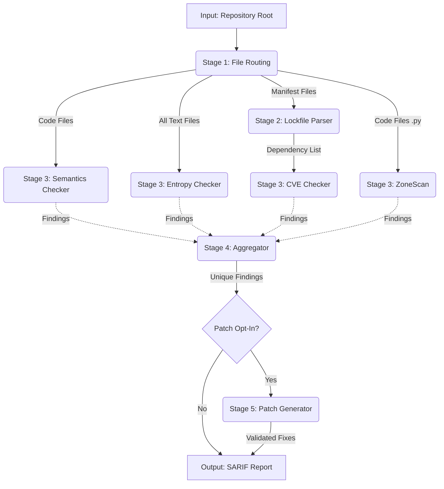
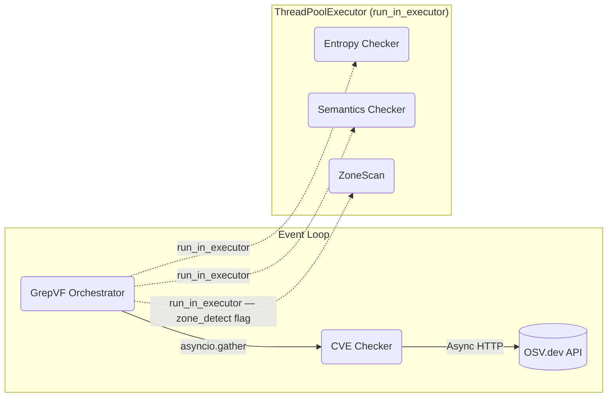
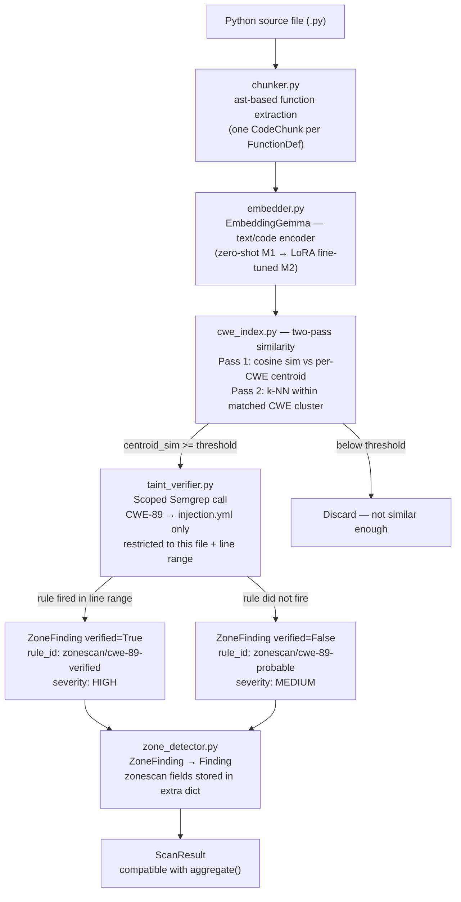
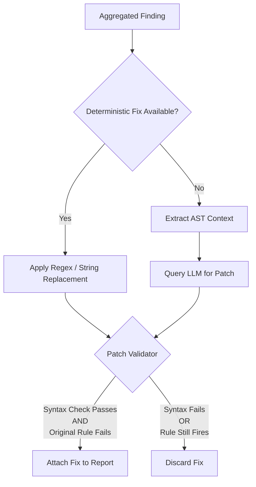
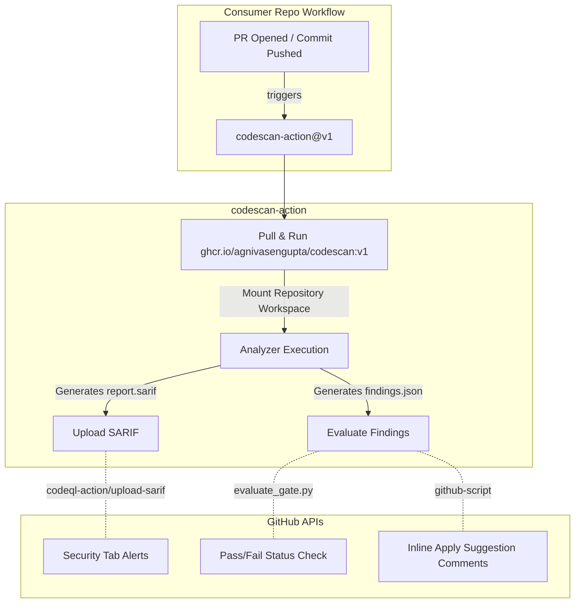

<!--metadata
  title: "GrepVF"
  authors: ["Subhajit Gorai"]
  dateCreated: "14/04/2026"
  dateEdited: "22/04/2026"
  description: ""
  tags: [""]
-->

# A CVE Checker that can Hack

The GrepVF engine is a static application security testing (SAST) and secret-scanning pipeline designed to be fast, asynchronous, and capable of generating validated autofixes.

## High-Level Pipeline Flow

The engine orchestration is centralized in `engine.core.GrepVF`. The pipeline executes in five distinct, ordered stages.



---

## Stage Breakdown

### 1. File Routing (engine/filescan)
Before any heavy scanning begins, `scanner.py` walks the repository and aggressively filters out binary files, oversized blobs, and ignored directories (`.git`, `node_modules`).
It partitions the remaining files into three non-mutually-exclusive queues:
* **Secrets Queue:** Almost all text files, targeting hardcoded credentials.
* **Manifests Queue:** Dependency lockfiles (e.g., `package-lock.json`, `requirements.txt`).
* **Code Queue:** Files with specific extensions (`.py`, `.js`, etc.) or specific names (`Dockerfile`) that require semantic AST analysis.

### 2. Manifest Parse (engine/codescan/lockfile_parser.py)
This step is a synchronous prerequisite for the CVE checker. It parses all files in the Manifests queue into a standardized `list[Dependency]` (Package Name, Version, Ecosystem) so the downstream checker doesn't need to implement ecosystem-specific parsers.

### 3. Concurrent Scanners (engine/codescan, engine/zonescan)
The heart of the engine. To maximize throughput, the orchestrator (`core.py`) dispatches **four** scanners concurrently using `asyncio.gather`.



```excalidraw
{
  "type": "excalidraw",
  "version": 2,
  "source": "https://excalidraw.com",
  "elements": [
    {
      "type": "rectangle",
      "id": "subgraph-event-loop",
      "x": 50,
      "y": 50,
      "width": 950,
      "height": 200,
      "strokeColor": "#000000",
      "backgroundColor": "transparent",
      "fillStyle": "hachure",
      "strokeWidth": 1,
      "strokeStyle": "dashed",
      "roughness": 1,
      "opacity": 100,
      "groupIds": [],
      "roundness": { "type": 3 }
    },
    {
      "type": "text",
      "id": "text-event-loop",
      "x": 60,
      "y": 60,
      "width": 120,
      "height": 25,
      "strokeColor": "#000000",
      "text": "Event Loop",
      "fontSize": 20,
      "fontFamily": 1,
      "textAlign": "left",
      "verticalAlign": "top"
    },
    {
      "type": "rectangle",
      "id": "subgraph-threadpool",
      "x": 450,
      "y": 280,
      "width": 450,
      "height": 340,
      "strokeColor": "#000000",
      "backgroundColor": "transparent",
      "fillStyle": "hachure",
      "strokeWidth": 1,
      "strokeStyle": "dashed",
      "roughness": 1,
      "opacity": 100,
      "groupIds": [],
      "roundness": { "type": 3 }
    },
    {
      "type": "text",
      "id": "text-threadpool",
      "x": 460,
      "y": 290,
      "width": 350,
      "height": 25,
      "strokeColor": "#000000",
      "text": "ThreadPoolExecutor (run_in_executor)",
      "fontSize": 20,
      "fontFamily": 1,
      "textAlign": "left",
      "verticalAlign": "top"
    },
    {
      "type": "rectangle",
      "id": "node-a",
      "x": 100,
      "y": 120,
      "width": 240,
      "height": 60,
      "strokeColor": "#000000",
      "backgroundColor": "#e6fcf5",
      "fillStyle": "solid",
      "strokeWidth": 2,
      "strokeStyle": "solid",
      "roughness": 1,
      "opacity": 100
    },
    {
      "type": "text",
      "id": "text-a",
      "x": 120,
      "y": 135,
      "width": 200,
      "height": 25,
      "strokeColor": "#000000",
      "text": "GrepVF Orchestrator",
      "fontSize": 20,
      "fontFamily": 1,
      "textAlign": "center",
      "verticalAlign": "middle"
    },
    {
      "type": "rectangle",
      "id": "node-b",
      "x": 520,
      "y": 120,
      "width": 180,
      "height": 60,
      "strokeColor": "#000000",
      "backgroundColor": "#fff4e6",
      "fillStyle": "solid",
      "strokeWidth": 2,
      "strokeStyle": "solid",
      "roughness": 1,
      "opacity": 100
    },
    {
      "type": "text",
      "id": "text-b",
      "x": 545,
      "y": 135,
      "width": 130,
      "height": 25,
      "strokeColor": "#000000",
      "text": "CVE Checker",
      "fontSize": 20,
      "fontFamily": 1,
      "textAlign": "center",
      "verticalAlign": "middle"
    },
    {
      "type": "rectangle",
      "id": "node-c",
      "x": 800,
      "y": 120,
      "width": 180,
      "height": 60,
      "strokeColor": "#000000",
      "backgroundColor": "#e7f5ff",
      "fillStyle": "solid",
      "strokeWidth": 2,
      "strokeStyle": "solid",
      "roughness": 1,
      "opacity": 100,
      "roundness": { "type": 3 }
    },
    {
      "type": "text",
      "id": "text-c",
      "x": 825,
      "y": 135,
      "width": 130,
      "height": 25,
      "strokeColor": "#000000",
      "text": "OSV.dev API",
      "fontSize": 20,
      "fontFamily": 1,
      "textAlign": "center",
      "verticalAlign": "middle"
    },
    {
      "type": "rectangle",
      "id": "node-d",
      "x": 500,
      "y": 340,
      "width": 240,
      "height": 60,
      "strokeColor": "#000000",
      "backgroundColor": "#f8f9fa",
      "fillStyle": "solid",
      "strokeWidth": 2,
      "strokeStyle": "solid",
      "roughness": 1,
      "opacity": 100
    },
    {
      "type": "text",
      "id": "text-d",
      "x": 530,
      "y": 355,
      "width": 180,
      "height": 25,
      "strokeColor": "#000000",
      "text": "Entropy Checker",
      "fontSize": 20,
      "fontFamily": 1,
      "textAlign": "center",
      "verticalAlign": "middle"
    },
    {
      "type": "rectangle",
      "id": "node-e",
      "x": 500,
      "y": 440,
      "width": 240,
      "height": 60,
      "strokeColor": "#000000",
      "backgroundColor": "#f8f9fa",
      "fillStyle": "solid",
      "strokeWidth": 2,
      "strokeStyle": "solid",
      "roughness": 1,
      "opacity": 100
    },
    {
      "type": "text",
      "id": "text-e",
      "x": 520,
      "y": 455,
      "width": 200,
      "height": 25,
      "strokeColor": "#000000",
      "text": "Semantics Checker",
      "fontSize": 20,
      "fontFamily": 1,
      "textAlign": "center",
      "verticalAlign": "middle"
    },
    {
      "type": "rectangle",
      "id": "node-z",
      "x": 500,
      "y": 540,
      "width": 240,
      "height": 60,
      "strokeColor": "#000000",
      "backgroundColor": "#f8f9fa",
      "fillStyle": "solid",
      "strokeWidth": 2,
      "strokeStyle": "solid",
      "roughness": 1,
      "opacity": 100
    },
    {
      "type": "text",
      "id": "text-z",
      "x": 560,
      "y": 555,
      "width": 120,
      "height": 25,
      "strokeColor": "#000000",
      "text": "ZoneScan",
      "fontSize": 20,
      "fontFamily": 1,
      "textAlign": "center",
      "verticalAlign": "middle"
    },
    {
      "type": "arrow",
      "id": "edge-a-b",
      "x": 340,
      "y": 150,
      "width": 180,
      "height": 0,
      "strokeColor": "#000000",
      "strokeWidth": 1,
      "strokeStyle": "solid",
      "roughness": 1,
      "opacity": 100,
      "startArrowhead": null,
      "endArrowhead": "arrow",
      "points": [[0, 0], [180, 0]]
    },
    {
      "type": "text",
      "id": "label-a-b",
      "x": 360,
      "y": 125,
      "width": 130,
      "height": 20,
      "strokeColor": "#000000",
      "text": "asyncio.gather",
      "fontSize": 16,
      "fontFamily": 1,
      "textAlign": "center",
      "verticalAlign": "middle"
    },
    {
      "type": "arrow",
      "id": "edge-b-c",
      "x": 700,
      "y": 150,
      "width": 100,
      "height": 0,
      "strokeColor": "#000000",
      "strokeWidth": 1,
      "strokeStyle": "solid",
      "roughness": 1,
      "opacity": 100,
      "startArrowhead": null,
      "endArrowhead": "arrow",
      "points": [[0, 0], [100, 0]]
    },
    {
      "type": "text",
      "id": "label-b-c",
      "x": 710,
      "y": 125,
      "width": 90,
      "height": 20,
      "strokeColor": "#000000",
      "text": "Async HTTP",
      "fontSize": 16,
      "fontFamily": 1,
      "textAlign": "center",
      "verticalAlign": "middle"
    },
    {
      "type": "arrow",
      "id": "edge-a-d",
      "x": 220,
      "y": 180,
      "width": 280,
      "height": 190,
      "strokeColor": "#000000",
      "strokeWidth": 1,
      "strokeStyle": "dashed",
      "roughness": 1,
      "opacity": 100,
      "startArrowhead": null,
      "endArrowhead": "arrow",
      "points": [[0, 0], [280, 190]]
    },
    {
      "type": "text",
      "id": "label-a-d",
      "x": 310,
      "y": 250,
      "width": 140,
      "height": 20,
      "strokeColor": "#000000",
      "text": "run_in_executor",
      "fontSize": 16,
      "fontFamily": 1,
      "textAlign": "center",
      "verticalAlign": "middle"
    },
    {
      "type": "arrow",
      "id": "edge-a-e",
      "x": 200,
      "y": 180,
      "width": 300,
      "height": 290,
      "strokeColor": "#000000",
      "strokeWidth": 1,
      "strokeStyle": "dashed",
      "roughness": 1,
      "opacity": 100,
      "startArrowhead": null,
      "endArrowhead": "arrow",
      "points": [[0, 0], [300, 290]]
    },
    {
      "type": "text",
      "id": "label-a-e",
      "x": 290,
      "y": 340,
      "width": 140,
      "height": 20,
      "strokeColor": "#000000",
      "text": "run_in_executor",
      "fontSize": 16,
      "fontFamily": 1,
      "textAlign": "center",
      "verticalAlign": "middle"
    },
    {
      "type": "arrow",
      "id": "edge-a-z",
      "x": 180,
      "y": 180,
      "width": 320,
      "height": 390,
      "strokeColor": "#000000",
      "strokeWidth": 1,
      "strokeStyle": "dashed",
      "roughness": 1,
      "opacity": 100,
      "startArrowhead": null,
      "endArrowhead": "arrow",
      "points": [[0, 0], [320, 390]]
    },
    {
      "type": "text",
      "id": "label-a-z",
      "x": 230,
      "y": 440,
      "width": 250,
      "height": 20,
      "strokeColor": "#000000",
      "text": "run_in_executor — zone_detect",
      "fontSize": 16,
      "fontFamily": 1,
      "textAlign": "center",
      "verticalAlign": "middle"
    }
  ],
  "appState": {
    "viewBackgroundColor": "#ffffff",
    "gridSize": 20
  }
}
```

* **Entropy Checker:** Runs in a thread pool. Uses pure regex matching for known secret formats (AWS, Stripe, GitHub PATs) and Shannon-entropy math to detect unknown high-entropy tokens, utilizing strict false-positive guards (ignoring UUIDs, hex hashes, and placeholder values like "changeme").
* **Semantics Checker:** Runs in a thread pool. Shells out to a `semgrep` subprocess to perform deep, AST-aware taint tracking using custom rules. It also runs Python-native "structural absence" checks (e.g., missing `USER` in Dockerfiles).
* **CVE Checker:** Runs natively on the async event loop. Batches dependencies into groups of 100 and sends them to the OSV.dev `querybatch` API to detect known vulnerable package versions.
* **ZoneScan** *(opt-in, `--zone-detect`)*: Runs in a thread pool. A retrieval-augmented vulnerability detector that generalizes beyond exact-match rules — see the ZoneScan section below.

#### Why Four Scanners?

The three original scanners are all **exact-match systems**: regex patterns, Semgrep AST rules, and pinned package versions. None of them generalize to a variant they haven't seen. ZoneScan is structurally different:

| Scanner | Signal type | Generalizes to unseen variants? |
|---|---|---|
| Entropy Checker | Regex + Shannon entropy | No |
| Semantics Checker | Semgrep taint/structural rules | No |
| CVE Checker | OSV.dev package@version lookup | No |
| **ZoneScan** | Embedding similarity → scoped taint verify | **Yes** |

---

### ZoneScan (`engine/zonescan/`) — Retrieval + Targeted Verification

ZoneScan flags code *semantically* close to known-vulnerable patterns, then uses the existing Semgrep taint infrastructure — scoped down to one rule file and one line range — to confirm or reject each candidate.

**MVP scope:** CWE-89 (SQL Injection), Python only. Designed to be extended to CWE-22, CWE-79, and JS/TS in Phase 2.



**Key design choices:**

- **Source text, not AST, for embedding:** `EmbeddingGemma` is a pretrained text/code encoder — identifiers like `query` next to `execute` are meaningful signal. AST is used only to find clean function boundaries to chunk on, not to transform what gets embedded.
- **Scoped verification reuses existing Semgrep:** `taint_verifier.py` calls `run_semgrep_scoped()` (extracted from `semantics_checker.py`) with a single rule file and a single file path. This makes the existing scanner *smarter* (targeted) rather than replacing it, and avoids standing up Joern (JVM + CPG extraction) for MVP.
- **Unverified findings are surfaced:** A `zonescan/cwe-89-probable` finding (high similarity, taint not confirmed) still gets emitted at MEDIUM severity. This is the structural novelty: a pattern that *looks like* CWE-89 but that scoped Semgrep couldn't confirm may represent a variant the exact-match rules haven't been written for yet.
- **Graceful degradation:** If `transformers`/`torch` are not installed, the embedder falls back to a deterministic hash-based stub. The scanner runs, returns no candidates above the real threshold, and the pipeline continues normally.

**ZoneScan milestones:**

| Milestone | Status | Description |
|---|---|---|
| M0 — Skeleton | ✅ | Stub wired into `core.py` behind `--zone-detect`; existing tests green |
| M1 — Zero-shot | ✅ | Real chunker + embedder + hand-seeded CWE-89 centroid + scoped Semgrep verify |
| M2 — Fine-tuned | 🔲 | LoRA fine-tune on VulGate CWE-89 subset; precision/recall table vs M1 |
| M3 — Temporal holdout | 🔲 | Recall on post-cutoff CVEs; the honest generalization number |
| M4 — Aggregator bump | ✅ | Corroboration hazard bump wired in `final.py` |

---

### 4. Aggregator (`engine/reports/final.py`)
Because multiple scanners might flag the same issue on the same line (e.g., the Semantics checker flags an ENV var as a misconfiguration, while the Entropy checker flags it as a hardcoded secret), the aggregator normalizes the output.
* **Deduplication:** Collapses identical `(file_path, line)` collisions within the same category, keeping the finding with the highest severity. ZoneScan findings with `Category.INJECTION` on the same line as a Semgrep injection finding will merge — one winner per line. If ZoneScan finds something Semgrep *missed* (the valuable case), it stands alone.
* **Hazard Scoring:** Elevates priority via a 0–10 score. Bumps applied:
  * `+1.0` — Semgrep taint-mode confirmed (`sql-injection-string-concat`, `zonescan/cwe-89-verified`)
  * `+1.0` — finding in an internet-facing file (`views.py`, `routes.py`, `api.py`, etc.)
  * `+0.5` — CVE with a known fixed version available
  * `+0.5` — ZoneScan **corroboration bump**: both semantic-similarity retrieval AND independent scoped-taint confirmation agree. A verified zone finding at HIGH base: **7.0 + 1.0 + 0.5 = 8.5** — stronger signal than either alone.

### 5. Patch Generator (`engine/patcher`)
If instantiated with `patch=True`, the engine attempts to generate autofixes for the aggregated findings.



* **Deterministic Fixes:** Safe, hardcoded string replacements for known structural issues (e.g., replacing `verify=False` with `verify=True`).
* **LLM Patcher:** For complex semantic issues, extracts a minimal, token-optimized AST slice of the vulnerable code and prompts an LLM to rewrite it.
* **Patch Validator:** **Critical Safety Gate.** No patch is presented to the user unless it proves it works. The validator writes the patched snippet to a temp file, runs the Python syntax checker, and re-runs the *exact same* Semgrep or Regex rule that triggered the finding. If the code is broken or the rule still fires, the patch is discarded.

## Final Output (`engine/sarif`)
The internal `AggregatedReport` is serialized into **SARIF v2.1.0**. The `writer.py` maps engine attributes (like `Finding.dedup_key()`) to SARIF `partialFingerprints` and `security-severity` properties, allowing the native GitHub Security tab to accurately track vulnerabilities across commits without duplicate noise.

ZoneScan findings use distinct rule IDs (`zonescan/cwe-89-verified`, `zonescan/cwe-89-probable`) so SARIF `partialFingerprints` identity never collides with Semgrep findings on the same line — both can appear in the Security tab independently.

---

## GitHub Actions Integration (`codescan-action`)

The `GrepVF` engine is packaged as a platform-agnostic Docker container (`ghcr.io/agnivasengupta/codescan`). To make it plug-and-play for GitHub users, a separate repository (`codescan-action`) provides the GitHub-specific wrapper (`action.yml`).

This separation of concerns ensures that the core engine knows nothing about GitHub pull requests, while the Action handles all GitHub API interactions.



### How the Action Works:
1. **Container Execution:** The action spins up the `codescan` Docker image, mounts the user's repository into `/workspace`, and runs the engine with `--patch` enabled.
2. **SARIF Upload:** The action uses the official `github/codeql-action/upload-sarif` to push the generated `report.sarif` to the GitHub Security tab.
3. **Gate Evaluation:** A Python script (`evaluate_gate.py`) reads the `findings.json` and compares the unresolved findings against the user's `.codescan.yml` thresholds (e.g., `fail-on: high`).
4. **PR Inline Suggestions:** If triggered on a Pull Request, a Node.js script parses the `findings.json` and uses the GitHub REST API (`createReviewComment`) to post inline comments. It uses the ` ```suggestion ` markdown syntax so that developers can 1-click apply or batch the validated autofixes directly from the GitHub UI.

### ZoneScan in the Pipeline

ZoneScan is **opt-in** and **off by default** in the Docker image. To enable it for a consumer repo, pass `--zone-detect` to the engine in the action's `args`:

```yaml
- uses: your-org/codescan-action@v1
  with:
    args: "--zone-detect"          # enable ZoneScan (M1 zero-shot centroid)
    # args: "--zone-detect --zone-index /workspace/.codescan/cwe_index"  # M2+ with trained index
```

The base Docker image includes `numpy` (required for the centroid similarity math) but **not** `torch` or `transformers` — those are large and only needed for the real embedding model. For M1 zero-shot, the image uses the hash-based stub embedder unless the ML deps are pre-installed. For M2+, a separate `:zonescan` image tag will include the full ML stack.
